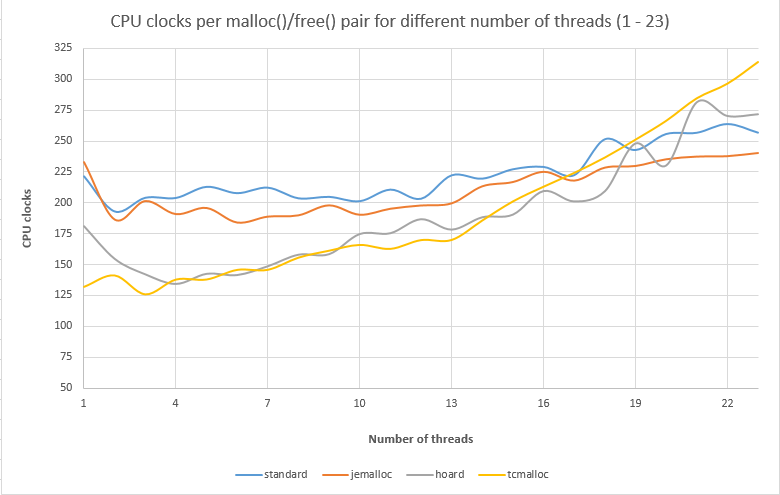
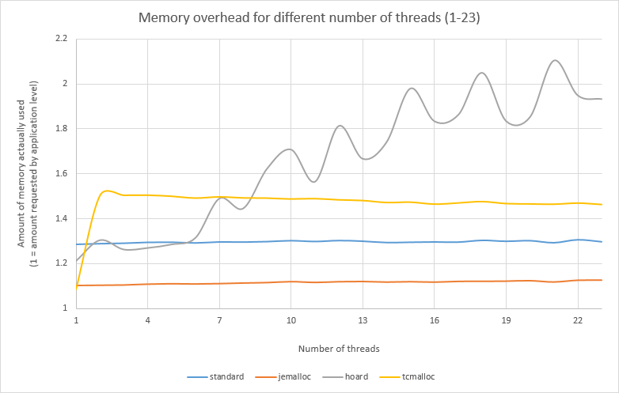

很多软件，我们没有必要对其内存使用进行优化。这是因为有些软件的内存消耗非常的小，不值得再继续优化；
有些软件虽然开销很大，但是对于业务运行没有影响，因此也就没有必要 (动力) 优化。

我们需要执行优化，很多时候是使用（测试/压测）过程发现了问题。软件还是那个软件，但是因为使用的场景变化了，
新的问题就出现了。比如个人使用 OpenResty 做反向代理来管理自己的几个小站点，这个时候就不容易出问题。如果是
企业使用，这时候可能会有成千上万个站点；这种情况下内存，CPU 的开销就变大了，因此优化效果也就比较可观。

前面唠叨了那么多，我们下面重点讲一讲怎么选择内存分配器。Linux 上，个人常见的 内存分配器有 Glibc 自带的 ptmalloc，以及
Google 出品的 TCmalloc 和 Facebook 出品的 [Jemalloc](https://github.com/jemalloc/jemalloc)。Google 的 TCmalloc 分成[开源](https://github.com/gperftools/gperftools) 和 [内部](https://github.com/google/tcmalloc) 两个版本。另外还有一个 hoard 内存分配器个人则不太了解，不过看其 github 的提交记录，2020 年 8 月之后就没有更新了。

可以从这个 [链接](http://ithare.com/testing-memory-allocators-ptmalloc2-tcmalloc-hoard-jemalloc-while-trying-to-simulate-real-world-loads/)
了解到各个内存分配器的性能测试数据。

从这边可以看到，标准的 Glibc 自带的内存分配器的分配性能基本上是最差的，但是在单线程的情况下反而比 jemalloc 要来的好。tcmalloc 的分配性能在 17 线程以下都比 jemalloc 和 Glibc 自带的内存分配器来得好。

从图中可以看到，jemalloc 的内存额外开销是最小的，tcmalloc 会比 jemalloc 高出 50%。

我们翻译一下他给出的结论：

1. 在没有指定确切的应用程序的情况下，我们测试的现代内存分配器彼此之间相差并不太大。更重要的是，它们中的每一个都可以在特定条件下胜过另一个。换句话说：如果你确实想通过更改内存分配器来获得性能提升，请确保用自己的应用程序测试它们。
2. 如果我们不知道一个确切的应用程序，那么我们的建议如下：
    - 考虑到奇怪的内存开销，尽量不选 hoard 内存分配器
    - tcmalloc 和 ptmalloc2 非常相似 (在这一点上，似乎 tcmalloc 对台式机有优势，而 ptmalloc2 对服务器有优势，但现在下结论还为时过早)
    - 但在我们看来，目前为止的总冠军是 jemalloc。它的低内存开销有望改善缓存的处理方式，对于一个“普通的应用程序”，我们希望它的性能至少不会比其他应用程序差。

所以，如果我们想对应用的内存分配进行优化，还是得结合实际的应用进行测试。并且这个测试应该贴近实际使用，而不是为了得到好看的数字。
当然这里说的实际使用不是指多数情况下软件运行的基本状态，应该是各种情形都需要测试。比如网络连接数变化，传输文件大小变化，网络带宽变化等各种情况。因为正在运行的软件多数情况下是没有问题的，否则也不应该上线。

因为上面介绍的主要是内存的分配和释放，其实还有一点很重要：是否能够把内存及时归还给操作系统。
比如升级软件的时候，为了实现平滑过渡，新旧进程同时存在，如果旧进程不能够及时把内存归还给操作系统，那么就会造成 2 倍的内存开销。在内存不足时，操作系统的 OOM killer 开始工作就会把内存占用最大的进程给杀死（不确切，是打分机制，暂且这么理解），这时候也就达不到平滑过渡的效果。

各种分配器为了提升分配性能，都有各种各样的缓存机制，从操作系统申请的内存页面多数情况下都不会及时归还给操作系统。Glibc 为此提供了一个 `int malloc_trim(size_t pad)` 的接口来实现将 heap 顶端的空闲内存归还给操作系统。
但是由于 sbrk 内存分配的特性，malloc_trim 的效果并不是大多数人想的将空闲内存都归还给操作系统，这个得用另外的文章来介绍 sbrk 的内存分配才能深入的理解。jemalloc 和 tcmalloc 不使用 sbrk 方式分配内存，在归还内存给操作系统方面相对来说会好得多，但是因为缓存机制，内存碎片的原因，什么时候归还给操作系统也不确定。

因此，对于内存分配器的选择，我的建议是：

1. 首先确认是否有必要进行内存优化
2. 确认内存优化的目标：是提升分配的速度还是降低内存额外开销
3. 设计测试场景，覆盖常用情况和极端情况
4. 使用各种内存分配器对内存分配进行测试

# 内存回收优化

对于长期运行的程序，经常会有内存碎片的的烦恼，如何减少内存碎片变成一个很重要的问题。

## Jemalloc

点击 [Jemalloc 内存回收优化参数](https://github.com/jemalloc/jemalloc/blob/master/TUNING.md) 可以查看具体的内存优化参数。
把主要的参数摘抄如下：

- background_thread

  Enabling jemalloc background threads generally improves the tail latency for application threads, since unused memory purging is shifted to the dedicated background threads. In addition, unintended purging delay caused by application inactivity is avoided with background threads.

  Suggested: background_thread:true when jemalloc managed threads can be allowed.

- metadata_thp

  Allowing jemalloc to utilize transparent huge pages for its internal metadata usually reduces TLB misses significantly, especially for programs with large memory footprint and frequent allocation / deallocation activities. Metadata memory usage may increase due to the use of huge pages.

  Suggested for allocation intensive programs: metadata_thp:auto or metadata_thp:always, which is expected to improve CPU utilization at a small memory cost.

- dirty_decay_ms and muzzy_decay_ms

  Decay time determines how fast jemalloc returns unused pages back to the operating system, and therefore provides a fairly straightforward trade-off between CPU and memory usage. Shorter decay time purges unused pages faster to reduces memory usage (usually at the cost of more CPU cycles spent on purging), and vice versa.

  Suggested: tune the values based on the desired trade-offs.

- narenas

  By default jemalloc uses multiple arenas to reduce internal lock contention. However high arena count may also increase overall memory fragmentation, since arenas manage memory independently. When high degree of parallelism is not expected at the allocator level, lower number of arenas often improves memory usage.

  Suggested: if low parallelism is expected, try lower arena count while monitoring CPU and memory usage.

- percpu_arena

  Enable dynamic thread to arena association based on running CPU. This has the potential to improve locality, e.g. when thread to CPU affinity is present.

  Suggested: try percpu_arena:percpu or percpu_arena:phycpu if thread migration between processors is expected to be infrequent.
