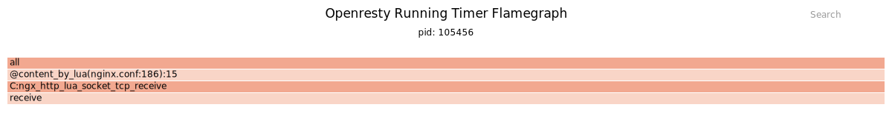

# 背景

我们修改 nginx 的配置之后，为了让新的配置生效，我们需要重新载在 nginx 的配置文件。
为了让配置生效，我们需要执行 `nginx -s reload` 这样的命令。根据实际情况可能会有所不同，
比如有的系统上是 `systemctl reload nginx`, 如果是 OpenResty，那么是 `systemctl reload openresty`。
这些命令最后都是向 nginx 的 master 进程发送 SIGHUP 信号，可以参考 [Controlling nginx](http://nginx.org/en/docs/control.html) 进一步了解。

在执行 reload 后，旧的 nginx worker 进程会进入 shutting down 状态。比如：

```shell
$ ps aux | grep nginx
root       71083  0.0  0.0  42024  9084 ?        Ss   12:18   0:00 nginx: master process /usr/local/openresty/nginx/sbin/nginx
nobody     99821  0.0  0.0  74628  7800 ?        S    14:05   0:00 nginx: worker process is shutting down
nobody    100314  0.0  0.0  74636  7148 ?        S    14:06   0:00 nginx: worker process
```

当然 shutting down 状态的 nginx worker 进程你不一定能看到，需要有一些长链接的请求存在。比如可以通过限速下载大文件来模拟，或者是 websocket 的连接。

我们希望 nginx worker 进程可以在规定的时间退出，而不是无限制的等待下去。
因此我们在配置文件中增加了 `worker_shutdown_timeout 15` 这样一条配置。
验证的时候确认这个命令是可以正常工作的，但是一上线就发现不能在规定的时间正常退出了。
经过分析确认是 OpenResty cosocket 创建的连接没有关闭导致 nginx worker 进程无法退出。
因此我们来了解一下 nginx 的 worker_shutdown_timeout 是如何工作的。

# worker_shutdown_timeout 的实现原理

nginx 的 [官方文档](http://nginx.org/en/docs/ngx_core_module.html#worker_shutdown_timeout) 的说明如下：

```text
Syntax:	worker_shutdown_timeout time;
Default:	—
Context:	main
This directive appeared in version 1.11.11.

Configures a timeout for a graceful shutdown of worker processes. When the time expires, nginx will try to close all the connections currently open to facilitate shutdown.
```

从上面的说明我们可以看到，nginx 在 worker_shutdown_timeout 超时之后，会试图关闭所有的连接来实现关闭进程的目的。也就是说该指令并不会强制 nginx 进程退出。
我们来看一下代码是怎么实现的。


```c
ngx_worker_process_cycle(ngx_cycle_t *cycle, void *data)
{
    ngx_int_t worker = (intptr_t) data;

    ngx_process = NGX_PROCESS_WORKER;
    ngx_worker = worker;

    ngx_worker_process_init(cycle, worker);

#if (NGX_SSL)
    if(ngx_ssl_engine_init) {
        ngx_ssl_engine_init(cycle);
    }
#endif
    
    ngx_setproctitle("worker process");

    for ( ;; ) {
        if (ngx_exiting) {
            if (ngx_event_no_timers_left() == NGX_OK) {
                // 不存在定时器的时候才退出进程
                ngx_log_error(NGX_LOG_NOTICE, cycle->log, 0, "exiting");

                ngx_worker_process_exit(cycle);
            }
        }

        ngx_log_debug0(NGX_LOG_DEBUG_EVENT, cycle->log, 0, "worker cycle");

        ngx_process_events_and_timers(cycle);

        if (ngx_terminate) {
            ngx_log_error(NGX_LOG_NOTICE, cycle->log, 0, "exiting");
            ngx_worker_process_exit(cycle);
        }

        if (ngx_quit) {
            ngx_quit = 0;
            ngx_log_error(NGX_LOG_NOTICE, cycle->log, 0,
                          "gracefully shutting down");
            ngx_setproctitle("worker process is shutting down");

            if (!ngx_exiting) {
                ngx_exiting = 1;
                ngx_set_shutdown_timer(cycle); //---> 这里启动 shutdown_timeout 的定时器
                ngx_close_listening_sockets(cycle);
                ngx_close_idle_connections(cycle);
            }
        }
        ...
    }
}

void
ngx_set_shutdown_timer(ngx_cycle_t *cycle)
{
    ngx_core_conf_t  *ccf;

    ccf = (ngx_core_conf_t *) ngx_get_conf(cycle->conf_ctx, ngx_core_module);

    if (ccf->shutdown_timeout) {
        ngx_shutdown_event.handler = ngx_shutdown_timer_handler;
        ngx_shutdown_event.data = cycle;
        ngx_shutdown_event.log = cycle->log;
        ngx_shutdown_event.cancelable = 1;

        ngx_add_timer(&ngx_shutdown_event, ccf->shutdown_timeout);
    }
}

static void
ngx_shutdown_timer_handler(ngx_event_t *ev)
{
    ngx_uint_t         i;
    ngx_cycle_t       *cycle;
    ngx_connection_t  *c;

    cycle = ev->data;

    c = cycle->connections;

    for (i = 0; i < cycle->connection_n; i++) {

        if (c[i].fd == (ngx_socket_t) -1
            || c[i].read == NULL
            || c[i].read->accept
            || c[i].read->channel
            || c[i].read->resolver)
        {
            continue;
        }

        ngx_log_debug1(NGX_LOG_DEBUG_CORE, ev->log, 0,
                       "*%uA shutdown timeout", c[i].number);

        c[i].close = 1;
        c[i].error = 1;

        c[i].read->handler(c[i].read);
    }
}

```

从上面的代码可以看到：

1. 在 nginx worker 接收到 ngx_quit 的指示之后会通过函数 ngx_set_shutdown_timer 启动一个定时器。
2. 在定时器超时后，ngx_shutdown_timer_handler 回调函数被调用。该函数会将所有的连接设置上 close 和 error 标志，然后调用连接的 read->handler。
3. read->handler 回调函数处理回调事件。

而 nginx worker 进程的退出条件是 ngx_event_no_timers_left() == NGX_OK。

因此，如果 read->handler 不能够正确的处理这种假的连接关闭事件导致 nginx timer 残留，那么进程就不会及时退出。

为了验证我的猜想，我用 OpenResty XRay 查看当前正在执行的定时器，得到如下的火焰图。



可以很明显的看到是 @content_by_lua(nginx.conf:186):15 的位置启动的定时器。

# 解决方案

这个 bug 最终处理起来也很简单，只需要增加一行代码就行了。具体的可以参考 [lua-nginx-module PR 2144](https://github.com/openresty/lua-nginx-module/pull/2144)

# 总结

1. worker_shutdown_timeout 指令是关闭连接而不是强制进程退出
2. 开发第三方模块的时候应该要注意处理 worker_shutdown_timeout 设置的 connection->close connection->error 标志，否则可能导致 nginx worker 进程无法及时退出。
