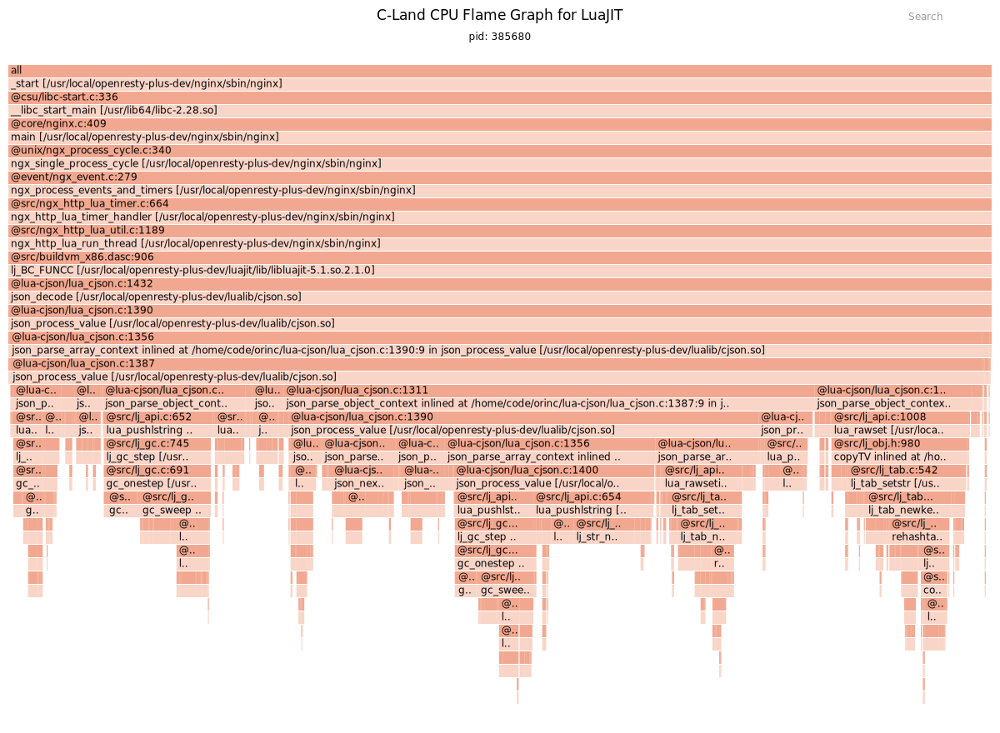
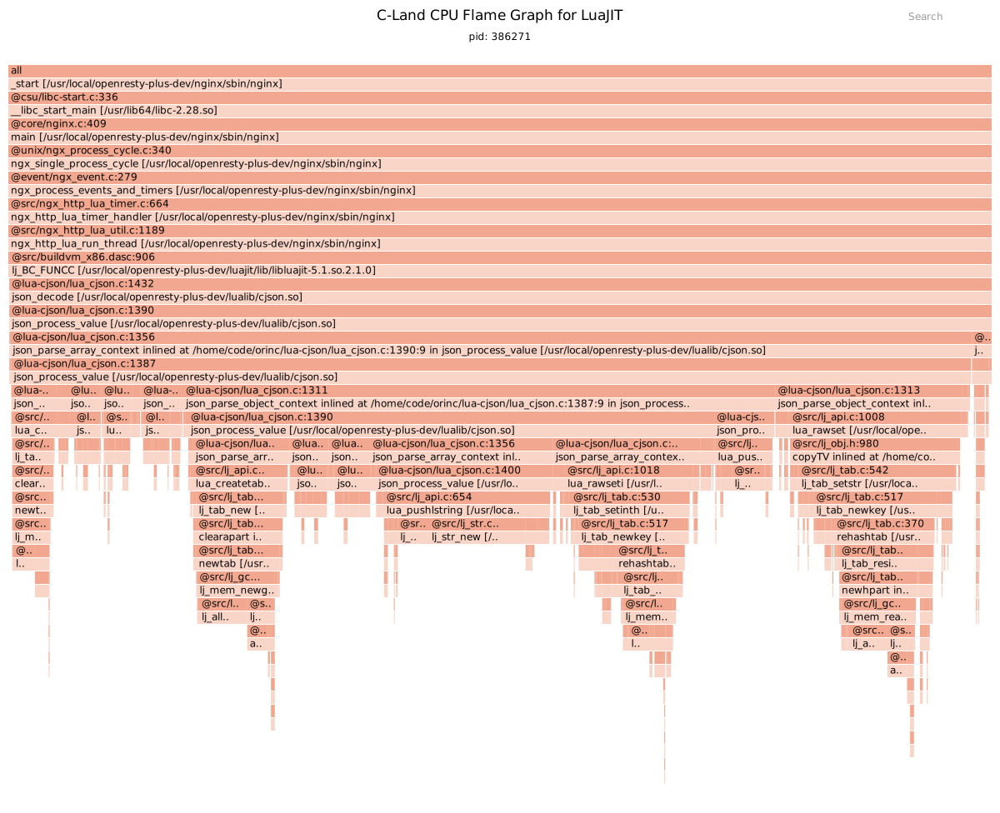

OpenResty 是一个市场占有率非常高的网关，对 OpenResty 的性能优化也就尤其重要。

这里从 GC 的角度探讨一下 Lua 的代码的性能优化。

# GC 开销的火焰图

下面这个图是使用 [OpenResty XRay](https://xray.openresty.com) 这个性能分析产品得到的火焰图。

从这个火焰图可以看到，GC 相关的开销高达 `22.3%`。这个数值我们可以通过在右上角的 search 搜索框中输入 `lj_gc_step ` 即可得到高亮的结果。



# Lua 的 GC 回收是怎么回事

Lua GC 回收使用的是扫描的方式，从根出发进行深度遍历，扫描不到的对象都是死对象。
这些死的对象的内存都是会被 Lua GC 回收再利用的。

哪些对象是根对象呢？ 根据 [Lua 官方的这个分享文章](https://www.lua.org/wshop18/Ierusalimschy.pdf) 我们知道只有注册表和共享元表才是根。而寄存器里面又
包含了全局表 _G, 主线程 和 package.loaded.

- root set: the registry and shared metatables.
- the registry contains the global table (_G), the main
thread, and package.loaded.

Lua 5.0 以及之前采用的是 `标记扫描` 的垃圾回收机制。
Lua 5.1 以及引入了 `增量标记扫描` 的垃圾回收机制。
LuaJIT 是采用的 Lua 5.1 的语法标准，GC 的机制也是采用的是 Lua 5.1 的方式。

# GC 对象和性能是什么关系

因为 GC 要扫描所有的 GC 对象，因此是一个非常耗费 CPU 的操作。所以，如果能够减少 GC 对象的数量，那么就可以提升 OpenResty 网关的性能。

要减少GC，我们得先清楚 Lua 当成有哪些 GC 对象呢？哪些操作会产生新的 GC 对相应？

要回答哪些有哪些类型的 GC 对象反而不容易，但是反过来说哪些不是GC对象就容易了。

Lua 中除了数值，bool， nil 不是 GC 对象外，所有其它的类型都是受 GC 对象。
比如 字符串， table，Closure/function, coroutine，Cdata 等等。

因此，要减少 GC 对象我们就要进行减少 Lua table 的创建，减少不必要的函数闭包，避免生成新的字符串对象。

# 减少 GC 对象的具体方式

## 减少创建字符串

比如下面的代码片段一不会产生新的 GC 对象，而代码判断二会产生一个新的 GC 对象

代码片段1

```lua
ngx.say(a, b, c, d)
```

代码片段2

```lua
ngx.say(a .. b .. c .. d)
```

# 减少创建新的表

对于 Lua table，我们也应该尽可能的复用，而不要创建。
比如下面的这个代码片段示例通过 `table.clear` 这个扩展原语将 tbale 的成员清空来实现复用。

Lua table 的复用效果是非常的好，因此 OpenResty 官方有一个专门的仓库 [table-pool](https://github.com/openresty/lua-tablepool) 就是为了解决 table 复用的问题。

```lua
local table_clear = require "table.clear"
local res = {}

for i = 1,10 do
    process_step1(data, res)

    process_step2(res)

    table_clear(res)
end
```

# 复用 Cdata

对于 Cdata，我们经常会忽略 GC 开销这个问题。想想通过 ffi.new 申请的对象不需要主动释放，
那谁来释放呢？ 是 GC 来帮你保证资源不会泄漏的，因此 Cdata 就是一个 GC 对象了。
因此如果我们通过 ffi.new 申请的内存能够复用，那么就可以减少 GC 对象了。

下面这个操作就存在每次调用 get_msg() 都会分配一次内存，这样也就会产生大量的 GC 对象了。
我们应该把这个内存分配的操作放在函数的外部，作为函数的upvalue，这样就不需要每次都分配一次内存。

```lua
local ffi = require "ffi"
local C = ffi.C

local function get_msg()
    local buf = ffi.new(char[?], 128)
    C.ffi_get_msg(buf)
end
```

# 不要使用闭包

Lua 的闭包也是一个很典型的性能瓶颈的根源。可以说是：闭包一时爽，性能火葬场。

像下面这个函数，每次都返回一个函数，这种就会创建大量的闭包函数。
为时候会觉得这样能够面向对象编程，看起来非常舒服，但是代价就是性能很惨。

```lua
local function factory(weight, color)
    local attr = {weight=weight, color=color}
    return function()
      -- do something in the function
    end
end
```

如果 GC 对象没有办法避免，那么我们还能做什么呢？

# 关闭 GC 的可行性

GC 会干扰性能，那么能不能关闭 GC 呢？ Lua 提供了关闭 GC 和开启 GC 的接口。

```lua
collectgarbage("stop")
collectgarbage("restart")
```

如果是长时间关闭 GC，那么显然不是一个理想的方法，这样会存在内存不可控的增长的问题。

但是如果内存的增长是我们可以预期的，并且我们对于进程阻塞不是那么敏感，那么手动
进行 GC 控制也是一个不错的注意。

比如在进程初始化的时候需要进行大量的配置解析操作，那么这个时候可以关闭 GC，等到
进程初始化完成以后再打开 GC 并执行一次全量的垃圾回收操作。

我这里还是使用 OpenResty XRay 进行了一次关闭垃圾回收的实验。可以看到在关闭垃圾回收后，就
采集不到到任何垃圾回收的行为了。

在关闭垃圾回收之前，我们跑的性能测试程序花费了 `2.86s`， 而关闭垃圾回收后只使用了 `2.41s`。也就是说垃圾回收在我的测试样本中增加了 `18.7%` 的时间开销。这个跟最开始的火焰图里面反馈的 GC 开销 占用 `22.3%` 基本上是对得上的。 可以这么换算：`100 - 22.3）/ 100 * 2.86s = 2.22s`。

所以：火焰图诚不欺我也！





根垃圾回收相关的接口如下：

  - collectgarbage("collect") − Runs one complete cycle of garbage collection.
  - collectgarbage("count") − Returns the amount of memory currently used by the program in Kilobytes.
  - collectgarbage("restart") − If the garbage collector has been stopped, it restarts it.
  - collectgarbage("setpause") − Sets the value given as second parameter divided by 100 to the garbage collector pause variable. Its uses are as discussed a little above.
  - collectgarbage("setstepmul") − Sets the value given as second parameter divided by 100 to the garbage step multiplier variable. Its uses are as discussed a little above.
  - collectgarbage("step") − Runs one step of garbage collection. The larger the second argument is, the larger this step will be. The collectgarbage will return true if the triggered step was the last step of a garbage-collection cycle.
  - collectgarbage("stop") − Stops the garbage collector if its running.

上面这个列表来自 [tutorialspoint](https://www.tutorialspoint.com/lua/lua_garbage_collection.htm)
