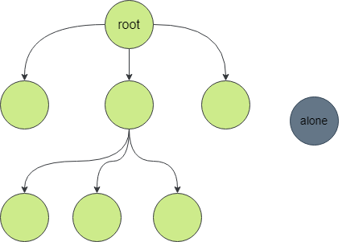

# Lua GC 的回顾

Lua 是一门带 GC 回收的语言，因此程序员很幸福，不需要自己处理内存的分配和回收。
但是为了复用现有的生态或者利用 C 来实现高效的算法，就需要跟 C 语言进行交互。
跟 C 语言交互免不了需要使用 C 的数据结果，比如一个数组等等。

LuaJIT 的 FFI 接口让 Lua 和 C 的交互变得非常的简单。调用C函数不再需要通过传统的通过 Lua 栈的方式
来传递数据。可以参考 [luajit-ffi-howto](./2023-02-04-luajit-ffi-howto.md) 这个文章来查看如何使用 FFI 接口进行编程。
FFI 接口的方式不仅让编码更加快捷方便，Lua 代码的运行效率也大大提高。
这里面的性能提升包括消除了参数转换的开销(从Lua转换到C以及从C转换到Lua) 和 Lua 代码可以被 JIT 运行带来的性能提升。

涉及到跟 C 的交互免不了要带来内存分配和内存管理的问题。一个是 LuaJIT 自身的内存分配传递给 C， 一个是 C 分配的内存传递给Lua。

Lua 分配的内存传递给 C 不存在内存未释放的问题，主要是 Lua 内存生命期的管理。
而 C 函数调用返回给 Lua 的内存就需要在 Lua 一侧主动释放，否则就会造成内存泄漏。

这个时候我们就要问：Lua 分配的内存为什么会涉及生命期的管理呢？Lua 应该是主动回收内存的，不存在生命期的问题啊？
更准确的说这里的问题其实是： 如果内存一直没有被回收，那么就会造成内存泄漏；如果内存提早被回收又被C模块使用，那么就造成内存改写等问题 (read-after-free if not modify)。

因此，我们就需要知道 Lua 的 GC 是怎么回收内存的。

[lua.org 上的这个 PPT](https://www.lua.org/wshop18/Ierusalimschy.pdf) 说 Lua 中所有的对象都接受垃圾回收的管理；只有从根出发能够访问到的对象才会被保留。原话如下：

- All objects in Lua are subject to garbage collection.
  * tables, functions, “modules”, threads (coroutines),etc.

- Only objects accessible from the root set are preserved.
  * root set: the registry and shared metatables.
  * the registry contains the global table (_G), the main thread, and package.loaded.

那么上面这两句话到底是什么意思呢？其实如果没有垃圾回收的知识的话还是很难理解透彻。如果真正理解了上面的两句话，那么你也就对这两句话更心领神会了：垃圾回收器是负责回收孤魂野鬼的。比如下图中的 alone 就是个落单的对象，无依无靠就像孤魂野鬼，最终就会被垃圾回收器回收。




# 一个 GC 回收导致内存改写的例子

下面的这个例子展示了内存被 Lua GC 回收导致的内存改写的问题。如果你不看分析，你能够自己发现那个地方内存被回收了吗？

```lua
local ffi = require "ffi"
local base = require "resty.core.base"

local ffi_new = ffi.new
local ffi_str = ffi.string
local get_string_buf = base.get_string_buf
local C = ffi.C


ffi.cdef[[
    typedef struct my_str_s {
    size_t   len;
    char    *data;
} my_str_t;

int snprintf(char *str, size_t size, const char *format, ...);
]]

local bufp = ffi_new("my_str_t[1]")
local buf = bufp[0]
buf.len = 1024
buf.data = get_string_buf(buf.len, true)

local _M = {}

function _M.run()
    print(tostring(bufp))
    C.snprintf(buf.data, buf.len, "%s", "Hello world")
    local res = ffi_str(buf.data)
    return res
end

return _M
```

我们讲上述代码保存到当前目录下，名称为 `mod.lua`。

## 如何运行这个例子

我们将使用 `resty` 运行这个例子。 `resty` 程序是 `openresty` 自带的一个实用程序。
可以通过 `yum`, `apt` 等方式安装 `resty` 命令, 比如 `yum -y install openresty-resty`。

因为 OpenResty 的仓库并不会包含在各种 Linux 发行版本中，因此需要先把 OpenResty 的软件仓库
添加到系统中，具体可以 [ OpenResty 预编译包安装 ](https://openresty.org/en/linux-packages.html) 这个页面


### 最简单的运行方式

我们使用最简单，最常用的 resty 命令运行该模块，得到的结果是非常正常的。
不是说这个有程序崩溃吗，为什么没有出现呢？我们到底要感谢软件世界的美好还是恐惧于这里面隐藏的深刻危机？

```shell
$ resty -I ./ -e "local m = require 'mod'; print(m.run())"
Hello world
```

### 加上 valgrind 的运行模式

要发现内存问题，我们肯定得上一些 valgrind 这个内存分析的利器。resty 命令也可以指定 --valgrind 的参数。
加上命令行参数后再次运行，我们还是没有发现问题。

为什么不会出现问题呢？这其实跟 GC 的回收机制有关系。 Lua GC 并不是时时刻刻都在工作，一旦有垃圾立马可以回收。
那么怎么才能让垃圾回收更加频繁呢？ 请看下面。

```shell
$ resty --valgrind -I ./ -e "local m = require 'mod'; print(m.run())"
==55745== Memcheck, a memory error detector
==55745== Copyright (C) 2002-2022, and GNU GPL'd, by Julian Seward et al.
==55745== Using Valgrind-3.19.0 and LibVEX; rerun with -h for copyright info
==55745== 
Hello world
==55745== 
==55745== HEAP SUMMARY:
==55745==     in use at exit: 52,155 bytes in 150 blocks
==55745==   total heap usage: 14,288 allocs, 14,138 frees, 2,619,763 bytes allocated
==55745== 
==55745== LEAK SUMMARY:
==55745==    definitely lost: 432 bytes in 1 blocks
==55745==    indirectly lost: 0 bytes in 0 blocks
==55745==      possibly lost: 128 bytes in 1 blocks
==55745==    still reachable: 51,595 bytes in 148 blocks
==55745==         suppressed: 0 bytes in 0 blocks
==55745== Rerun with --leak-check=full to see details of leaked memory
==55745== 
==55745== For lists of detected and suppressed errors, rerun with: -s
==55745== ERROR SUMMARY: 0 errors from 0 contexts (suppressed: 0 from 0)
```

### 逐行垃圾回收的运行模式

我们开启了逐行垃圾回收模式进行测试，这个时候我们预期的是在 C.snprintf() 函数调用的时候就报错，
但是 valgrind 却在进程要退出，释放所有资源的是才报错。

之所以会出现这样的问题，是因为 LuaJIT 默认使用自己的内存分配器，因此也就不会有
malloc， free 等内存分配释放的函数被调用到。valgrind 无法替换这些内存分配函数也就没有办法检测到内存使用的异常。

```shell
$ resty --nginx /usr/local/openresty/nginx/sbin/nginx --valgrind -I ./ -e "debug.sethook(function () collectgarbage() end, 'l'); jit.off(); require 'resty.core' local m = require 'mod'; print(m.run())

==81520== Memcheck, a memory error detector
==81520== Copyright (C) 2002-2022, and GNU GPL'd, by Julian Seward et al.
==81520== Using Valgrind-3.19.0 and LibVEX; rerun with -h for copyright info
==81520== Command: /usr/local/openresty/nginx/sbin/nginx -p /tmp/resty_JymkgZuaun/ -c conf/nginx.conf
==81520== 
cdata<struct my_str_s [1]>: 0x040c1468
Hello world
==81520== Invalid read of size 8
==81520==    at 0x54F3BDB: lj_alloc_free (lj_alloc.c:1372)
==81520==    by 0x54A1910: gc_sweep (lj_gc.c:423)
==81520==    by 0x54A2BDA: lj_gc_freeall (lj_gc.c:608)
==81520==    by 0x54AA17D: close_state (lj_state.c:167)
==81520==    by 0x4F699B: ngx_http_lua_cleanup_vm (ngx_http_lua_util.c:3993)
==81520==    by 0x4F699B: ngx_http_lua_cleanup_vm (ngx_http_lua_util.c:3972)
==81520==    by 0x4257B5: ngx_destroy_pool (ngx_palloc.c:57)
==81520==    by 0x44A3F8: ngx_master_process_exit (ngx_process_cycle.c:764)
==81520==    by 0x44C1A1: ngx_single_process_cycle (ngx_process_cycle.c:334)
==81520==    by 0x423372: main (nginx.c:383)
==81520==  Address 0x6f77206f6c6c6570 is not stack'd, malloc'd or (recently) free'd
==81520== 
==81520== 
==81520== Process terminating with default action of signal 11 (SIGSEGV)
==81520==  General Protection Fault
==81520==    at 0x54F3BDB: lj_alloc_free (lj_alloc.c:1372)
==81520==    by 0x54A1910: gc_sweep (lj_gc.c:423)
==81520==    by 0x54A2BDA: lj_gc_freeall (lj_gc.c:608)
==81520==    by 0x54AA17D: close_state (lj_state.c:167)
==81520==    by 0x4F699B: ngx_http_lua_cleanup_vm (ngx_http_lua_util.c:3993)
==81520==    by 0x4F699B: ngx_http_lua_cleanup_vm (ngx_http_lua_util.c:3972)
==81520==    by 0x4257B5: ngx_destroy_pool (ngx_palloc.c:57)
==81520==    by 0x44A3F8: ngx_master_process_exit (ngx_process_cycle.c:764)
==81520==    by 0x44C1A1: ngx_single_process_cycle (ngx_process_cycle.c:334)
==81520==    by 0x423372: main (nginx.c:383)
==81520== 
==81520== HEAP SUMMARY:
==81520==     in use at exit: 359,965 bytes in 3,909 blocks
==81520==   total heap usage: 4,840 allocs, 931 frees, 901,727 bytes allocated
==81520== 
==81520== LEAK SUMMARY:
==81520==    definitely lost: 0 bytes in 0 blocks
==81520==    indirectly lost: 0 bytes in 0 blocks
==81520==      possibly lost: 0 bytes in 0 blocks
==81520==    still reachable: 359,965 bytes in 3,909 blocks
==81520==         suppressed: 0 bytes in 0 blocks
==81520== Rerun with --leak-check=full to see details of leaked memory
==81520== 
==81520== For lists of detected and suppressed errors, rerun with: -s
==81520== ERROR SUMMARY: 1 errors from 1 contexts (suppressed: 0 from 0)
```

根据上面说的，我们需要编译特别的版本来让 LuaJIT 使用常规的 glibc的内存分配器。
如果编译可以参考 [OpenResty 软件是如何保证高质量](./2023-03-19-openresty-test-quality.md) 这个文章。

使用新的编译方式后，我们执行得到如下结果，可以看到 vsnprintf 的调用报错了，使用了已经释放的内存。

```shell
$ resty --nginx ./work/nginx/sbin/nginx --valgrind -I ./ -e "debug.sethook
    (function () collectgarbage() end, 'l'); jit.off(); require 'resty.core' local m = require 'mod
    '; print(m.run())"

==74631== Memcheck, a memory error detector
==74631== Copyright (C) 2002-2022, and GNU GPL'd, by Julian Seward et al.
==74631== Using Valgrind-3.19.0 and LibVEX; rerun with -h for copyright info
==74631== Command: ../lua-nginx-module-plus/work/nginx/sbin/nginx -p /tmp/resty_skwvpYTLWF/ -c conf
/nginx.conf
==74631==
==74631== Invalid write of size 1
==74631==    at 0x670831D: vsnprintf (vsnprintf.c:112)
==74631==    by 0x66E7AB2: snprintf (snprintf.c:33)
==74631==    by 0x404CEAE: lj_vm_ffi_call (in /opt/luajit21/lib/libluajit-5.1.so.2.1.0)
==74631==    by 0x40A8DAD: lj_ccall_func (lj_ccall.c:1382)
==74631==    by 0x40C1318: lj_cf_ffi_meta___call (lib_ffi.c:230)
==74631==    by 0x404AA8D: lj_BC_FUNCC (in /opt/luajit21/lib/libluajit-5.1.so.2.1.0)
==74631==    by 0x40644F5: lua_resume (lj_api.c:1272)
==74631==    by 0x237758: ngx_http_lua_run_thread (ngx_http_lua_util.c:1185)
==74631==    by 0x258D3A: ngx_http_lua_timer_handler (ngx_http_lua_timer.c:660)
==74631==    by 0x16BEF4: ngx_process_events_and_timers (ngx_event.c:305)
==74631==    by 0x1779E0: ngx_single_process_cycle (ngx_process_cycle.c:338)
==74631==    by 0x14A002: main (nginx.c:394)
==74631==  Address 0x902ff58 is 24 bytes inside a block of size 1,048 free'd
==74631==    at 0x4C39A93: free (vg_replace_malloc.c:872)
==74631==    by 0x40B1F9E: mem_alloc (lib_aux.c:332)
==74631==    by 0x40A43B3: lj_mem_free (lj_gc.h:122)
==74631==    by 0x40A43B3: lj_cdata_free (lj_cdata.c:83)
==74631==    by 0x404D0D5: gc_sweep (lj_gc.c:423)
==74631==    by 0x404EA0E: gc_onestep (lj_gc.c:683)
==74631==    by 0x404EFC6: lj_gc_fullgc (lj_gc.c:798)
==74631==    by 0x40645E1: lua_gc (lj_api.c:1295)
==74631==    by 0x40B35C0: lj_cf_collectgarbage (lib_base.c:470)
==74631==    by 0x404AA8D: lj_BC_FUNCC (in /opt/luajit21/lib/libluajit-5.1.so.2.1.0)
==74631==    by 0x4063F2B: lua_call (lj_api.c:1127)
==74631==    by 0x40BB49A: hookf (lib_debug.c:299)
==74631==    by 0x4057F76: callhook (lj_dispatch.c:375)
```

# 内存问题的解释

`C.snprintf(buf.data, buf.len, "%s", "Hello world")` 这个函数使用的内存
`buf.data` 是通过 `buf.data = get_string_buf(buf.len, true)` 这样的方式分配的。

那么这个内存就被 `buf.data` 引用了，而 buf 又被函数 _M.run() 所引用。作为一个模块，
通过 `require "mod" ` 这样的方式加载后，这个模块会被放在 `package.loaded.mod` 中。
`package` 是一个全局的变量，因此可以说我们可以从根找到 `buf.data` 这个对象。
也就是可以这么引用这个对象 `package.loaded.mod.run.upvalue("buf").data`。

如果这样的分析是对的，那么就不会出现上面的内存问题。

上面的分析头头是道，但是忽略了一个很重要的问题，`buf` 是一个 `cdata`。我们通过
`buf.data` 来使用 `data` 并不代表 `data` 被 `buf` 对象所引用而不会被垃圾回收。
`buf` 和成员 `data` 并没有 Lua 对象的间的引用关系。

那么怎么样才会有 Lua 对象间的引用关系呢？ 比如 Lua table 中的元素就被 Lua table 所引用。
Lua function 用到的 upvalue 就会被 Lua function所引用。

因为给 cdata 的成员赋值并不会让 cdata 和这个值产生引用关系，因此 `get_string_buf(buf.len, true)`
分配的变量在 `require "mod"` 执行结束之后就被释放了, 所以在调用 `_M.run()` 的时候就产生了访问释放后的变量的问题。

如果我们不使用 逐语句GC 的方式来测试，那么这个 `get_string_buf(buf.len, true)` 分配的变量什么时候真正被回收就是不确定的。
那么对应的内存块可能被回收后又重新分配，因此会产生什么样的问题是无法预料的。
可能你发现预期结果错误了，但是你怎么都找不到原因；也可能遇到程序崩溃了，你很抓狂；还有可能 Bug 默默的陪伴着你，始终没有发现(因为没有用户反馈)。
