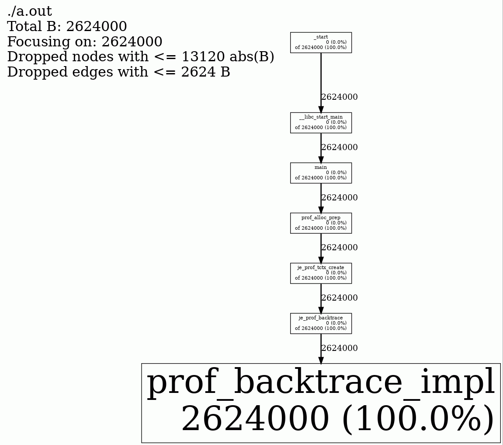

# 内存泄漏的问题

内存泄漏的表项形式多种多样，不同的泄漏形式需要使用不同的工具来分析。
如果内存的使用随着程序运行而不断的增长，但是在进程退出的时候又完全释放干净，
那么这种内存泄漏就是假泄漏。这些泄漏形式如果要 valgrind 来检查，那么 valgrind 会
报告没有内存泄漏。因此 Valgrind 不适合用来分析这种形式的问题。

Jemalloc 也提供了内存泄漏的检测功能，一样可以在进程退出的时候报告内存泄漏的情况。
但是这个功能会遇到和 valgrind 一样的问题，既在退出的时候内存已经释放干净，检测不到内存泄漏。

Jemalloc 同时它还提供了另一个内存分析的功能：prof.dump。 通过 prof.dump 可以把当前分配的
内存详情给打印到文件，这样我们就可以通过比较前后两次 prof.dump 的情况来分析新增的内存是哪些调用栈分配的。

# 编译 Jemalloc

系统自带的 Jemalloc 可能没有开启 Jemalloc 的 prof 功能，因此需要自己编译。

```shell
sudo yum install -y libunwind-devel
sudo yum install -y graphviz
sudo sudo yum install -y graphviz-gd

wget https://github.com/jemalloc/jemalloc/archive/refs/tags/5.3.0.tar.gz
tar -xf 5.3.0.tar.gz
cd jemalloc-5.3.0 
./autogen.sh
./configure --enable-prof --enable-prof-libunwind
make -j8
sudo make install
```

# 测试程序

```C
#include <stdlib.h>
#include <stdio.h>
#include <string.h>

int main(int argc, char **argv)
{
   void *p;
   int   i;

   for (i = 0; i < 4096; i++) {
       p = malloc(1024);
       memset(p, 0, 1024);
       strncpy(p, "abc", 3);
   }
   return 0;
}
```

我们使用这个命令来编译测试程序

```shell
gcc -O2 -g -fno-omit-frame-pointer main.c
```

执行上述命令后，我们可以在当前目录下看到 `a.out` 这个可执行程序。

# Jemalloc prof.dump 的使用

怎么使用 Jemalloc 的 prof.dump 功能呢？官方有三种建议

1. 每分配指定字节的内存后执行一次
2. 每当使用的虚拟内存达到一个新高时执行一次
3. 手动调用 prof.dump 的功能

我们来分别看看怎么使用这些建议


## 每分配指定字节方式

```shell
export LD_PRELOAD=/usr/local/lib/libjemalloc.so
export MALLOC_CONF=prof:true,lg_prof_interval:20
./a.out
```

执行上述命令以后，我们可以在当前目录下看到以 `jeprof.out.` 开头的文件。

```shell
$ ls -l jeprof.out*
-rw-r--r-- 1 xxx xxxx 5195 Apr  4 23:30 jeprof.out.960943.0.i0.heap
-rw-r--r-- 1 xxx xxxx 5195 Apr  4 23:30 jeprof.out.960943.1.i1.heap
-rw-r--r-- 1 xxx xxxx 5195 Apr  4 23:30 jeprof.out.960943.2.i2.heap
```

```shell
jeprof --gif ./a.out --show_bytes  --base=jeprof.out.960943.0.i0.heap  jeprof.out.960943.2.i2.heap > jeprof.memleak.gif
```



通过该图我们可以看到，内存是在main函数分配的。

我们还可以指定 `opt.lg_prof_sample` 这个参数。这个参数主要用来调整采样的频度。
采样越频繁，那么开销越大，精度也越高；采样也稀疏开销越小，开销越小，偏差也就越大。
这个参数的单位是字节，也就是每分配多少个字节才采样一次。这里是以对数为单位，因此如果
参数值是10，那么就是 2^10 字节，也就是 1k。


比如上面的命令可以换成这样子

```shell
export MALLOC_CONF="prof:true,prof_prefix:jeprof.out,lg_prof_interval:20,lg_prof_sample:5"
export LD_PRELOAD=/usr/local/lib/libjemalloc.so
./a.out
```

如果想让程序在退出之前也打印一下内存分配的情况，可以增加 `opt.prof_final` 选项。比如：

```shell
export MALLOC_CONF="prof:true,prof_prefix:jeprof.out,lg_prof_interval:20,lg_prof_sample:5,prof_final:true"
export LD_PRELOAD=/usr/local/lib/libjemalloc.so
./a.out
```

## 每次新高就执行的方式

```shell
export MALLOC_CONF="prof:true,prof_prefix:jeprof.out,prof_gdump:true"
export LD_PRELOAD=/usr/local/lib/libjemalloc.so
./a.out
```

通过执行上面的命令行，我们可以看到当前目录下产生了大量的 jeprof.out 的文件。

```shell
$ ls | grep jeprof.out | wc -l
1032
```

## 手动调用的方式

手动调用的方式需要修改代码，但是这个很多时候恰恰是我们想要的。比如进程启动初始化的时候
会有大量的内存分别，但是我们并不关心。因此我们希望在进程启动初始化完成以后开始第一次导出数据。
然后再运行指定功能之后再导出一次 heap 分配是数据。这样子我们就可以得到相对干净的内存分配情况。

```C
mallctl("prof.dump", NULL, NULL, NULL, 0);
```

我们需要在程序中指定的位置调用上面这个函数。

以 OpenResty 为例，它可以通过 FFI 调用 C 函数而无需重新编译。
我们在 OpenResty 的 init_by_lua 阶段调用 prof.dump。
那么 `nginx -s reload` 执行后就会再次执行 init_by_lua。
我们就可以得到两次 init_by_lua 之间的内存差异了。

```nginx
    init_by_lua_block {
        local ffi = require "ffi"
        local C = ffi.C

        ffi.cdef[[
          int mallctl(	const char *name,
           	void *oldp,
           	size_t *oldlenp,
           	void *newp,
           	size_t newlen);
        ]]

        C.mallctl("prof.dump", NULL, NULL, NULL, 0)
    }
```


在执行可执行程序的时候，我们一样需要在命令行上指定一些参数，比如

```shell
export MALLOC_CONF=prof:true
export LD_PRELOAD=/usr/local/lib/libjemalloc.so
./sbin/nginx -s reload
```

# 参考文档

https://github.com/jemalloc/jemalloc/wiki/Use-Case%3A-Heap-Profiling
