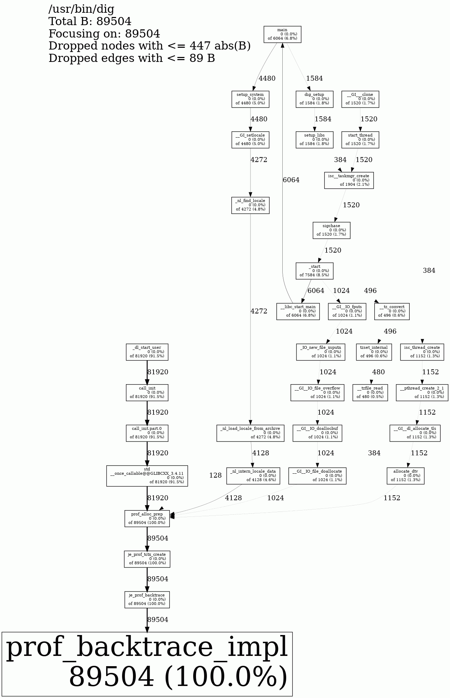

# 内存泄漏的问题

一般情况下，我们提到内存泄漏就是指忘记调用内存释放函数释放内存了的情况。
我们可以使用 valgrind 来检测内存泄漏，但是 valgrind 运行速度很慢，会让程序运行速度下降
成百上千倍，因此在一些场景下我们无法接受。比如，运行大量的测试的时候，
我们不希望等待太久才知道最终结果；线上环境使用 valgrind 则完全无法提供正常服务。

对于线上环境使用 Jemalloc 的 prof_leak 来分析内存泄漏就非常合适。我们看看具体怎么使用。

# 编译 Jemalloc

参考 [Jemalloc 编译](./2023-04-04-how-to-analyze-memory-leak.md/#编译-jemalloc) 这个章节

# 测试的 C 程序

```C
#include <stdlib.h>
#include <stdio.h>
#include <string.h>

void __attribute__ ((noinline)) leak_test()
{
   void *p;
   int   i;

   for (i = 0; i < 4096; i++) {
       p = malloc(1024);
       memset(p, 0, 1024);
       strncpy(p, "abc", 3);
   }
}

int main(int argc, char **argv)
{
    leak_test();

    return 0;
}
```

我们使用这个命令来编译测试程序

```shell
gcc -O2 -g main.c
```

执行上述命令后，我们可以在当前目录下看到 `a.out` 这个可执行程序。

# 运行 Jemalloc

```shell
$ export MALLOC_CONF=prof_leak:true,lg_prof_sample:0,prof_final:true
$ export LD_PRELOAD=/usr/local/lib/libjemalloc.so
$ ./a.out

<jemalloc>: Leak approximation summary: ~4276224 bytes, ~4097 objects, >= 2 contexts
<jemalloc>: Run jeprof on dump output for leak detail
```

可以看到，Jemalloc 报告约 4276244 字节的内存泄漏，约 4097 个对象没有释放，并且提示我们
执行 `jeprof` 来查看详情。

```shell
$ jeprof --text a.out jeprof.25861.0.f.heap

Total: 4.1 MB
     4.1 100.0% 100.0%      4.1 100.0% prof_backtrace_impl
     0.0   0.0% 100.0%      4.0  98.1% __libc_start_main
     0.0   0.0% 100.0%      0.1   1.9% _dl_start_user
     0.0   0.0% 100.0%      4.0  98.1% _start
     0.0   0.0% 100.0%      0.1   1.9% call_init
     0.0   0.0% 100.0%      0.1   1.9% call_init.part.0
     0.0   0.0% 100.0%      4.1 100.0% je_prof_backtrace
     0.0   0.0% 100.0%      4.1 100.0% je_prof_tctx_create
     0.0   0.0% 100.0%      4.0  98.1% leak_test
     0.0   0.0% 100.0%      4.0  98.1% main
     0.0   0.0% 100.0%      4.1 100.0% prof_alloc_prep
     0.0   0.0% 100.0%      0.1   1.9% std::__once_callable@@GLIBCXX_3.4.11
```

可以看到上面有一个 `leak_test` -> `main` 这样的调用栈

# Jemalloc 分析真实的程序

```shell
rm jeprof.*
export MALLOC_CONF=prof_leak:true,lg_prof_sample:0,prof_final:true
export LD_PRELOAD=/usr/local/lib/libjemalloc.so
dig @1.1.1.1 example.com
```

执行上述程序后，我们用文本的形式看看哪些调用栈发生了内存泄漏。
但是这个图并不是调用栈的形式，我们很难看懂是哪里发生了内存泄漏。

```shell
$ jeprof --text  /usr/bin/dig jeprof.30246.0.f.heap
Using local file /usr/bin/dig.
Using local file jeprof.30246.0.f.heap.
Total: 0.1 MB
     0.1 100.0% 100.0%      0.1 100.0% prof_backtrace_impl
     0.0   0.0% 100.0%      0.0   1.1% _IO_new_file_xsputn
     0.0   0.0% 100.0%      0.0   1.1% __GI__IO_doallocbuf
     0.0   0.0% 100.0%      0.0   1.1% __GI__IO_file_doallocate
     0.0   0.0% 100.0%      0.0   1.1% __GI__IO_file_overflow
     0.0   0.0% 100.0%      0.0   1.1% __GI__IO_fputs
     0.0   0.0% 100.0%      0.0   1.7% __GI___clone
     0.0   0.0% 100.0%      0.0   0.3% __GI___strdup
     0.0   0.0% 100.0%      0.0   1.3% __GI__dl_allocate_tls
     0.0   0.0% 100.0%      0.0   5.0% __GI_setlocale
     0.0   0.0% 100.0%      0.0   6.8% __libc_start_main
     0.0   0.0% 100.0%      0.0   1.3% __pthread_create_2_1
     0.0   0.0% 100.0%      0.0   0.5% __pthread_once_slow
     0.0   0.0% 100.0%      0.0   0.6% __tz_convert
     0.0   0.0% 100.0%      0.0   0.5% __tzfile_read
     0.0   0.0% 100.0%      0.0   0.1% __tzstring_len
     0.0   0.0% 100.0%      0.1  91.5% _dl_start_user
     0.0   0.0% 100.0%      0.0   4.8% _nl_find_locale
     0.0   0.0% 100.0%      0.0   4.6% _nl_intern_locale_data
     0.0   0.0% 100.0%      0.0   4.8% _nl_load_locale_from_archive
     0.0   0.0% 100.0%      0.0   8.5% _start
     0.0   0.0% 100.0%      0.0   1.3% allocate_dtv
     0.0   0.0% 100.0%      0.1  91.5% call_init
     0.0   0.0% 100.0%      0.1  91.5% call_init.part.0
     0.0   0.0% 100.0%      0.0   1.8% dig_setup
     0.0   0.0% 100.0%      0.0   0.0% dns_lib_initmsgcat
     0.0   0.0% 100.0%      0.0   0.4% dns_resolver_setnonbackofftries
     0.0   0.0% 100.0%      0.0   0.1% dst__privstruct_writefile
     0.0   0.0% 100.0%      0.0   0.1% dst_lib_init2
     0.0   0.0% 100.0%      0.0   0.0% dst_lib_initmsgcat
     0.0   0.0% 100.0%      0.0   0.4% isc__socketmgr_create2
     0.0   0.0% 100.0%      0.0   2.1% isc__taskmgr_create
     0.0   0.0% 100.0%      0.0   0.4% isc__timermgr_create
     0.0   0.0% 100.0%      0.0   0.0% isc_lib_initmsgcat
     0.0   0.0% 100.0%      0.0   0.1% isc_msgcat_open
     0.0   0.0% 100.0%      0.0   0.4% isc_regex_validate
     0.0   0.0% 100.0%      0.0   0.3% isc_result_register
     0.0   0.0% 100.0%      0.0   0.2% isc_result_registerids
     0.0   0.0% 100.0%      0.0   1.3% isc_thread_create
     0.0   0.0% 100.0%      0.1 100.0% je_prof_backtrace
     0.0   0.0% 100.0%      0.1 100.0% je_prof_tctx_create
     0.0   0.0% 100.0%      0.0   6.8% main
     0.0   0.0% 100.0%      0.0   0.0% new_composite_name
     0.0   0.0% 100.0%      0.1 100.0% prof_alloc_prep
     0.0   0.0% 100.0%      0.0   1.8% setup_libs
     0.0   0.0% 100.0%      0.0   5.0% setup_system
     0.0   0.0% 100.0%      0.0   1.7% sigchase
     0.0   0.0% 100.0%      0.0   1.7% start_thread
     0.0   0.0% 100.0%      0.1  91.5% std::__once_callable@@GLIBCXX_3.4.11
     0.0   0.0% 100.0%      0.0   0.6% tzset_internal
```

将调用栈转换成图形的形式就方便查看问题了，我们执行以下命令生成图片来分析。

```shell
jeprof --show_bytes --gif /usr/bin/dig jeprof.*.heap > dig-leak.gif
```



从上图可以看到，从 main 函数出发总共泄漏了 6.8% 的内存。而真正泄漏内存的函数不是 main，而是 allocate_dtv 等其它函数。因此，在需要查看具体哪些函数发生内存泄漏的时候最好是转换成图形来分析。

另外，从上面的这个图可以看到，还有其它函数会调用到 main 函数，形成了一个环。这里我们就不关心具体的细节了。

# 图形的函数调用栈是怎么得到的

上面的函数调用图是通过 jeprof 得到的，而 jeprof 是分析 jeprof.30246.0.f.heap 这样的数据文件。我们看看 jeprof.30246.0.f.heap 里面都有什么。

```text
heap_v2/1
  t*: 48: 89504 [0: 0]
  t0: 42: 87984 [0: 0]
  t1: 6: 1520 [0: 0]
@ 0x7f406b02a8ad 0x7f406b02ae40 0x7f406b01d3fb 0x7f406afaf87d 0x7f4067b4c705 0x7f4067b4e004 0x7f4067b4d127 0x7f4067b4d369 0x5645b67ea75f 0x5645b67fdcb5 0x7f406a09cf5e 0x7f40681981ce 0x7f4067a9be72
  t*: 2: 64 [0: 0]
  t1: 2: 64 [0: 0]
....
MAPPED_LIBRARIES:
5645b67e1000-5645b6807000 r-xp 00000000 fd:00 1709630                    /usr/bin/dig
5645b6a07000-5645b6a08000 r--p 00026000 fd:00 1709630                    /usr/bin/dig
5645b6a08000-5645b6a09000 rw-p 00027000 fd:00 1709630                    /usr/bin/dig
5645b6a09000-5645b6a0a000 rw-p 00000000 00:00 0
7f4052c00000-7f4053000000 rw-p 00000000 00:00 0
7f4053147000-7f40600fd000 r--p 00000000 fd:00 67789587                   /usr/lib/locale/locale-arc
hive
7f40600fd000-7f4063dfd000 rw-p 00000000 00:00 0
7f4063dfd000-7f4063dfe000 ---p 00000000 00:00 0
...
```

我们可以把整个文件分成三个部分：

  - 第一部分 `heap_v2/1` 应该是输出文件的格式。`t*` 代表所有线程，`t0`, `t1` 代表两个具体的线程。

  - 第二部分是调用栈，以 @ 开头，比如：@ 0x7f406b02a8ad 0x7f406b02ae40 0x7f406b01d3fb 0x7f406afaf87d 0x7f4067b4c705 0x7f4067b4e004 0x7f406。

  - 第三部分 MAPPED_LIBRARIES 是进程的内存空间布局。

有了这三分部分，我们就知道怎么得到函数调用栈了。

比如 0x7f4067a9be72 这个地址是在 7f4067a62000-7f4067c1e000 这个范围，这个范围对应的是 libc 的加载地址。

```text
7f4067a62000-7f4067c1e000 r-xp 00000000 fd:00 67815250                   /usr/lib64/libc-2.28.so
7f4067c1e000-7f4067e1e000 ---p 001bc000 fd:00 67815250                   /usr/lib64/libc-2.28.so
7f4067e1e000-7f4067e22000 r--p 001bc000 fd:00 67815250                   /usr/lib64/libc-2.28.so
7f4067e22000-7f4067e24000 rw-p 001c0000 fd:00 67815250                   /usr/lib64/libc-2.28.so
```

我们用 0x7f4067a9be72 - 0x7f4067a62000 得到 0x39e72。可以用如下的 Python 脚本计算：

```shell
python3 -c "print('0x{:02x}'.format(0x7f4067a9be72 - 0x7f4067a62000))"
```

这时候我们就可以通过 addr2line 计算 0x3bbe72 对应的函数名称了。

```shell
addr2line -f -i -e /usr/lib64/libc-2.28.so -a 0x39e72
0x0000000000039e72
__GI___clone
../sysdeps/unix/sysv/linux/x86_64/clone.S:95
```

再回到上面 jeprof 生成的图片中，你会发现一样有 __GI___clone 这个函数。
