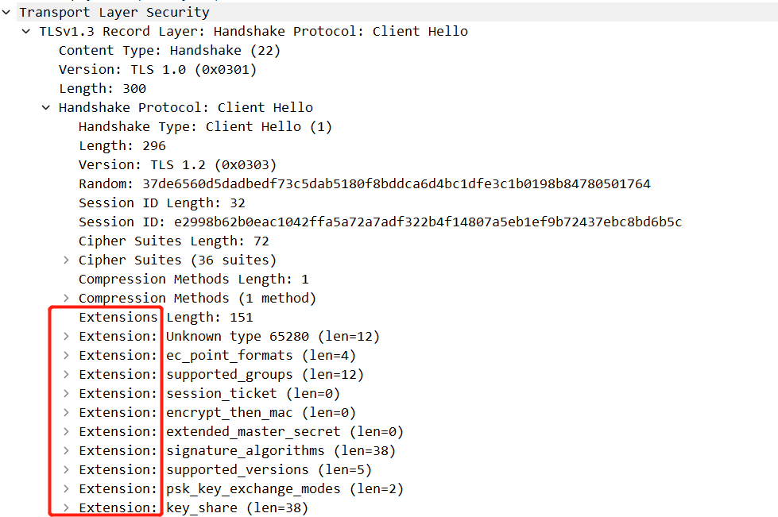
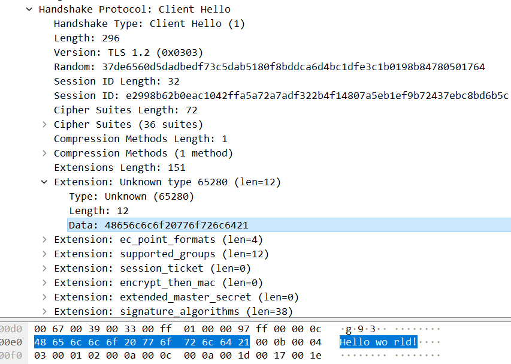

TLS 协议本身已经定义了很多标准的扩展头字段，同事它允许用户添加自定义的扩展头字段，
这就给我们增加新的功能添加了无限的想象空间。 

比如我们需要在 SSL 握手完成之前做一些动作，那么我们可以给 Client Hello 这个扩展头添加
一个扩展字段来实现我们的目的。因为这个字段是明文，因此我们不能在这里传输明文的敏感信息。

比如下图中的红框部分就是一些扩展头




那么我们如何添加扩展头呢？我们就以向 Client Hello 消息添加一个扩展头字段作为例子来演示如何添加扩展头。

# 客户端 C 代码

以下代码通过 SSL_CTX_add_custom_ext 函数添加了一个扩展头，扩展头的内容是 "Hello world!"

我们通过 wireshark 抓包可以看到这个扩展头的内容：



```C
#include <stdio.h>
#include <errno.h>
#include <unistd.h>
#include <malloc.h>
#include <string.h>
#include <sys/socket.h>
#include <resolv.h>
#include <netdb.h>
#include <openssl/ssl.h>
#include <openssl/err.h>

#define TEST_EXT_TYPE1  0xff00
#define FAIL    -1

static void ShowCerts(SSL *ssl);

static int
new_add_cb(SSL *s, unsigned int ext_type, unsigned int context,
           const unsigned char **out, size_t *outlen, X509 *x,
           size_t chainidx, int *al, void *ctx)
{
    size_t len;
    const char *ctx_info = (const char *)ctx;
    unsigned char *data;
    len = strlen(ctx_info);
    data = OPENSSL_malloc(len);

    if (data == NULL) {
        return -1;
    }

    memcpy(data, ctx_info, len);
    *out = data;
    *outlen = len;
    return 1;
}

static void
new_free_cb(SSL *s, unsigned int ext_type, unsigned int context,
            const unsigned char *out, void *add_arg)
{
    OPENSSL_free((unsigned char *)out);
}

static int
OpenConnection(const char *hostname, int port)
{
    int sd;
    struct hostent *host;
    struct sockaddr_in addr;

    if ((host = gethostbyname(hostname)) == NULL) {
        perror(hostname);
        abort();
    }

    sd = socket(PF_INET, SOCK_STREAM, 0);
    bzero(&addr, sizeof(addr));
    addr.sin_family = AF_INET;
    addr.sin_port = htons(port);
    addr.sin_addr.s_addr = *(long *)(host->h_addr);

    if (connect(sd, (struct sockaddr *)&addr, sizeof(addr)) != 0) {
        close(sd);
        perror(hostname);
        abort();
    }

    return sd;
}

SSL_CTX *
InitCTX(void)
{
    const SSL_METHOD *method;
    SSL_CTX *ctx;
    unsigned int context;
    const char *ctx_info = "Hello world!";
    OpenSSL_add_all_algorithms();  /* Load cryptos, et.al. */
    SSL_load_error_strings();   /* Bring in and register error messages */
    method = TLS_client_method();  /* Create new client-method instance */
    ctx = SSL_CTX_new(method);   /* Create new context */

    if (ctx == NULL) {
        ERR_print_errors_fp(stderr);
        abort();
    }

    context = SSL_EXT_CLIENT_HELLO;

    if (!SSL_CTX_add_custom_ext(ctx, TEST_EXT_TYPE1, context,
                                new_add_cb, new_free_cb,
                                (void *) ctx_info, NULL, NULL)) {
    }

    return ctx;
}

static void
ShowCerts(SSL *ssl)
{
    X509 *cert;
    char *line;
    cert = SSL_get_peer_certificate(ssl); /* get the server's certificate */

    if (cert != NULL) {
        printf("Server certificates:\n");
        line = X509_NAME_oneline(X509_get_subject_name(cert), 0, 0);
        printf("Subject: %s\n", line);
        free(line);       /* free the malloc'ed string */
        line = X509_NAME_oneline(X509_get_issuer_name(cert), 0, 0);
        printf("Issuer: %s\n", line);
        free(line);       /* free the malloc'ed string */
        X509_free(cert);     /* free the malloc'ed certificate copy */

    } else {
        printf("Info: No client certificates configured.\n");
    }
}

int
main(int count, char *strings[])
{
    SSL_CTX *ctx;
    int server;
    SSL *ssl;
    char buf[1024];
    char acClientRequest[1024] = {0};
    int bytes;
    char *hostname, *portnum;

    if (count != 3) {
        printf("usage: %s <hostname> <portnum>\n", strings[0]);
        exit(0);
    }

    SSL_library_init();
    hostname = strings[1];
    portnum = strings[2];
    ctx = InitCTX();
    server = OpenConnection(hostname, atoi(portnum));
    ssl = SSL_new(ctx);      /* create new SSL connection state */
    SSL_set_fd(ssl, server);    /* attach the socket descriptor */

    if (SSL_connect(ssl) == FAIL) {   /* perform the connection */
        ERR_print_errors_fp(stderr);

    } else {
        char acUsername[16] = {0};
        char acPassword[16] = {0};
        const char *cpRequestMessage = "<Body>\
                               <UserName>%s<UserName>\
                 <Password>%s<Password>\
                 </Body>";
        printf("Enter the User Name : ");
        scanf("%s", acUsername);
        printf("Enter the Password : ");
        scanf("%s", acPassword);
        sprintf(acClientRequest, cpRequestMessage, acUsername,
                acPassword);  /* construct reply */
        printf("Connected with %s encryption\n", SSL_get_cipher(ssl));
        ShowCerts(ssl);        /* get any certs */
        SSL_write(ssl, acClientRequest,
                  strlen(acClientRequest));  /* encrypt & send message */
        bytes = SSL_read(ssl, buf, sizeof(buf)); /* get reply & decrypt */
        buf[bytes] = 0;
        printf("Received: \"%s\"\n", buf);
        SSL_free(ssl);        /* release connection state */
    }

    close(server);         /* close socket */
    SSL_CTX_free(ctx);        /* release context */
    return 0;
}
```

# 服务端 C 代码

在服务端的代码中，我们一样通过 SSL_CTX_add_custom_ext 这个函数来添加扩展头的回调函数。与客户端不同的是，这里我们需要的是解析扩展头。

```C
#include "openssl/err.h"
#include "openssl/ssl.h"
#include <arpa/inet.h>
#include <errno.h>
#include <malloc.h>
#include <netinet/in.h>
#include <resolv.h>
#include <string.h>
#include <sys/socket.h>
#include <sys/types.h>
#include <unistd.h>

#define TEST_EXT_TYPE1  0xff00
#define FAIL -1

static int
new_parse_cb(SSL *s, unsigned int ext_type, unsigned int context,
             const unsigned char *in, size_t inlen, X509 *x,
             size_t chainidx, int *al, void *parse_arg)
{
    printf("receive: %.*s\n", (int)inlen, in);
    return 1;
}


// Create the SSL socket and intialize the socket address structure
int
OpenListener(int port)
{
    int sd;
    struct sockaddr_in addr;
    sd = socket(PF_INET, SOCK_STREAM, 0);
    bzero(&addr, sizeof(addr));
    addr.sin_family = AF_INET;
    addr.sin_port = htons(port);
    addr.sin_addr.s_addr = INADDR_ANY;

    if (bind(sd, (struct sockaddr *)&addr, sizeof(addr)) != 0) {
        perror("can't bind port");
        abort();
    }

    if (listen(sd, 10) != 0) {
        perror("Can't configure listening port");
        abort();
    }

    return sd;
}

SSL_CTX *
InitServerCTX(void)
{
    const SSL_METHOD *method;
    SSL_CTX *ctx;
    OpenSSL_add_all_algorithms(); /* load & register all cryptos, etc. */
    SSL_load_error_strings();     /* load all error messages */
    method = TLS_server_method(); /* create new server-method instance */
    unsigned int context = SSL_EXT_CLIENT_HELLO;
    ctx = SSL_CTX_new(method);    /* create new context from method */

    if (ctx == NULL) {
        ERR_print_errors_fp(stderr);
        abort();
    }

    if (!SSL_CTX_add_custom_ext(ctx, TEST_EXT_TYPE1, context,
                                NULL, NULL, NULL, new_parse_cb, ctx)) {
        fprintf(stderr, "SSL_CTX_add_custom_ext failed\n");
    }

    return ctx;
}

void
LoadCertificates(SSL_CTX *ctx, char *CertFile, char *KeyFile)
{
    /* set the local certificate from CertFile */
    if (SSL_CTX_use_certificate_file(ctx, CertFile, SSL_FILETYPE_PEM) <= 0) {
        ERR_print_errors_fp(stderr);
        abort();
    }

    /* set the private key from KeyFile (may be the same as CertFile) */
    if (SSL_CTX_use_PrivateKey_file(ctx, KeyFile, SSL_FILETYPE_PEM) <= 0) {
        ERR_print_errors_fp(stderr);
        abort();
    }

    /* verify private key */
    if (!SSL_CTX_check_private_key(ctx)) {
        fprintf(stderr, "Private key does not match the public certificate\n");
        abort();
    }
}

void
ShowCerts(SSL *ssl)
{
    X509 *cert;
    char *line;
    cert = SSL_get_peer_certificate(ssl); /* Get certificates (if available) */

    if (cert != NULL) {
        printf("Server certificates:\n");
        line = X509_NAME_oneline(X509_get_subject_name(cert), 0, 0);
        printf("Subject: %s\n", line);
        free(line);
        line = X509_NAME_oneline(X509_get_issuer_name(cert), 0, 0);
        printf("Issuer: %s\n", line);
        free(line);
        X509_free(cert);

    } else {
        printf("No certificates.\n");
    }
}

void
Servlet(SSL *ssl) /* Serve the connection -- threadable */
{
    char buf[1024] = {0};
    int sd, bytes;
    const char *ServerResponse = "<Body>\
        <Name>zhuizhuhaomeng.com</Name>\
        <BlogType>Performace Optimization</BlogType>\
        <Author>lijunlong<Author>\
        </Body>";
    const char *cpValidMessage = "<Body>\
        <UserName>zhuizhuhaomeng<UserName>\
        <Password>123456<Password>\
        </Body>";

    if (SSL_accept(ssl) == FAIL) { /* do SSL-protocol accept */
        ERR_print_errors_fp(stderr);

    } else {
        ShowCerts(ssl);                          /* get any certificates */
        bytes = SSL_read(ssl, buf, sizeof(buf)); /* get request */
        buf[bytes] = '\0';
        printf("Client msg: \"%s\"\n", buf);

        if (bytes > 0) {
            if (strcmp(cpValidMessage, buf) == 0) {
                SSL_write(ssl, ServerResponse, strlen(ServerResponse)); /* send reply */

            } else {
                SSL_write(ssl, "Invalid Message",
                          strlen("Invalid Message")); /* send reply */
            }

        } else {
            ERR_print_errors_fp(stderr);
        }
    }

    sd = SSL_get_fd(ssl); /* get socket connection */
    SSL_free(ssl);        /* release SSL state */
    close(sd);            /* close connection */
}

int
main(int argv, char *argc[])
{
    SSL_CTX *ctx;
    int server;
    char *portnum;

    if (argv != 2) {
        printf("Usage: %s <portnum>\n", argc[0]);
        exit(0);
    }

    // Initialize the SSL library
    SSL_library_init();
    portnum = argc[1];
    ctx = InitServerCTX();
    LoadCertificates(ctx, "mycert.pem", "mycert.key"); /* load certs */
    server = OpenListener(atoi(portnum));

    while (1) {
        struct sockaddr_in addr;
        socklen_t len = sizeof(addr);
        SSL *ssl;
        int client = accept(server, (struct sockaddr *)&addr, &len);
        printf("Connection: %s:%d\n", inet_ntoa(addr.sin_addr),
               ntohs(addr.sin_port));
        ssl = SSL_new(ctx);      /* get new SSL state with context */
        SSL_set_fd(ssl, client); /* set connection socket to SSL state */
        Servlet(ssl);            /* service connection */
    }

    close(server);     /* close server socket */
    SSL_CTX_free(ctx); /* release context */
}
```

# 代码编译

```shell
gcc -Wall -o client  client.c -L/usr/lib -lssl -lcrypto
gcc -Wall -o server server.c -L/usr/lib -lssl -lcrypto
```

# 生成证书

使用下述脚本生成测试证书

```shell
#! /usr/bin/env bash

openssl req -new -newkey rsa:2048 -days 3650 -nodes -x509 \
    -subj "/C=CN/ST=Beijing/L=Beijing/O=Dev/CN=root.test.com" \
    -keyout ca.key -out ca.crt

openssl req -new -newkey rsa:2048 -nodes \
    -keyout mycert.key -out mycert.csr \
    -subj "/C=CN/ST=Beijing/L=Beijing/O=Dev/CN=server.com"

openssl x509 -req -days 365 -in mycert.csr -CA ca.crt -CAkey ca.key -set_serial "0x`openssl rand -hex 8`" -out mycert.pem
```


# 运行结果

```shell
$ ./server 1988
Connection: 127.0.0.1:46026
receive: Hello world!
No certificates.
```

可以看到，我们成功的解析了扩展头，得到 "Hello world 这个消息"。
