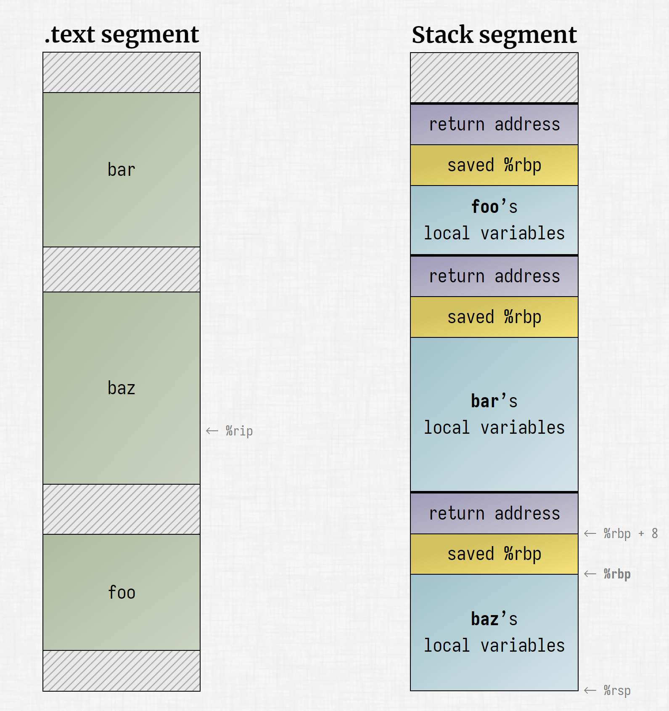
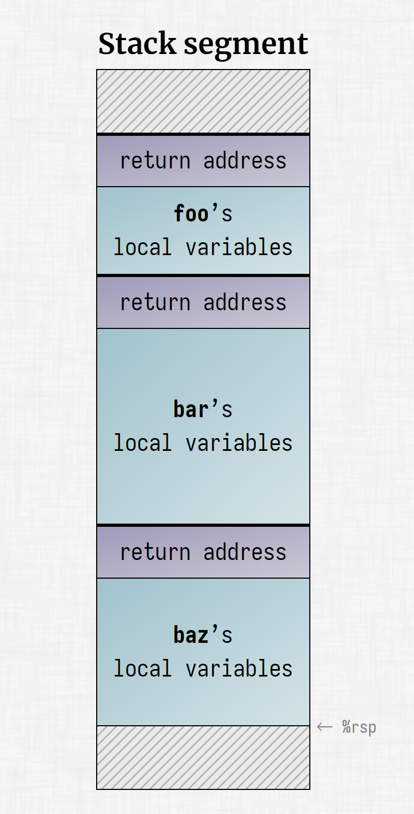
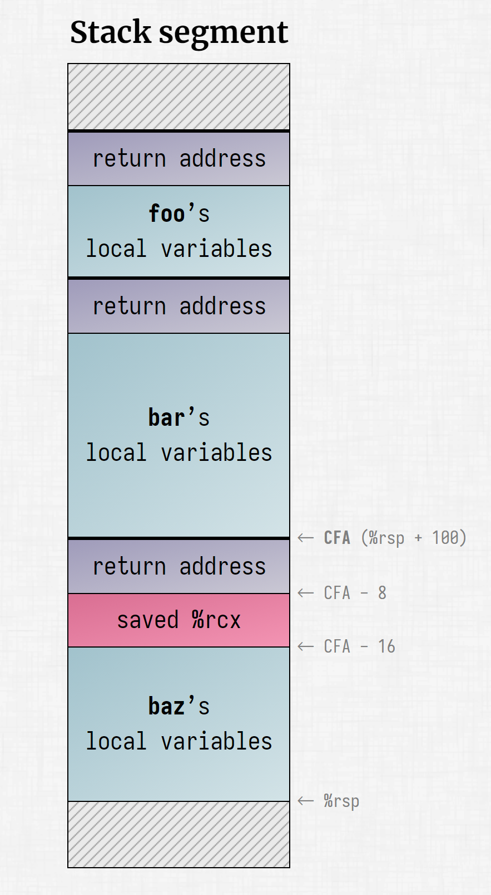

> 为了防止原文丢失，把该文章翻译成中文备份。原文地址：https://lesenechal.fr/en/linux/unwinding-the-stack-the-hard-way

Kévin Lesénéchal
15 April 2023

> 假设你有一个 C 语言或 Rust 语言的程序，这个程序有一个错误。你在终端看到的只是可怕的分段错误（核心转储）。那么......假设这是一个 C 语言程序。你想知道发生了什么，甚至想修复它！普通人会启动 `GDB` 并运行 `bt` 来获得回溯；但我们不是普通人，我们喜欢受罪。我们将自己进行回溯，我指的不是调用 `backtrace()`：那是一种新手的解决方案。不，`libunwind` 也不行；真正的开发人员会自己徒手解开堆栈。在本文中，我们将深入探讨堆栈解卷、异常处理、调用帧的复杂性，并对 `ELF` 和 `DWARF 进行剖析。

Table of contents
- [只需使用帧指针](#只需使用帧指针)
- [.eh_frame: 调用帧信息 call frame information (CFI)](#eh_frame-调用帧信息-call-frame-information-cfi)
- [cfa规范帧地址](#cfa规范帧地址)
- [寄存器规则](#寄存器规则)
- [Call frame instructions](#调用帧指令)
- [DWARF expressions](#dwarf-表达式)
- [Generating CFI from assembly](#从汇编代码生成-cfi)
- [.eh_frame_hdr: binary search lookup table](#eh_frame_hdr二分查找查找表)
- [Implementing the backtrace](#实现回溯)
  - [使用 gimli 解析 .eh_frame 和 .eh_frame_hdr](#使用-gimli-解析-eh_frame-和-eh_frame_hdr)
  - [设计我们的堆栈展开器](#设计我们的堆栈展开器)
  - [寄存器组](#寄存器组)
  - [展开堆栈](#展开堆栈)
  - [Going further](#更进一步)
- [References](#参考)

我正在为我的个人项目 Nucloid 做一些编程工作，这是一个用 `Rust` 编写的内核。有一次，由于页表有问题，内核出现了页面故障。像往常一样，内核崩溃了，机器状态被转储：


```shell
PANIC! Invalid read at 00000000'00010000: page is not mapped
rax=00000000'00010000  rbx=ffff8000'00b40b38  rcx=ffff8000'0164cf00  rdx=ffff8000'00b03bd0
rdi=ffff8000'00b40210  rsi=00000000'00000000  rbp=00000000'00000000  rsp=ffff8000'00b3f798
 r8=00000000'00000000   r9=ffff8000'0018d200  r10=00000000'0000003d  r11=ffff8000'00180e10
r12=00000000'00000000  r13=00000000'00000000  r14=00000000'00000000  r15=00000000'00000000
rip=ffff8000'0010c93e      cs=0008   ss=0010   ds=0000   es=0000   fs=0000   gs=0000
```

但是缺少堆栈跟踪！根据 `%rip` 值（0xffff8000'0010c93e），我们可以确定故障指令位于哪个函数中。但谁在调用我们呢？这毕竟是一个重要信息！尤其是如果该指令恰好位于标准库中，那么知道 `Result::unwrap()` 抛出 `panic` 也无济于事。

对于普通程序，我们有调试器，内核也提供了 `ptrace` 等机制来处理此类任务。但谁来调试内核呢？当然不是调试器。内核必须自行调试。通常情况下，程序不会尝试自我调试--但我见过程序处理 `SIGSEGV`：看在上帝的份上，别这么做！不过，内核不是普通的程序，如果它想提供一定的调试体验，就必须自己处理。

于是，我开始研究如何在独立环境中计算堆栈跟踪。一般的解决方案都是使用 GNU 扩展的 `backtrace()` 函数，但这是行不通的。还有 `libunwind` 我不知道它是否有用，我从来没试过：我只是告诉自己，我要自己开发一个回溯函数，这并不难，我听说过帧指针或 `%rbp` 这类东西。

当时，我完全不知道自己即将进入的是一个怎样的兔子洞。如果我当时知道需要做什么，我可能就不会开始了。幸运的是，我当时既不了解情况，又天真无邪，真是不幸中的万幸。当迷雾终于散去，当我意识到堆栈跟踪需要什么时，一切都为时已晚：我太投入了，做了太多的研究，我必须完成。

所以，还是做帧指针吧，今天就到此为止。

# 只需使用帧指针

有些人可能听说过帧指针；在 `x86-64` 上，帧指针指的是 `%rbp` 寄存器：它包含当前函数调用帧内一个固定点的地址。每次进入或离开函数时，该寄存器都会更新。只要读取 `%rbp` 寄存器，就能知道当前调用帧的起始位置。此外，在堆栈的该地址上还保存着调用函数 `%rbp` 的前一个值。有了这个参考点，我们就可以使用相对地址来访问调用帧中的特定元素：返回地址、局部变量，甚至一些通过堆栈传递的参数。



在本例中，我们有三个函数：`foo` 调用 `bar`，`baz` 调用 `baz`。需要提醒大家的是，在 `x86` 系统中，堆栈会向下扩展到较低的地址。`%rsp` 指向堆栈底部，即最后推送的值。`%rbp` 提供当前（最后）调用帧的信息。要访问之前的调用帧，我们只需读取保存在堆栈中 `%rbp` 所含地址处的前一个 `%rbp` 值。

这样看来，我们要做的就是读取 `%rbp` 寄存器，然后访问 `%rbp + 8` 处的堆栈，找到返回地址。返回地址会告诉我们是哪个函数中的哪条指令调用了我们，这正是堆栈跟踪的意义所在。然后，我们读取 `%rbp` 地址处的堆栈，获取上一个调用帧保存的 `%rbp` 值。然后重复这个过程，浏览 `%rbp` 值的链接列表，直到找到表示第一个调用帧的保存值 0。

这太简单了！我在想，为什么有人要写一整篇文章来介绍这么明显又简单的事情呢？

要是这么简单就好了......有什么问题吗？编译器省略帧指针已经有一段时间了！`x86` 并不是一开始就有很多寄存器，所以有一个空闲的寄存器是很有必要的。

如果没有帧指针 `%rbp`，我们的堆栈看起来就是这样：



我们只剩下 `%rsp`。我们如何找出返回地址呢？它仍然比我们的调用帧顶部低 8 个字节。那我们怎么知道调用帧的顶部在哪里呢？那我们就完蛋了，我们没有这方面的信息。我们需要知道函数的局部变量占用了多少空间，才能从 `%rsp` 中推断出调用帧的起始地址。更糟糕的是，当我们在函数中执行指令时，`%rsp` 会随着局部变量的分配和释放而移动。我们不仅错过了关键信息，而且还瞄准了一个移动的目标。

实际上，这对编译器来说并不是问题：编译器并不需要帧指针，因为编译器在创建调用帧时就已经知道了调用帧的结构、大小、开始位置、返回地址等。但是当编译器编译完我们的程序后，这些信息就会丢失。真的是这样吗？

# .eh_frame: 调用帧信息 call frame information (CFI)

让我们来编译一个非常简单的 C 程序：

```C
#include <stdio.h>

int main() {
    printf("Hello, world!\n");

    return 0;
}
```

```shell
kevin@kevin-desktop:~ » gcc main.c
```

现在，让我们使用出色的 elf-info 命令检查 ELF，并列出所有部分：

```shell
kevin@kevin-desktop:~ » export ELF=a.out
kevin@kevin-desktop:~ » elf sh
───┤ SECTIONS (30) ├─────────────────────────────────────────────────────────
No │ Name                 │ Type         │ Virt. addr.         │ Size                   │
───┼──────────────────────┼──────────────┼─────────────────────┼────────────────────────┤
 0 │                      │ NULL         │ 0x00000000'00000000 │ 0x0000'0000      0 B   │
 1 │ .interp              │ PROGBITS     │ 0x00000000'00000318 │ 0x0000'001c     28 B   │
 2 │ .note.gnu.property   │ NOTE         │ 0x00000000'00000338 │ 0x0000'0040     64 B   │
 3 │ .note.gnu.build-id   │ NOTE         │ 0x00000000'00000378 │ 0x0000'0024     36 B   │
 4 │ .note.ABI-tag        │ NOTE         │ 0x00000000'0000039c │ 0x0000'0020     32 B   │
 5 │ .gnu.hash            │ GNU_HASH     │ 0x00000000'000003c0 │ 0x0000'001c     28 B   │
 6 │ .dynsym              │ DYNSYM       │ 0x00000000'000003e0 │ 0x0000'00a8    168 B   │
 7 │ .dynstr              │ STRTAB       │ 0x00000000'00000488 │ 0x0000'008d    141 B   │
 8 │ .gnu.version         │ GNU_VERSYM   │ 0x00000000'00000516 │ 0x0000'000e     14 B   │
 9 │ .gnu.version_r       │ GNU_VERNEED  │ 0x00000000'00000528 │ 0x0000'0030     48 B   │
10 │ .rela.dyn            │ RELA         │ 0x00000000'00000558 │ 0x0000'00c0    192 B   │
11 │ .rela.plt            │ RELA         │ 0x00000000'00000618 │ 0x0000'0018     24 B   │
12 │ .init                │ PROGBITS     │ 0x00000000'00001000 │ 0x0000'001b     27 B   │
13 │ .plt                 │ PROGBITS     │ 0x00000000'00001020 │ 0x0000'0020     32 B   │
14 │ .text                │ PROGBITS     │ 0x00000000'00001040 │ 0x0000'0113    275 B   │
15 │ .fini                │ PROGBITS     │ 0x00000000'00001154 │ 0x0000'000d     13 B   │
16 │ .rodata              │ PROGBITS     │ 0x00000000'00002000 │ 0x0000'0012     18 B   │
17 │ .eh_frame_hdr        │ PROGBITS     │ 0x00000000'00002014 │ 0x0000'0024     36 B   │
18 │ .eh_frame            │ PROGBITS     │ 0x00000000'00002038 │ 0x0000'007c    124 B   │
19 │ .init_array          │ INIT_ARRAY   │ 0x00000000'00003dd0 │ 0x0000'0008      8 B   │
20 │ .fini_array          │ FINI_ARRAY   │ 0x00000000'00003dd8 │ 0x0000'0008      8 B   │
21 │ .dynamic             │ DYNAMIC      │ 0x00000000'00003de0 │ 0x0000'01e0    480 B   │
22 │ .got                 │ PROGBITS     │ 0x00000000'00003fc0 │ 0x0000'0028     40 B   │
23 │ .got.plt             │ PROGBITS     │ 0x00000000'00003fe8 │ 0x0000'0020     32 B   │
24 │ .data                │ PROGBITS     │ 0x00000000'00004008 │ 0x0000'0010     16 B   │
25 │ .bss                 │ NOBITS       │ 0x00000000'00004018 │ 0x0000'0008      8 B   │
26 │ .comment             │ PROGBITS     │ 0x00000000'00000000 │ 0x0000'001b     27 B   │
27 │ .symtab              │ SYMTAB       │ 0x00000000'00000000 │ 0x0000'0240    576 B   │
28 │ .strtab              │ STRTAB       │ 0x00000000'00000000 │ 0x0000'0126    294 B   │
29 │ .shstrtab            │ STRTAB       │ 0x00000000'00000000 │ 0x0000'0116    278 B   │
```

其中两个部分将成为本文的主题：`.eh_frame` 和 `.eh_frame_hdr`。我们稍后再谈 `.eh_frame_hdr`。该 `.eh_frame` 部分包含编译器为我们保存的缺失信息。它代表异常处理帧，这是因为在 `C++` 或 `Rust` 等语言中，异常（我们在 `Rust` 中称之为恐慌）是通过堆栈展开来处理的：我们通过在向上移动时弹出调用帧来展开堆栈并恢复寄存器值，调用析构函数等

因此，在运行时需要该信息来在出现异常、恐慌或请求堆栈跟踪的情况下执行堆栈展开。这就是为什么与调试信息不​​同，这两个部分实际上加载到内存中的原因。

> 译者注： 使用 readelf 来查看 ELF 包含哪些节。因为不是原作者编译的程序，因此内容会稍微不一样

```shell
There are 31 section headers, starting at offset 0x5d38:

Section Headers:
  [Nr] Name              Type            Address          Off    Size   ES Flg Lk Inf Al
  [ 0]                   NULL            0000000000000000 000000 000000 00      0   0  0
  [ 1] .interp           PROGBITS        0000000000400318 000318 00001c 00   A  0   0  1
  [ 2] .note.gnu.property NOTE            0000000000400338 000338 000020 00   A  0   0  8
  [ 3] .note.gnu.build-id NOTE            0000000000400358 000358 000024 00   A  0   0  4
  [ 4] .note.ABI-tag     NOTE            000000000040037c 00037c 000020 00   A  0   0  4
  [ 5] .gnu.hash         GNU_HASH        00000000004003a0 0003a0 00001c 00   A  6   0  8
  [ 6] .dynsym           DYNSYM          00000000004003c0 0003c0 000090 18   A  7   1  8
  [ 7] .dynstr           STRTAB          0000000000400450 000450 00007e 00   A  0   0  1
  [ 8] .gnu.version      VERSYM          00000000004004ce 0004ce 00000c 02   A  6   0  2
  [ 9] .gnu.version_r    VERNEED         00000000004004e0 0004e0 000030 00   A  7   1  8
  [10] .rela.dyn         RELA            0000000000400510 000510 000060 18   A  6   0  8
  [11] .rela.plt         RELA            0000000000400570 000570 000018 18  AI  6  23  8
  [12] .init             PROGBITS        0000000000401000 001000 00001b 00  AX  0   0  4
  [13] .plt              PROGBITS        0000000000401020 001020 000020 10  AX  0   0 16
  [14] .text             PROGBITS        0000000000401040 001040 0000fb 00  AX  0   0 16
  [15] .fini             PROGBITS        000000000040113c 00113c 00000d 00  AX  0   0  4
  [16] .rodata           PROGBITS        0000000000402000 002000 00001e 00   A  0   0  8
  [17] .eh_frame_hdr     PROGBITS        0000000000402020 002020 00002c 00   A  0   0  4
  [18] .eh_frame         PROGBITS        0000000000402050 002050 00008c 00   A  0   0  8
  [19] .init_array       INIT_ARRAY      0000000000403e00 002e00 000008 08  WA  0   0  8
  [20] .fini_array       FINI_ARRAY      0000000000403e08 002e08 000008 08  WA  0   0  8
  [21] .dynamic          DYNAMIC         0000000000403e10 002e10 0001d0 10  WA  7   0  8
  [22] .got              PROGBITS        0000000000403fe0 002fe0 000020 08  WA  0   0  8
  [23] .got.plt          PROGBITS        0000000000404000 003000 000020 08  WA  0   0  8
  [24] .data             PROGBITS        0000000000404020 003020 000004 00  WA  0   0  1
  [25] .bss              NOBITS          0000000000404024 003024 000004 00  WA  0   0  1
  [26] .comment          PROGBITS        0000000000000000 003024 00002e 01  MS  0   0  1
  [27] .gnu.build.attributes NOTE            0000000000406028 003054 001d4c 00      0   0  4
  [28] .symtab           SYMTAB          0000000000000000 004da0 0008e8 18     29  77  8
  [29] .strtab           STRTAB          0000000000000000 005688 000580 00      0   0  1
  [30] .shstrtab         STRTAB          0000000000000000 005c08 00012c 00      0   0  1
Key to Flags:
  W (write), A (alloc), X (execute), M (merge), S (strings), I (info),
  L (link order), O (extra OS processing required), G (group), T (TLS),
  C (compressed), x (unknown), o (OS specific), E (exclude),
  D (mbind), l (large), p (processor specific)
```

那么，`.eh_frame` 我们的程序中包含什么呢？让我们使用我们最喜欢的 ELF 剖析工具：

```shell
kevin@kevin-desktop:~ » elf sh -x .eh_frame
───┤ SECTION ".eh_frame" ├───────────────────────────────────────────────────
              Name │ .eh_frame
              Type │ PROGBITS (0x00000001)
   Virtual address │ 0x00000000'00002038
     Offset in ELF │ 0x00000000'00002038 B
              Size │ 0x00000000'0000007c B (124 B)
         Alignment │ 0x00000000'00000008 B
        Entry size │ 0x00000000'00000000 B

       0 │  14 00 00 00 00 00 00 00 │ 01 7a 52 00 01 78 10 01  │╳╳╳╳╳╳╳╳│╳zR╳╳x╳╳│
      10 │  1b 0c 07 08 90 01 00 00 │ 14 00 00 00 1c 00 00 00  │╳╳╳╳╳╳╳╳│╳╳╳╳╳╳╳╳│
      20 │  e8 ef ff ff 26 00 00 00 │ 00 44 07 10 00 00 00 00  │╳╳╳╳&╳╳╳│╳D╳╳╳╳╳╳│
      30 │  24 00 00 00 34 00 00 00 │ b0 ef ff ff 20 00 00 00  │$╳╳╳4╳╳╳│╳╳╳╳ ╳╳╳│
      40 │  00 0e 10 46 0e 18 4a 0f │ 0b 77 08 80 00 3f 1a 3b  │╳╳╳F╳╳J╳│╳w╳╳╳?╳;│
      50 │  2a 33 24 22 00 00 00 00 │ 1c 00 00 00 5c 00 00 00  │*3$"╳╳╳╳│╳╳╳╳\╳╳╳│
      60 │  a1 f0 ff ff 1a 00 00 00 │ 00 41 0e 10 86 02 43 0d  │╳╳╳╳╳╳╳╳│╳A╳╳╳╳C╳│
      70 │  06 55 0c 07 08 00 00 00 │ 00 00 00 00              │╳U╳╳╳╳╳╳│╳╳╳╳────│
```

幸运的是，124 字节并没有那么长。但我们仍然不知道里面有什么。该 `.eh_frame` 部分实际上包含 `DWARF` 信息。是的，你没听错，`DWARF`，就像调试符号一样。但在这里，`DWARF` 并不用于实际调试，而是用于表达已加载并可在运行时访问的数据。这就是类似函数 `backtrace()` 或类似库 `libunwind` 查找必要信息以在调用帧堆栈中向上移动的方式。每次引发异常或恐慌时，我们都需要展开堆栈，因此需要咨询 `.eh_frame` 如何执行此操作。

> 译者注： 我们用 readelf 工具来查看一下自己编译的程序

```shell
readelf -x .eh_frame ./a.out

Hex dump of section '.eh_frame':
  0x00402050 14000000 00000000 017a5200 01781001 .........zR..x..
  0x00402060 1b0c0708 90010000 10000000 1c000000 ................
  0x00402070 d0efffff 26000000 00440710 10000000 ....&....D......
  0x00402080 30000000 ecefffff 05000000 00000000 0...............
  0x00402090 24000000 44000000 88efffff 20000000 $...D....... ...
  0x004020a0 000e1046 0e184a0f 0b770880 003f1a3b ...F..J..w...?.;
  0x004020b0 2a332422 00000000 1c000000 6c000000 *3$"........l...
  0x004020c0 66f0ffff 15000000 00410e10 8602430d f........A....C.
  0x004020d0 06500c07 08000000 00000000          .P..........
```

我们可以查看 `DWARF` 参考文档来手动解析这样的结构，但我们将依赖它 `elf-info` 来执行该工作；为此，只需删除 -x 我之前通过的选项：这要求始终显示十六进制转储而不是解释该部分的内容。

```shell
kevin@kevin-desktop:~ » elf sh .eh_frame
───┤ SECTION ".eh_frame" ├───────────────────────────────────────────────────
              Name │ .eh_frame
              Type │ PROGBITS (0x00000001)
   Virtual address │ 0x00000000'00002038
     Offset in ELF │ 0x00000000'00002038 B
              Size │ 0x00000000'0000007c B (124 B)
         Alignment │ 0x00000000'00000008 B
        Entry size │ 0x00000000'00000000 B

│
├╴ CIE  offset=0x00000000'00000000
│  ├╴             Version │ 1
│  ├╴              Length │ 20
│  ├╴        Augmentation │
│  ├╴      Code alignment │ 1
│  ├╴      Data alignment │ -8
│  ├╴Return addr register │ 16 (%RA)
│  ├──⮞ DW_CFA_def_cfa(7, 8)            cfa = %rsp + 8
│  ├──⮞ DW_CFA_offset(16, 1)            %RA @ cfa − 8
│  ├──⮞ DW_CFA_nop()
│  ├──⮞ DW_CFA_nop()
│  │
│  ├╴ FDE  offset=0x00000000'00000018  CIE=0x00000000'00000000
│  │  ├╴  PC range │ 0x00000000'00001040..0x00000000'00001066
│  │  ├╴    Symbol │ _start + 0x0
│  │  ├──⮞ DW_CFA_advance_loc(4)        loc += 4        loc = 0x00000000'00001044
│  │  ├──⮞ DW_CFA_undefined(16)         %RA @ ??? (unrecoverable)
│  │  ├──⮞ DW_CFA_nop()
│  │  ├──⮞ DW_CFA_nop()
│  │  ├──⮞ DW_CFA_nop()
│  │  ├──⮞ DW_CFA_nop()
│  │
│  ├╴ FDE  offset=0x00000000'00000030  CIE=0x00000000'00000000
│  │  ├╴  PC range │ 0x00000000'00001020..0x00000000'00001040
│  │  ├╴    Symbol │ _init + 0x20
│  │  ├──⮞ DW_CFA_def_cfa_offset(16)    cfa = %rsp + 16
│  │  ├──⮞ DW_CFA_advance_loc(6)        loc += 6        loc = 0x00000000'00001026
│  │  ├──⮞ DW_CFA_def_cfa_offset(24)    cfa = %rsp + 24
│  │  ├──⮞ DW_CFA_advance_loc(10)       loc += 10       loc = 0x00000000'00001030
│  │  ├──⮞ DW_CFA_def_cfa_expression([77, 08, 80, 00, 3f, 1a, 3b, 2a, 33, 24, 22])
│  │  ├──⮞ DW_CFA_nop()
│  │  ├──⮞ DW_CFA_nop()
│  │  ├──⮞ DW_CFA_nop()
│  │  ├──⮞ DW_CFA_nop()
│  │
│  ├╴ FDE  offset=0x00000000'00000058  CIE=0x00000000'00000000
│  │  ├╴  PC range │ 0x00000000'00001139..0x00000000'00001153
│  │  ├╴    Symbol │ main + 0x0
│  │  ├──⮞ DW_CFA_advance_loc(1)        loc += 1        loc = 0x00000000'0000113a
│  │  ├──⮞ DW_CFA_def_cfa_offset(16)    cfa = %rsp + 16
│  │  ├──⮞ DW_CFA_offset(6, 2)          %rbp @ cfa − 16
│  │  ├──⮞ DW_CFA_advance_loc(3)        loc += 3        loc = 0x00000000'0000113d
│  │  ├──⮞ DW_CFA_def_cfa_register(6)   cfa = %rbp + 16
│  │  ├──⮞ DW_CFA_advance_loc(21)       loc += 21       loc = 0x00000000'00001152
│  │  ├──⮞ DW_CFA_def_cfa(7, 8)         cfa = %rsp + 8
│  │  ├──⮞ DW_CFA_nop()
│  │  ├──⮞ DW_CFA_nop()
│  │  ├──⮞ DW_CFA_nop()
```

> 译者注： 也可以使用 `readelf -wf ./a.out` 来查看 `.eh_frame`

哇，有很多东西需要消化。乍一看，似乎有一个由 `CIE` 和 `FDE` 组成的层次结构。每个 `FDE`（或帧描述条目）都与一个父 `CIE`（或公共信息条目）相关联。这种层次结构的原因只是为了通过分解 `FDE` 的公共信息来减少二进制大小，因此得名。要计算完整条目，只需将 `FDE` 附加到其父 `CIE` 即可。

我们还看到 `FDE` 有一个 `PC` 范围，一个程序计数器地址范围，即包含在寄存器中.text 并由寄存器指向的机器指令 `%rip`。这个 `PC` 范围实际上指的是功能。我们通常会为每个功能提供一个 `FDE`。elf-info 足以显示 `PC` 地址属于哪个符号。

`FDE` 标头下方是指令列表，遵循这些指令后，将为我们提供有关调用帧结构所需了解的所有信息。我们将根据这些指令构建一个心理表：对于每一行，函数中都会有一条指令的地址；每列都有一个寄存器。在此表的每个单元格中，都有一个规则来控制如何恢复该代码位置处的寄存器的值。

|PC|CFA|%rax|%rbx|%rcx|…|
|---|---|---|---|---|---|
|0x0000|%rsp + 80|undefined|undefined|offset(-16)|…|
|0x0001|%rsp + 80|undefined|undefined|offset(-16)|…|
|0x0002|%rsp + 80|undefined|undefined|offset(-16)|…|
|0x0003|%rsp + 100|undefined|register(%r10)|offset(-16)|…|
|…|…|…|…|…|…|


通过这个示例表，我们知道，如果我们位于地址 0x0002 处, `%rax` 和 `%rbx` 的值是未定义的，即这些寄存器无法恢复。保存的 %rcx 的值位于 CFA - 16 的位置。对于该指令，`CFA` 为 `%rsp + 80`

当然，这样的表只是概念性的。我们永远不会真正分配和填充它：它太大了。

## CFA：规范帧地址

`CFA` 或规范帧地址至关重要：本质上，它是我们的 “基指针”，指向调用帧的顶部。根据定义，`CFA` 是前一帧调用位置处的堆栈指针 的值，就在指令之前；它与被调用函数中的 `%rsp` 值不同。`CFA` 是我们的锚点，我们可以从中解析当前帧的寄存器的值。

为了确定 `CFA`，我们必须在我们想要的特定指令地址处查找 `CFA` 规则的调用帧信息。在我们的示例中，`CFA` 是使用 `%rsp` 带有偏移量的值来计算的。该偏移量随着值压入堆栈或从堆栈弹出（即 `%rsp` 移动）而变化，因为对于给定的调用帧，`CFA` 必须保持固定。



在此示例中，假设我们位于指令 0x0003。调用帧信息表表明，要找到 `CFA`，我们需要将当前 `%rsp` 的值 加上 100。要获取 `%rcx` 的先前值，我们只需读取 `CFA - 16` 处的堆栈即可 。

计算 `CFA` 只有两种可能的规则：`寄存器加偏移量`（通常的方式）或 `DWARF 表达式`：您必须实现并评估表达式的特定基于堆栈的虚拟机的一些字节码; 这是一种表达任意复杂规则的卡夫卡式方式。

## 寄存器规则

有几个规则可以恢复寄存器以前的值，以下是其中一些：

- undefined：寄存器的值不能恢复；
- same value：值未受影响，无需恢复；
- offset(n)：该值位于地址 CFA + n；
- val_offset(n)：值是 CFA + n 它本身，没有解引用；
- register(r)：该值与寄存器中的值相同 r。
- expression(e) 和 val_expression(e)：都根据 `DWARF` 表达式 `e` 计算一个值，在 `val_expression(e)` 的情况下，前一个寄存器的值是计算值本身，或者在 `expression(e)` 的情况下位于该地址的值。

当然，恢复寄存器仅对被调用函数必须保留的寄存器才有意义，即所谓的被调用者保存的寄存器，这取决于 ABI 的调用约定。对于 x86-64 System V ABI，被调用者保存的寄存器包括 %rbx、%rsp、%rbp、%r12、%r13、%r14 和%r15。

## 调用帧指令

我们现在需要知道如何根据 `FDE` 的指令构建这样一个表。我们重点关注该 `main` 函数，再次使用 `elf-info` 来显示有关该函数的所有 `CFI`：

```shell
kevin@kevin-desktop:~ » elf eh -s main
│
├╴ CIE  offset=0x00000000'00000000
│  ├╴             Version │ 1
│  ├╴              Length │ 20
│  ├╴        Augmentation │
│  ├╴      Code alignment │ 1
│  ├╴      Data alignment │ -8
│  ├╴Return addr register │ 16 (%RA)
│  ├──⮞ DW_CFA_def_cfa(7, 8)            cfa = %rsp + 8
│  ├──⮞ DW_CFA_offset(16, 1)            %RA @ cfa − 8
│  ├──⮞ DW_CFA_nop()
│  ├──⮞ DW_CFA_nop()
│  │
│  ├╴ FDE  offset=0x00000000'00000058  CIE=0x00000000'00000000
│  │  ├╴  PC range │ 0x00000000'00001139..0x00000000'00001153
│  │  ├╴    Symbol │ main + 0x0
│  │  ├──⮞ DW_CFA_advance_loc(1)        loc += 1        loc = 0x00000000'0000113a
│  │  ├──⮞ DW_CFA_def_cfa_offset(16)    cfa = %rsp + 16
│  │  ├──⮞ DW_CFA_offset(6, 2)          %rbp @ cfa − 16
│  │  ├──⮞ DW_CFA_advance_loc(3)        loc += 3        loc = 0x00000000'0000113d
│  │  ├──⮞ DW_CFA_def_cfa_register(6)   cfa = %rbp + 16
│  │  ├──⮞ DW_CFA_advance_loc(21)       loc += 21       loc = 0x00000000'00001152
│  │  ├──⮞ DW_CFA_def_cfa(7, 8)         cfa = %rsp + 8
│  │  ├──⮞ DW_CFA_nop()
│  │  ├──⮞ DW_CFA_nop()
│  │  ├──⮞ DW_CFA_nop()
```

指令是以 ──⮞ 开头的行。为了获得 `FDE` 的完整指令列表，我们需要结合 `CIE` 和 `FDE`；我们还将忽略 `DW_CFA_nop` 不执行任何操作并用作填充的指令。这给了我们：

```shell
DW_CFA_def_cfa(7, 8)         cfa = %rsp + 8
DW_CFA_offset(16, 1)         %RA @ cfa − 8
DW_CFA_advance_loc(1)        loc += 1        loc = 0x00000000'0000113a
DW_CFA_def_cfa_offset(16)    %rsp + 16
DW_CFA_offset(6, 2)          %rbp @ cfa − 16
DW_CFA_advance_loc(3)        loc += 3        loc = 0x00000000'0000113d
DW_CFA_def_cfa_register(6)   cfa = %rbp + 16
DW_CFA_advance_loc(21)       loc += 21       loc = 0x00000000'00001152
DW_CFA_def_cfa(7, 8)         cfa = %rsp + 8
```

我们不会列出所有 `DWARF` 调用帧指令，但这里有一些：

- DW_CFA_def_cfa(register, offset)

  定义 CFA = register + offset，即从现在开始，可以通过取寄存器的值 register 并 offset 与其值相加来计算 CFA 值；
- DW_CFA_def_cfa_offset(offset)

  重新定义 CFA 偏移量，但保持基址寄存器不变；
- DW_CFA_def_cfa_register(register)

  重新定义 CFA 基址寄存器，但保持偏移量不变；
- DW_CFA_offset(register, n)

  register 的规则 register 是 now offset(n)，即之前的值是 at CFA + n；
- DW_CFA_undefined(register)

  寄存器的规则 register 是 now undefined，即值不能恢复；

然后是 DW_CFA_advance_loc(n) 当前 PC 的加上 n。仅当指令传递给新 PC 时，才必须遵循所有后续调用帧指令。

如果我们遵循该函数的所有说明 main，则会给出以下表格：

|PC|CFA|%RA|%rbp|
|---|---|---|---|
|0x1139|%rsp + 8| offset(-8)|undefined|
|0x113a|%rsp + 16| offset(-8)|offset(-16)|
|0x113b|%rsp + 16| offset(-8)|offset(-16)|
|0x113c|%rsp + 16| offset(-8)|offset(-16)|
|0x113d|%rbp + 16| offset(-8)|offset(-16)|
|0x113e|%rbp + 16| offset(-8)|offset(-16)|
|0x1152|%rsp + 8 | offset(-8)|offset(-16)|

`%RA` 是包含返回地址的寄存器。当然，在 x86 上，没有这样的东西，所以这是一个假寄存器，一个伪寄存器。知道了 `CFA` 定义，我们推断出在 x86-64 上，的规则%RA 将始终是查看 `CFA - 8`：这是在执行 `call` 时将返回地址压入堆栈的位置。

在继续之前，让我们再次利用 elf-info 来更好地了解 `main` 函数的 `CFI` 指令。`elf fn` 是通过符号名称反汇编函数的命令。如果我们添加该`--cfi` 选项，反汇编将用调用帧信息进行注释。

```shell
kevin@kevin-desktop:~ » elf fn --cfi main
main:
[CFI] DW_CFA_def_cfa(7, 8)           cfa = %rsp + 8 # 因为这个位置是 call 指令之后，rip 已经压栈。
[CFI] DW_CFA_offset(16, 1)           %RA @ cfa − 8
0x00000000'00001139 │  55                       │  push    %rbp
[CFI] DW_CFA_def_cfa_offset(16)      cfa = %rsp + 16
[CFI] DW_CFA_offset(6, 2)            %rbp @ cfa − 16
0x00000000'0000113a │  48 89 e5                 │  mov     %rsp, %rbp
[CFI] DW_CFA_def_cfa_register(6)     cfa = %rbp + 16
0x00000000'0000113d │  48 8d 05 c0 0e 00 00     │  lea     0x2004, %rax
0x00000000'00001144 │  48 89 c7                 │  mov     %rax, %rdi
0x00000000'00001147 │  e8 e4 fe ff ff           │  call    0x0000000000001030
0x00000000'0000114c │  b8 00 00 00 00           │  mov     $__cxa_finalize@GLIBC_2.2.5, %eax
0x00000000'00001151 │  5d                       │  pop     %rbp
[CFI] DW_CFA_def_cfa(7, 8)           cfa = %rsp + 8
0x00000000'00001152 │  c3                       │  ret
```

前两条 `CFI` 指令来自 `CIE`，它们定义了确定 `CFA` 的默认规则：`CFA = %rsp + 8`。然后，指令 0x1139 压 `%rbp` 入堆栈；这降低了`%rsp` 的值，需要更新 `CFA` 规则（`CFA` 必须保持固定）并变为 `CFA = %rsp + 16`。因为我们刚刚保存 `%rbp`，所以会发出一条 `CFI` 指令来通知 `%rbp` 保存在 `CFA - 16`。0x113a 然后指令将 `%rsp` 赋值给 `%rbp` 并设置新的 `CFA` 规则：`CFA = `%rbp` + 16`。我们得出结论，该函数确实用作 `%rbp` 帧指针。

## DWARF 表达式

在继续之前，我想谈谈 `DWARF` 表达式：它们允许表达用于 `CFA` 规则或寄存器规则的复杂值计算，而其他类型的规则无法表达。

我们的测试程序中有这样一条规则：

```shell
│  ├╴ FDE  offset=0x00000000'00000030  CIE=0x00000000'00000000
│  │  ├╴  PC range │ 0x00000000'00001020..0x00000000'00001040
│  │  ├╴    Symbol │ _init + 0x20
│  │  ├──⮞ DW_CFA_def_cfa_offset(16)    cfa = %rsp + 16
│  │  ├──⮞ DW_CFA_advance_loc(6)        loc += 6        loc = 0x00000000'00001026
│  │  ├──⮞ DW_CFA_def_cfa_offset(24)    cfa = %rsp + 24
│  │  ├──⮞ DW_CFA_advance_loc(10)       loc += 10       loc = 0x00000000'00001030
│  │  ├──⮞ DW_CFA_def_cfa_expression([77, 08, 80, 00, 3f, 1a, 3b, 2a, 33, 24, 22])
```

顺便说一句，这个 `FDE` 指向的是 `PLT 蹦床代码` puts（编译器实际上将我们的 `printf` 调用转换为 `puts` 调用，这作为一种优化是有意义的）。该 `DW_CFA_def_cfa_expression` 指令将 `CFA` 定义为该字节码表示的 `DWARF` 表达式的计算结果：

```text
77, 08, 80, 00, 3f, 1a, 3b, 2a, 33, 24, 22
```

让我们将其解码为 DWARF 符号名称：

```text
DW_OP_breg7
DW_OP_breg16
DW_OP_lit15
DW_OP_and
DW_OP_lit11
DW_OP_ge
DW_OP_lit3
DW_OP_shl
DW_OP_plus
```

它们代表必须在基于堆栈的虚拟机中评估的指令。`DW_OP_breg7` 和 `DW_OP_breg16` 分别向虚拟机的堆栈压入 `%rsp` 和 `%rip`。`DW_OP_lit15` 压入字面量 15。`DW_OP_and` 从堆栈中弹出两个值(15, `%rip`)并计算逻辑与，然后将结果压入堆栈。我们按照这样的方式继续执行指令。最后的结果是栈顶的值，也就是最后压入的值。

让我们用伪汇编代码重写这个表达式：

```asm
  push %rsp
        push %rip
        push 0xf
      and
      push 11
    ge
    push 3
  shl
plus
```

缩进有助于可视化操作数的结构。例如，`plus` 采用两个参数：`%rsp` 和 `shl` 的结果。`shl` 采用两个参数：`ge` 的结果 和 3。我们可以用伪代码再次重写表达式：

```
CFA = %rsp + (((%rip & 0xf) >= 11 ? 1 : 0) << 3);
```

# 从汇编代码生成 CFI

如果您正在编写 `C`、`C++` 或 `Rust`，编译器将代表 `.eh_frame` 您发出调用帧信息；你不必担心它。但是，如果您编写汇编，则描述函数调用帧的责任就落在您身上。

幸运的是，汇编工具备完成这项任务的能力。对于 GNU 汇编器 as，有一组 `CFI` 指令来生成调用帧信息。这些指令将类似于 `DWARF CFI` 指令，原因是：该指令将在 `.eh_frame`.

以下是使用 `CFI` 指令以 GNU 汇编语言为 x86-64 编写的函数示例：

```asm
    .global foo
    .type foo, @function
foo:
    .cfi_startproc
    // By default, the CFA rule is `CFA = %rsp + 8`.
    // So, after pushing %rbp on the stack, %rsp will decrease and we will need
    // to change the CFA rule for it to become `CFA = %rsp + 16`.
    push    %rbp
    .cfi_def_cfa_offset 16  // CFA = %rsp + 16
    .cfi_offset 6, -16      // Register %rbp (6) is saved at CFA - 16

    // Let's return the sum of the two parameters.
    add     %rsi, %rdi      // %rdi is the first parameter, %rsi the second
    mov     %rdi, %rax      // %rax is the return value

    // We now restore %rbp from the stack.
    pop     %rbp
    // We just moved %rsp by popping, we must then adjust the CFA rule:
    .cfi_def_cfa_offset 8   // CFA = %rsp + 8

    ret
    .cfi_endproc
    .size foo, .-foo
```

如果我们 elf-info 从符号的二进制文件中提取 CFI foo，我们会得到以下 FDE：

```shell
│  ├╴ FDE  offset=0x00000000'00000078  CIE=0x00000000'00000000
│  │  ├╴  PC range │ 0x00000000'0000116a..0x00000000'00001173
│  │  ├╴    Symbol │ foo + 0x0
│  │  ├──⮞ DW_CFA_advance_loc(1)          loc += 1      loc = 0x00000000'0000116b
│  │  ├──⮞ DW_CFA_def_cfa_offset(16)      cfa = %rsp + 16
│  │  ├──⮞ DW_CFA_offset(6, 2)            %rbp @ cfa − 16
│  │  ├──⮞ DW_CFA_advance_loc(7)          loc += 7      loc = 0x00000000'00001172
│  │  ├──⮞ DW_CFA_def_cfa_offset(8)       cfa = %rsp + 8
```

这确实与汇编中描述的内容相对应。使用汇编程序的好处是它可以为我们处理 `DW_CFA_advance_loc`。

如果您使用 gcc -S 选项检查 GCC 在编译 C 时生成的程序集，您也会注意到那些 CFI 指令；这是我们的 hello world main 的样子：

```shell
        .globl  main
        .type   main, @function
main:
.LFB0:
        .cfi_startproc
        pushq   %rbp
        .cfi_def_cfa_offset 16    // CFA = %rsp + 16
        .cfi_offset 6, -16        // Register %rbp (6) is saved at CFA - 16
        movq    %rsp, %rbp
        .cfi_def_cfa_register 6   // CFA = %rbp + 16
        leaq    .LC0(%rip), %rax
        movq    %rax, %rdi
        call    puts@PLT
        movl    $0, %eax
        popq    %rbp
        .cfi_def_cfa 7, 8         // CFA = %rsp + 8
        ret
        .cfi_endproc
.LFE0:
        .size   main, .-main
```

这与功能几乎相同 foo。

# .eh_frame_hdr：二分查找查找表

现在我们知道，通过查找 `.eh_frame` 给定函数的指令地址 (PC) 部分，我们可以找到有关该函数的调用帧如何构造的信息，以及如何展开它们的信息。但是我们如何 `.eh_frame` 从该指令地址准确地找到 的 `FDE` 呢？一种方法是迭代所有 `FDE`，直到搜索地址落入 `FDE` 的 PC 范围。那行得通；这也将是非常低效的。

对我们来说幸运的是，还有另一个部分我们还没有讨论过：`.eh_frame_hdr`。这部分基本上是一个指令地址的排序表，我们可以在其上执行快速二分搜索。

我们亲爱的 elf-info 可以再次帮助我们看看表里面有什么：

```shell
kevin@kevin-desktop:~ » elf sh .eh_frame_hdr
───┤ SECTION ".eh_frame_hdr" ├───────────────────────────────────────────────
              Name │ .eh_frame_hdr
              Type │ PROGBITS (0x00000001)
   Virtual address │ 0x00000000'00002014
     Offset in ELF │ 0x00000000'00002014 B
              Size │ 0x00000000'00000024 B (36 B)
         Alignment │ 0x00000000'00000004 B
        Entry size │ 0x00000000'00000000 B

─── Header ───
               Version │ 1
 eh_frame_ptr encoding │ 0x1b (i32, relative to program counter)
    fde_count encoding │ 0x03 (u32, as is)
        Table encoding │ 0x3b (i32, relative to .eh_frame_hdr start)
     .eh_frame pointer │ 32  (-> 0x00000000'00002038)
            Nr entries │ 3

─── Table content ───
        (     -4084)  0x00000000'00001020  ->  0x00000000'00002068  (        84)
        (     -4052)  0x00000000'00001040  ->  0x00000000'00002050  (        60)
        (     -3803)  0x00000000'00001139  ->  0x00000000'00002090  (       124)
```

该程序中有 3 个条目。每个条目将 `.text` 中的指令地址 (PC) 与 `.eh_frame` 中的相关 `FDE` 地址关联起来。PC 地址已排序，因此可以进行二进制搜索。

没什么好说的 `.eh_frame_hdr`，它只是快速找出与指令地址关联的 `FDE` 的捷径。

# 实现回溯

现在是时候亲自动手并实际实现回溯函数了。不用说，实现将用 `Rust` 编写。您可以选择不具有任何 `crate` 依赖项，但为了保持专注于此事，我选择将 `DWARF` 解析委托给 `crate gimli(0.27.2)`。

为了简洁起见，我做了一些简化：首先，由您决定 `.eh_frame` 和 `.eh_frame_hdr` 位于内存中的位置以及它们的大小。如果您使用 `GNU ld`，则会 `__GNU_EH_FRAME_HDR` 定义一个指向该 `.eh_frame_hdr` 段的符号，该段又包含指向 的指针 `.eh_frame`。您必须自己确定这些分段的大小：不幸的是，Gimli 并不容易做到这一点。另外，我不会为寄存器和 `CFA` 实现所有可能的 `CFI` 规则；特别是，我肯定不会实现 `DWARF` 表达式求值。最后，此实现将与 x86-64 绑定。

我们要做的称为虚拟展开，因为我们将模拟堆栈展开，我们实际上不会恢复寄存器值和弹出调用帧。真正的异常确实会物理地展开堆栈和触摸寄存器，但计算回溯却不会。

## 使用 Gimli 解析 .eh_frame 和 .eh_frame_hdr

让我们首先使用 crate 解析这两个部分 gimli。我们将把信息存储在一个 EhInfo 结构中，我们的堆栈展开器将参考该结构来​​生成堆栈跟踪。

```Rust
use gimli::{BaseAddresses, EhFrame, EhHdrTable, EndianSlice, LittleEndian,
            ParsedEhFrameHdr};

struct EhInfo {
    /// A set of base addresses used for relative addressing.
    base_addrs: BaseAddresses,

    /// The parsed `.eh_frame_hdr` section.
    hdr: &'static ParsedEhFrameHdr<EndianSlice<'static, LittleEndian>>,

    /// The lookup table within the parsed `.eh_frame_hdr` section.
    hdr_table: EhHdrTable<'static, EndianSlice<'static, LittleEndian>>,

    /// The parsed `.eh_frame` containing the call frame information.
    eh_frame: EhFrame<EndianSlice<'static, LittleEndian>>,
}
```

为了实例化该结构，将 的地址 `.eh_frame_hdr` 传递给构造函数；`.eh_frame` 的地址将从标头中获取。必须检索两个部分的大小；我们将使用常量来表示它们。

```Rust
use gimli::{EhFrameHdr, Pointer};
use std::slice;

const EH_FRAME_HDR_SIZE: usize = todo!();
const EH_FRAME_SIZE: usize = todo!();

impl EhInfo {
    unsafe fn from_hdr_ptr(eh_frame_hdr: *const u8) -> Self { let mut base_addrs = BaseAddresses::default(); // We set the `.eh_frame_hdr`’s address in the set of base addresses,  // this will typically be used to compute the `.eh_frame` pointer.  base_addrs = base_addrs.set_eh_frame_hdr(eh_frame_hdr as u64); // The `.eh_frame_hdr` is parsed by Gimli. We leak a box for  // convenience, this gives us a reference with 'static lifetime.  let hdr = Box::leak(Box::new(EhFrameHdr::new( unsafe { slice::from_raw_parts(eh_frame_hdr, EH_FRAME_HDR_SIZE) }, LittleEndian, ).parse(&base_addrs, 8).unwrap())); // We deduce the `.eh_frame` address, only direct pointers are implemented.  let eh_frame = match hdr.eh_frame_ptr() { Pointer::Direct(addr) => addr as *mut u8, _ => unimplemented!(), }; // We then add the `.eh_frame` address for addresses relative to that  // section.  base_addrs = base_addrs.set_eh_frame(eh_frame as u64); // The `.eh_frame` section is then parsed.  let eh_frame = EhFrame::new( unsafe { slice::from_raw_parts(eh_frame, EH_FRAME_SIZE) }, LittleEndian, ); Self { base_addrs, hdr, hdr_table: hdr.table().unwrap(), eh_frame, } }
}
```

## 设计我们的堆栈展开器

核心部分是 Unwinder 结构体。它通过 引用调用帧信息 EhInfo，还存储我们的展开上下文：当前 CFA 是什么以及虚拟展开的寄存器的当前值。

```Rust
use gimli::{EndianSlice, LittleEndian, UnwindContext};

struct Unwinder {
    /// The call frame information.
    eh_info: EhInfo,

    /// A `UnwindContext` needed by Gimli for optimizations.
    unwind_ctx: UnwindContext<EndianSlice<'static, LittleEndian>>,

    /// The current values of registers. These values are updated as we restore
    /// register values.
    regs: RegisterSet,

    /// The current CFA address.
    cfa: u64,

    /// Is it the first iteration?
    is_first: bool,
}
```

展开器将有一个 next() 迭代调用帧的方法：

```Rust
impl Unwinder {
    fn new( eh_info: EhInfo, register_set: RegisterSet, ) -> Self { Self { eh_info, unwind_ctx: UnwindContext::new(), regs: register_set, cfa: 0, is_first: true, } }

    fn next(&mut self) -> Result<Option<CallFrame>, UnwinderError> { todo!() }
}
```

调用者可以通过传递 RegisterSet 实例来了解寄存器的当前值。该 next() 方法返回以下实例 CallFrame：

```Rust
#[derive(Debug)]
struct CallFrame {
    pub pc: u64,
}
```

它只包含指令指针：最后一帧的当前指令，以及所有其他帧的调用指令。None 如果没有更多帧，或者 Err(...) 展开期间发生错误，则该方法可以返回。可能的错误有：

```Rust
use gimli::Register;

#[derive(Debug)]
enum UnwinderError {
    UnexpectedRegister(Register),
    UnsupportedCfaRule,
    UnimplementedRegisterRule,
    CfaRuleUnknownRegister(Register),
    NoUnwindInfo,
    NoPcRegister,
    NoReturnAddr,
}
```

## 寄存器组

为了跟踪寄存器值，我们创建一个 RegisterSet 结构体：

```Rust
#[derive(Debug, Default)]
struct RegisterSet {
    rip: Option<u64>,
    rsp: Option<u64>,
    rbp: Option<u64>,
    ret: Option<u64>,
}
```

如您所见，我们并不对所有寄存器感兴趣。ret 是返回地址，它被认为是 DWARF 中的寄存器（名为%RA），因为它是某些体系结构上的实际寄存器；在 x86 上，返回地址存储在堆栈中。

如果 None，则表示寄存器的值当前未定义；因此，尝试根据该寄存器计算偏移量将引发错误。

然后我们添加一些方法来获取和设置值：

```Rust
use gimli::{X86_64, Register};

impl RegisterSet {
    fn get(&self, reg: Register) -> Option<u64> { match reg { X86_64::RSP => self.rsp, X86_64::RBP => self.rbp, X86_64::RA => self.ret, _ => None, } }

    fn set(&mut self, reg: Register, val: u64) -> Result<(), UnwinderError> { *match reg { X86_64::RSP => &mut self.rsp, X86_64::RBP => &mut self.rbp, X86_64::RA => &mut self.ret, _ => return Err(UnwinderError::UnexpectedRegister(reg)), } = Some(val); Ok(()) }

    fn undef(&mut self, reg: Register) { *match reg { X86_64::RSP => &mut self.rsp, X86_64::RBP => &mut self.rbp, X86_64::RA => &mut self.ret, _ => return, } = None; }

    fn get_pc(&self) -> Option<u64> { self.rip }

    fn set_pc(&mut self, val: u64) { self.rip = Some(val); }

    fn get_ret(&self) -> Option<u64> { self.ret }

    fn set_stack_ptr(&mut self, val: u64) { self.rsp = Some(val); }

    fn iter() -> impl Iterator<Item = Register> { [X86_64::RSP, X86_64::RBP, X86_64::RA].into_iter() }
}
```

该结构的目的是促进跨架构的可移植性。

## 展开堆栈

我们现在准备好实现 next() 我们的方法了 Unwinder。

```Rust
use gimli::{UnwindSection, CfaRule, RegisterRule};

impl Unwinder {
    // [...]

    fn next(&mut self) -> Result<Option<CallFrame>, UnwinderError> { let pc = self.regs.get_pc().ok_or(UnwinderError::NoPcRegister)?; if self.is_first { self.is_first = false; return Ok(Some(CallFrame { pc })); }
```

当前 PC（指令指针）值是从寄存器组中检索的。如果这是我们第一次调用 next()，我们不会展开任何内容，只是返回该 PC 值的值，因为我们已经处于最后一个调用帧中。

```Rust
        let row = self.eh_info.hdr_table.unwind_info_for_address(
            &self.eh_info.eh_frame,
            &self.eh_info.base_addrs,
            &mut self.unwind_ctx,
            pc,
            |section, bases, offset| section.cie_from_offset(bases, offset),
        ).map_err(|_| UnwinderError::NoUnwindInfo)?;
```

然后，我们在 `.eh_frame_hdr` 表中查找与当前指令指针关联的调用帧信息。这将返回一行；还记得 `CFI` 的概念表吗？正是这样：该行描述了目标指令的 `CFA` 和寄存器规则。

我们首先计算 `CFA`：

```Rust
        match row.cfa() {
            CfaRule::RegisterAndOffset { register, offset } => {
                let reg_val = self.regs.get(*register)
                    .ok_or(UnwinderError::CfaRuleUnknownRegister(*register))?;
                self.cfa = (reg_val as i64 + offset) as u64;
            },
            _ => return Err(UnwinderError::UnsupportedCfaRule),
        }
```

我们不支持计算 `DWARF` 表达式，这留给读者作为练习。计算 `CFA` 非常简单：获取规则中指定的寄存器的值并添加给定的偏移量。如果我们不跟踪所请求的寄存器或其值未定义，我们将返回错误。

然后，对于每个跟踪的寄存器，我们应用其规则：

```Rust
        for reg in RegisterSet::iter() {
            match row.register(reg) {
                RegisterRule::Undefined => self.regs.undef(reg),
                RegisterRule::SameValue => (),
                RegisterRule::Offset(offset) => {
                    let ptr = (self.cfa as i64 + offset) as u64 as *const usize;
                    self.regs.set(reg, unsafe { ptr.read() } as u64)?;
                },
                _ => return Err(UnwinderError::UnimplementedRegisterRule),
            }
        }
```

如果规则表明寄存器现在未定义，我们将其设置到 None 我们的寄存器集中。SameValue 是一个空操作。对于 Offset 规则，我们只需从地址 CFA + offset 处的堆栈中检索值。所有其他规则均未实现并返回错误。

```Rust
        let pc = self.regs.get_ret().ok_or(UnwinderError::NoReturnAddr)? - 1;
        self.regs.set_pc(pc);
        self.regs.set_stack_ptr(self.cfa);

        Ok(Some(CallFrame { pc }))
    }
}
```

然后我们从函数的返回值中获取 `%rip` 的新值并减去 1：该地址实际上指向 `call` 之后的下一条指令。通过减去 1，地址现在指向 `call`。 事实上，地址不指向指令的第一个字节 `call` 对我们来说就足够了。

然后，CFA 就变成了我们的新的 `%rsp`：这实际上模拟了函数的返回，我们基本上破坏了调用帧。虚拟展开在这里发挥了其全部意义。

最后，返回新 `%rip` 的值，因为它现在指向上述调用帧中的调用指令。

## 更进一步

就这样，你已经走到了最后。我们能够根据编译器通过 `.eh_frame` 执行虚拟堆栈展开向我们提供的 `CFI` 信息构建堆栈跟踪。

但调用者收到的只是指令地址。良好的堆栈跟踪还必须显示附加信息：

- 函数的名称、其未修饰的符号（对于 Rust 或 C++ 等语言）；
- 距函数开头的地址偏移量；
- 源文件和指令的行号；
- 参数类型和值。

这些不在本文中讨论。您必须查阅其他 DWARF 调试符号。

# 参考

GCC 12.2 manual, §3.11, “Options That Control Optimization”
DWARF format v5, §6.4 “Call Frame Information”, p. 171
DWARF format v5, §6.4.2 “Call Frame Instructions”, p. 176
DWARF format v5, §6.4.1 “Structure of Call Frame Information”, p. 173
Linux LSB 5.0.0, §10.6.2 “The .eh_frame_hdr section”
Linux LSB 5.0.0, §10.6 “Exception Frames”
System V ABI, AMD64 supplement, §3.2.3 “Parameter Passing”, p. 21
DWARF format v5, §2.5 “DWARF Expressions”, p. 26
DWARF format v5, §7.7.1 “DWARF Expressions”, pp. 223–226
binutils documentation, §7.12 “CFI directives”
