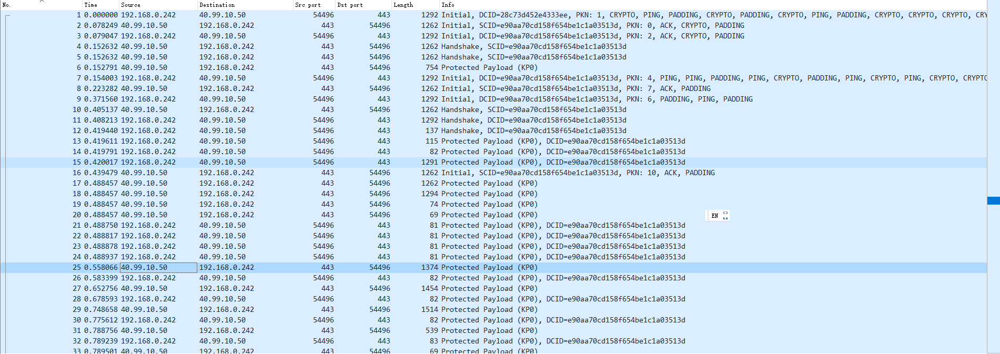
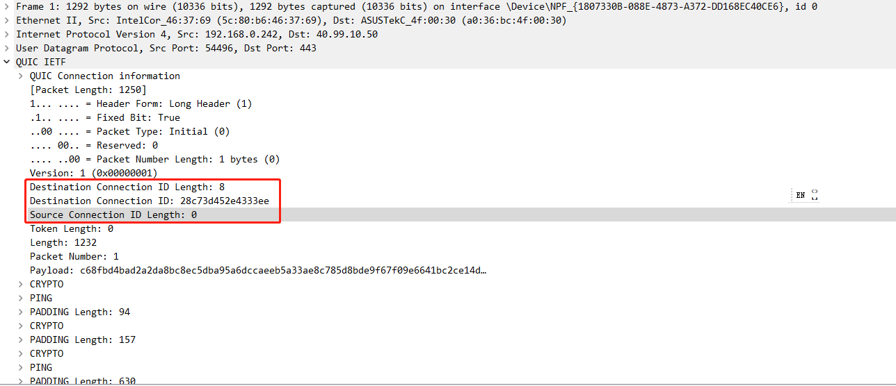
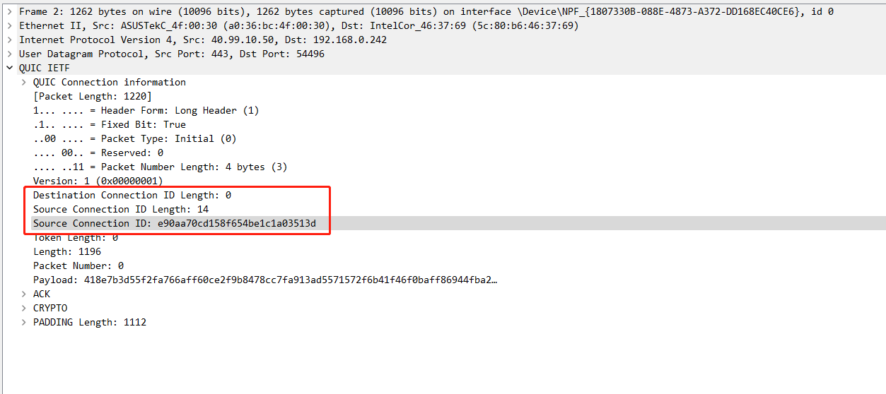

# 背景

Nginx 是多进程的架构，一个端口就会被多个进程同时进行监听。
因此 Linux 内核在派发报文的时候就需要一个策略来确定如何将报文发送给哪个进程。
对于 TCP 来说，这个事情就显得简单得多了。因为 TCP 是采用面向连接的协议，
每一个连接会关联一个独立的 socket，这个 socket 拥有不同唯一的 4元组（源 IP, 目的 IP，源端口，目的端口）。
因此， Linux 内核再 派发报文的时候只需要根据 4 元组发送报文到指定的 socket 即可。

对于 UDP 报文来说，也存在四元组的概念，一样可以通过四元组来派发报文。
但是在 Quic 中多出了一个连接迁移的功能，该功能导致多进程模式下的连接迁移不再可用。

何为连接迁移呢？从字面意思理解就是数据从一个连接转移到另一个连接。为什么会有这样的需求呢？
这个主要还是因为移动网络衍生出来的需求。比如你坐在火车上旅行，随着火车的行走，手机就会连接到不同的基站，基站会分配不同的 IP 地址给手机。
IP 地址变化后，原来的四元组就没用办法继续使用了，如果这时候你正在看电影，下周大文件，那么就会有中断。
另外比如你从室外进入室内，从 5G 移动信号转换成 WIFI 信号，那么这时候的手机 IP 地址也会变化。因此如果能够有连接迁移，那么真的是一个幸福的事情。
这就是 Quic 协议的连接迁移要解决的问题。

# Quic 的连接迁移

Quick 为了实现连接迁移，在 UDP 的负载部分增加了一个 Connection ID。
也就是说确定一个连接不再使用传输层的4元组，而是使用了应用层的数据，因此即使传输层的 IP 地址变化了也不影响连接的识别。

下图是一个 Quic 连接的基本信息



下图是客户端给服务端发送的第一个报文，可以看到有一个 Destination Connection ID。此时这个 ID 是客户端随机生成的。



下图是服务端给服务端发送的第一个报文，可以看到有一个 Source Connection ID。此时这个 ID 是服务端生成的。



我们可以看到，除了客户端发送过来的第一个握手报文外，其它的报文都是使用了服务端生成的 Connection ID。
同时服务端发送的报文在握手成功后是不带 Connection ID 的。
因为服务端才会一个 server socket 对应多个 client socket 的需求，而客户端每一个会话都是都是一个独立的 socket。
因此客户端可以在应用层自己维护 Connection ID 和 socket 的对应关系。理论上客户端也可以一个 socket 对应多个
Quic 的会话，但是这样做之后这个 socket 还是属于同一个进程，不存在内核派发报文选择发送给哪个客户端进程的问题。

# Nginx 的实现

在还没有看 Nginx 的实现的时候，我在想：是不是需要一个 UDP 四元组对应一个 EBPF 的表项。那这样就涉及大量的表项的
添加和删除，会有效率和内存问题。但是看了具体的实现后，我觉得实现非常的巧妙：使用 UDP socket 的 cookie 作为 key, 一个 UDP socket 只需要对应一个EBPF的表项即可，因此只要很小的的容量就能够满足要求。


此图来自： https://medium.com/nttlabs/nginx-quic-ebpf-soreuseport-127c62112a8d

## 定义 nginx_quic_sockmap

该代码在存在于 nginx/src/event/quick/bpf/ngx_quick_reuse_port_helper.c。
这个代码并不是直接连接到 nginx 中，而是通过 nginx/src/event/quic/ngx_event_quic_bpfgen.sh 生成另一份 C 代码
nginx/src/event/quic/ngx_event_quic_bpf_code.c。

这个是因为 EBPF 的代码 ngx_quic_reuse_port_helper.c 不能直接链接到普通的 C 程序，而是需要通过 clang 编译成字节码，
然后由 C 程序加载注入内核执行字节码。我们常用的 tcpdump 中的过滤规则就是典型的字节码在内核运行。
tcpdump 程序将过滤规则编译为字节码，而 Quic 选择端口是固定的规则，没有必要做到动态编译字节码。

```C
/*
 * actual map object is created by the "bpf" system call,
 * all pointers to this variable are replaced by the bpf loader
 */
struct bpf_map_def SEC("maps") ngx_quic_sockmap;
```

## 如何路由 UDP 报文

内核路由 UDP 报文的时候，使用的是 ngx_quic_select_socket_by_dcid 这个函数。
这个函数逻辑很简单，从 UDP 报文的 quic 头提取 DCID。然后调用 bpf_sk_select_reuseport
这个函数选择对应的 socket，然后根据该函数的返回值决定是放行还是丢弃。 Nginx 选择全部放行，
因为即使是非法的也希望应用层进一步处理 UDP 报文。


```C
SEC(PROGNAME)
int ngx_quic_select_socket_by_dcid(struct sk_reuseport_md *ctx)
{
    int             rc;
    __u64           key;
    size_t          len, offset;
    unsigned char  *start, *end, *data, *dcid;

    start = ctx->data;
    end = (unsigned char *) ctx->data_end;
    offset = 0;

    advance_data(sizeof(struct udphdr)); /* data at UDP header */
    advance_data(1); /* data at QUIC flags */

    if (data[0] & NGX_QUIC_PKT_LONG) {

        advance_data(4); /* data at QUIC version */
        advance_data(1); /* data at DCID len */

        len = data[0];   /* read DCID length */

        if (len < 8) {
            /* it's useless to search for key in such short DCID */
            return SK_PASS;
        }

    } else {
        len = NGX_QUIC_SERVER_CID_LEN;
    }

    dcid = &data[1];
    advance_data(len); /* we expect the packet to have full DCID */

    /* make verifier happy */
    if (dcid + sizeof(__u64) > end) {
        goto failed;
    }

    key = ngx_quic_parse_uint64(dcid);

    rc = bpf_sk_select_reuseport(ctx, &ngx_quic_sockmap, &key, 0);

    switch (rc) {
    case 0:
        debugmsg("nginx quic socket selected by key 0x%llx", key);
        return SK_PASS;

    /* kernel returns positive error numbers, errno.h defines positive */
    case -ENOENT:
        debugmsg("nginx quic default route for key 0x%llx", key);
        /* let the default reuseport logic decide which socket to choose */
        return SK_PASS;

    default:
        debugmsg("nginx quic bpf_sk_select_reuseport err: %d key 0x%llx",
                 rc, key);
        goto failed;
    }

failed:
    /*
     * SK_DROP will generate ICMP, but we may want to process "invalid" packet
     * in userspace quic to investigate further and finally react properly
     * (maybe ignore, maybe send something in response or close connection)
     */
    return SK_PASS;
}
```

bpf_sk_select_reuseport 函数的解释如下

```man
       long bpf_sk_select_reuseport(struct sk_reuseport_md *reuse,
       struct bpf_map *map, void *key, u64 flags)

              Description
                     Select a SO_REUSEPORT socket from a
                     BPF_MAP_TYPE_REUSEPORT_SOCKARRAY map.  It checks
                     the selected socket is matching the incoming
                     request in the socket buffer.

              Return 0 on success, or a negative error in case of
                     failure.
```

## nginx 如何生成 Connection ID

从下面的函数可以看到，nginx 是使用监听的 socket 的 cookie 作为 Connection ID 的前 8 个字节。
这样子就可以把 Connection ID 和 socket 关联起来。同时，因为 cookie 是不变的，因此不会导致
EBPF map 大小不断的膨胀。

```C
ngx_int_t
ngx_quic_create_server_id(ngx_connection_t *c, u_char *id)
{
    if (RAND_bytes(id, NGX_QUIC_SERVER_CID_LEN) != 1) {
        return NGX_ERROR;
    }

#if (NGX_QUIC_BPF)
    if (ngx_quic_bpf_attach_id(c, id) != NGX_OK) {
        ngx_log_error(NGX_LOG_ERR, c->log, 0,
                      "quic bpf failed to generate socket key");
        /* ignore error, things still may work */
    }
#endif

    return NGX_OK;
}

static ngx_int_t
ngx_quic_bpf_attach_id(ngx_connection_t *c, u_char *id)
{
    int        fd;
    uint64_t   cookie;
    socklen_t  optlen;

    fd = c->listening->fd;

    optlen = sizeof(cookie);

    if (getsockopt(fd, SOL_SOCKET, SO_COOKIE, &cookie, &optlen) == -1) {
        ngx_log_error(NGX_LOG_ERR, c->log, ngx_socket_errno,
                      "quic getsockopt(SO_COOKIE) failed");

        return NGX_ERROR;
    }

    ngx_quic_dcid_encode_key(id, cookie);

    return NGX_OK;
}
```

## 什么时候创建 EBPF 表项

要使用 quic 的 EBPF功能，首先需要开启 `quic_bpf on` 的选项。

创建 EBPF 的路由表项是在 ngx_quic_bpf_module_init。
ngx_quic_bpf_module_init 这个函数中，我们可以看到，bpf 的 ngx_quic_sockmap 表的大小被设置为
ccf->worker_processes * 4。 然后该函数遍历所有的 quic 协议的句柄，给每一个socket 创建 bpf 的组。
这里同一个监听地址的多个 reuseport 的 socket 是公用一个 bpf 组的。可以想像，内核在找到监听的地址之后，
根据这个 EBPF map 进行路由。

```C
    for (i = 0; i < cycle->listening.nelts; i++) {
        if (ls[i].quic && ls[i].reuseport) {
            if (ngx_quic_bpf_group_add_socket(cycle, &ls[i]) != NGX_OK) {
                goto failed;
            }
        }
    }

    //将 nginx 的 BPF 信息添加到环境变量中，在 binary upgrade 的时候通过
    //环境变量传递继承的 fd 的信息。
    if (ngx_quic_bpf_export_maps(cycle) != NGX_OK) {
        goto failed;
    }
```

ngx_quic_bpf_group_add_socket 会调用到 ngx_quic_bpf_create_group, 因此重点分析 ngx_quic_bpf_create_group 函数的执行过程

1. 调用 ngx_bpf_program_link 创建 map，得到 map_fd, 将 map_fd 存储在创建的 ngx_quic_sock_groups_t 中
1. 调用 ngx_bpf_program_link 修改 ngx_quic_reuseport_helper 的字节码，将 listen_fd 设置到指令中
1. 调用 ngx_bpf_load_program 加载 ngx_quic_reuseport_helper 注入内核，关联上面步骤创建的 map_fd，得到 prog_fd
1. 调用 setsockopt(SO_ATTACH_REUSEPORT_EBPF) 将 listen fd 和 prog_fd 关联
1. 调用 ngx_quic_bpf_close 关闭 prog_fd

```C
static ngx_quic_sock_group_t *
ngx_quic_bpf_create_group(ngx_cycle_t *cycle, ngx_listening_t *ls)
{
    int                     progfd, failed, flags, rc;
    ngx_quic_bpf_conf_t    *bcf;
    ngx_quic_sock_group_t  *grp;

    bcf = ngx_quic_bpf_get_conf(cycle);

    if (!bcf->enabled) {
        return NULL;
    }

    grp = ngx_quic_bpf_alloc_group(cycle, ls->sockaddr, ls->socklen);
    if (grp == NULL) {
        return NULL;
    }

    grp->map_fd = ngx_bpf_map_create(cycle->log, BPF_MAP_TYPE_SOCKHASH,
                                     sizeof(uint64_t), sizeof(uint64_t),
                                     bcf->map_size, 0);
    if (grp->map_fd == -1) {
        goto failed;
    }

    flags = fcntl(grp->map_fd, F_GETFD);
    if (flags == -1) {
        ngx_log_error(NGX_LOG_EMERG, cycle->log, errno,
                      "quic bpf getfd failed");
        goto failed;
    }

    /* need to inherit map during binary upgrade after exec */
    flags &= ~FD_CLOEXEC;

    rc = fcntl(grp->map_fd, F_SETFD, flags);
    if (rc == -1) {
        ngx_log_error(NGX_LOG_EMERG, cycle->log, errno,
                      "quic bpf setfd failed");
        goto failed;
    }

    ngx_bpf_program_link(&ngx_quic_reuseport_helper,
                         "ngx_quic_sockmap", grp->map_fd);

    progfd = ngx_bpf_load_program(cycle->log, &ngx_quic_reuseport_helper);
    if (progfd < 0) {
        goto failed;
    }

    failed = 0;

    if (setsockopt(ls->fd, SOL_SOCKET, SO_ATTACH_REUSEPORT_EBPF,
                   &progfd, sizeof(int))
        == -1)
    {
        ngx_log_error(NGX_LOG_EMERG, cycle->log, ngx_socket_errno,
                      "quic bpf setsockopt(SO_ATTACH_REUSEPORT_EBPF) failed");
        failed = 1;
    }

    ngx_quic_bpf_close(cycle->log, progfd, "program");

    if (failed) {
        goto failed;
    }

    ngx_log_debug1(NGX_LOG_DEBUG_EVENT, cycle->log, 0,
                   "quic bpf sockmap created fd:%d", grp->map_fd);
    return grp;

failed:

    if (grp->map_fd != -1) {
        ngx_quic_bpf_close(cycle->log, grp->map_fd, "map");
    }

    ngx_queue_remove(&grp->queue);

    return NULL;
}

int
ngx_bpf_map_create(ngx_log_t *log, enum bpf_map_type type, int key_size,
    int value_size, int max_entries, uint32_t map_flags)
{
    int             fd;
    union bpf_attr  attr;

    ngx_memzero(&attr, sizeof(union bpf_attr));

    attr.map_type = type;
    attr.key_size = key_size;
    attr.value_size = value_size;
    attr.max_entries = max_entries;
    attr.map_flags = map_flags;

    fd = ngx_bpf(BPF_MAP_CREATE, &attr, sizeof(attr));
    if (fd < 0) {
        ngx_log_error(NGX_LOG_ALERT, log, ngx_errno,
                      "failed to create BPF map");
        return NGX_ERROR;
    }

    return fd;
}

static ngx_inline int
ngx_bpf(enum bpf_cmd cmd, union bpf_attr *attr, unsigned int size)
{
    return syscall(__NR_bpf, cmd, attr, size);
}

void
ngx_bpf_program_link(ngx_bpf_program_t *program, const char *symbol, int fd)
{
    ngx_uint_t        i;
    ngx_bpf_reloc_t  *rl;

    rl = program->relocs;

    for (i = 0; i < program->nrelocs; i++) {
        if (ngx_strcmp(rl[i].name, symbol) == 0) {
            program->ins[rl[i].offset].src_reg = 1;
            program->ins[rl[i].offset].imm = fd;
        }
    }
}


int
ngx_bpf_load_program(ngx_log_t *log, ngx_bpf_program_t *program)
{
    int             fd;
    union bpf_attr  attr;
#if (NGX_DEBUG)
    char            buf[NGX_BPF_LOGBUF_SIZE];
#endif

    ngx_memzero(&attr, sizeof(union bpf_attr));

    attr.license = (uintptr_t) program->license;
    attr.prog_type = program->type;
    attr.insns = (uintptr_t) program->ins;
    attr.insn_cnt = program->nins;

#if (NGX_DEBUG)
    /* for verifier errors */
    attr.log_buf = (uintptr_t) buf;
    attr.log_size = NGX_BPF_LOGBUF_SIZE;
    attr.log_level = 1;
#endif

    fd = ngx_bpf(BPF_PROG_LOAD, &attr, sizeof(attr));
    if (fd < 0) {
        ngx_log_error(NGX_LOG_ALERT, log, ngx_errno,
                      "failed to load BPF program");

        ngx_log_debug1(NGX_LOG_DEBUG_CORE, log, 0,
                       "bpf verifier: %s", buf);

        return -1;
    }

    return fd;
}
```


总的下来，涉及的重点 API 接口如下

```C
getsockopt(fd, SOL_SOCKET, SO_COOKIE, &cookie, &optlen)

setsockopt(ls->fd, SOL_SOCKET, SO_ATTACH_REUSEPORT_EBPF, &progfd, sizeof(int))

void ngx_bpf_program_link(ngx_bpf_program_t *program, const char *symbol, int fd);
int ngx_bpf_load_program(ngx_log_t *log, ngx_bpf_program_t *program);

int ngx_bpf_map_create(ngx_log_t *log, enum bpf_map_type type, int key_size, int value_size, int max_entries, uint32_t map_flags);
int ngx_bpf_map_update(int fd, const void *key, const void *value, uint64_t flags);
int ngx_bpf_map_delete(int fd, const void *key);
int ngx_bpf_map_lookup(int fd, const void *key, void *value);

static ngx_inline int
ngx_bpf(enum bpf_cmd cmd, union bpf_attr *attr, unsigned int size)
{
    return syscall(__NR_bpf, cmd, attr, size);
}
```

# nginx binary upgrade 是否继承 http3 的 udp socket

如果继承的话就会导致 Nginx 在 binary upgarde 或者 reload 的时候无法将报文分发给正确的进程。
那么 Nginx 是如何做到这点的呢？

Nginx 只是设置了 ignore 的标志位，就表示不继承该 socket 了。
这个操作是在 ngx_quic_bpf_group_add_socket(ngx_cycle_t *cycle,  ngx_listening_t *ls) 函数中进行的。

## nginx 如何继承 socket

nginx 继承 socket 是在 ngx_add_inherited_sockets 实现的。在调用了 ngx_add_inherited_sockets 之后才进行配置解析，也就是配置解析完成再调用 ngx_init_cycle 函数。
但是 nginx 是什么时候复制多份 reuseport 的 listen socket的呢? 是在 函数 ngx_clone_listening(ngx_cycle_t *cycle, ngx_listening_t *ls) 复制的。
而该函数又是被函数 ngx_event_init_conf(ngx_cycle_t *cycle, void *conf) 所调用。

因此，从函数调用关系上是下面这样子。

```
ngx_add_inherited_sockets
ngx_init_cycle
    ngx_event_init_conf
    compare & copy fd from old_cycle
    ngx_open_listening_sockets
    ngx_configure_listening_sockets
```

ngx_init_cycle 中重要的相关代码如下:


```C
ngx_cycle_t *
ngx_init_cycle(ngx_cycle_t *old_cycle)
{
    if (ngx_conf_parse(&conf, &cycle->conf_file) != NGX_CONF_OK) {
        environ = senv;
        ngx_destroy_cycle_pools(&conf);
        return NULL;
    }

    ...

    for (i = 0; cycle->modules[i]; i++) {
        if (cycle->modules[i]->type != NGX_CORE_MODULE) {
            continue;
        }

        module = cycle->modules[i]->ctx;

        if (module->init_conf) {
            // 这里会调用 ngx_event_init_conf
            if (module->init_conf(cycle,
                                  cycle->conf_ctx[cycle->modules[i]->index])
                == NGX_CONF_ERROR)
            {
                environ = senv;
                ngx_destroy_cycle_pools(&conf);
                return NULL;
            }
        }
    }
    /* handle the listening sockets */

    if (old_cycle->listening.nelts) {
        ls = old_cycle->listening.elts;
        for (i = 0; i < old_cycle->listening.nelts; i++) {
            ls[i].remain = 0;
        }

        nls = cycle->listening.elts;
        for (n = 0; n < cycle->listening.nelts; n++) {

            for (i = 0; i < old_cycle->listening.nelts; i++) {
                if (ls[i].ignore) {
                    continue;
                }

                if (ls[i].remain) {
                    continue;
                }

                if (ls[i].type != nls[n].type) {
                    continue;
                }

                if (ngx_cmp_sockaddr(nls[n].sockaddr, nls[n].socklen,
                                     ls[i].sockaddr, ls[i].socklen, 1)
                    == NGX_OK)
                {
                    nls[n].fd = ls[i].fd;  // 这里只是把继承的 socket 的 fd 赋值给新的结构，因此 nls[n].worker 不受影响。
                    nls[n].inherited = ls[i].inherited;
                    nls[n].previous = &ls[i];
                    ls[i].remain = 1;

                    if (ls[i].backlog != nls[n].backlog) {
                        nls[n].listen = 1;
                    }

#if (NGX_HAVE_DEFERRED_ACCEPT && defined SO_ACCEPTFILTER)

                    /*
                     * FreeBSD, except the most recent versions,
                     * could not remove accept filter
                     */
                    nls[n].deferred_accept = ls[i].deferred_accept;

                    if (ls[i].accept_filter && nls[n].accept_filter) {
                        if (ngx_strcmp(ls[i].accept_filter,
                                       nls[n].accept_filter)
                            != 0)
                        {
                            nls[n].delete_deferred = 1;
                            nls[n].add_deferred = 1;
                        }

                    } else if (ls[i].accept_filter) {
                        nls[n].delete_deferred = 1;

                    } else if (nls[n].accept_filter) {
                        nls[n].add_deferred = 1;
                    }
#endif

#if (NGX_HAVE_DEFERRED_ACCEPT && defined TCP_DEFER_ACCEPT)

                    if (ls[i].deferred_accept && !nls[n].deferred_accept) {
                        nls[n].delete_deferred = 1;

                    } else if (ls[i].deferred_accept != nls[n].deferred_accept)
                    {
                        nls[n].add_deferred = 1;
                    }
#endif

#if (NGX_HAVE_REUSEPORT)
                    if (nls[n].reuseport && !ls[i].reuseport) {
                        nls[n].add_reuseport = 1;
                    }
#endif

                    break;
                }
            }

            if (nls[n].fd == (ngx_socket_t) -1) {
                nls[n].open = 1;
#if (NGX_HAVE_DEFERRED_ACCEPT && defined SO_ACCEPTFILTER)
                if (nls[n].accept_filter) {
                    nls[n].add_deferred = 1;
                }
#endif
#if (NGX_HAVE_DEFERRED_ACCEPT && defined TCP_DEFER_ACCEPT)
                if (nls[n].deferred_accept) {
                    nls[n].add_deferred = 1;
                }
#endif
            }
        }

    }

    if (ngx_open_listening_sockets(cycle) != NGX_OK) {
        goto failed;
    }

    if (!ngx_test_config) {
        ngx_configure_listening_sockets(cycle);
    }

}
```

# 参考文档

https://medium.com/nttlabs/nginx-quic-ebpf-soreuseport-127c62112a8d
