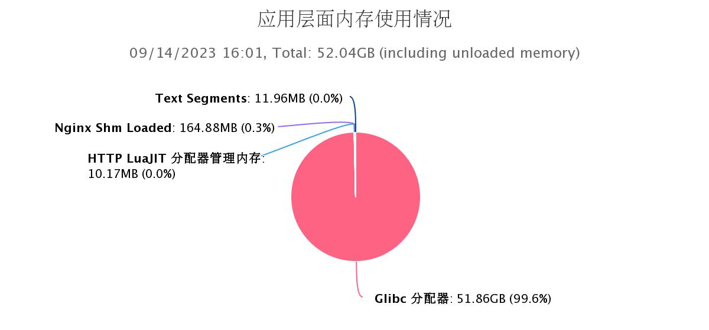
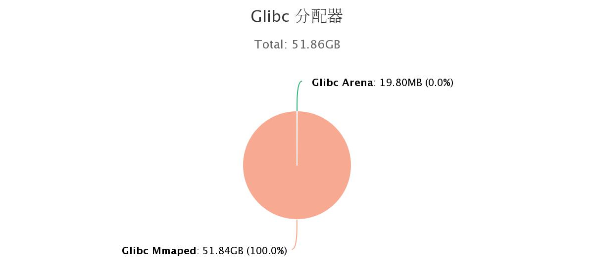

Nginx 的内存池让 Nginx 的内存泄漏变得很不容易。不过我们的一个客户的 Nginx 进程却泄漏了 52G 的内存。

第一眼看到 Nginx worker 进程消耗了 52G 内存着实吓人。

我们观察一下 Nginx 的内存增长趋势，发现所有的 Nginx 进程内存都是 52G。这说明这些被使用的内存是被所有 Nginx 进程共享的。而共享内存是 Nginx 多进程通信之间的一个基本操作，有可能是 Nginx 共享内存惹的祸。

但是，通过查看 OpenResty XRay 的 resty-memory 这个专有工具可以看到共享内存只占用 164M，简直是毛毛雨。因此，我们可以确认跟 Nginx 的共享内存机制是没有关系的。

我们从图中可以看到 Glibc 的内存分配达到 51.86GB，结合上面说的 Nginx Master 进程和 Nginx worker 进程一样消耗了 52G的内存这一情况，我们可以判断是 Nginx Master 进程泄漏导致的。

那么 Glibc 是如何消耗内存的呢？可以看到 Glibc 中使用 mmap 的方式分配了大量的内存。

这个时候我们可以使用 OpenResty XRay 的 mmap-leak 这个工具来快速定位泄漏内存的调用栈。
客户通过执行 nginx reload 触发 Nginx Master 进程执行后，很快就捕捉到了内存泄漏的调用栈，快速的解决问题了。

OpenRest XRay 工具自动运行分析工具，专家协助分析，5分钟就帮客户确认问题的根源。

客户感叹又是一个可以安稳睡觉的一天。

快来尝试 OpenResty XRay 吧！请点击这里直达[申请页面](http://xray.openresty.com.cn)。
