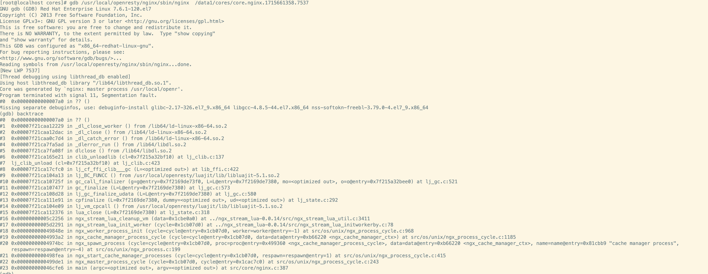

# 遇到麻烦

做开发的同学都知道，`Makefile` 会有一个 `install` 的目标。
我们通过源码安装软件的时候，经常使用 `sudo make install` 命令直接将软件安装到系统。
在软件开发的过程中，由于需要频繁修改代码并更新程序进行测试，因此也是使用 `sudo make install` 的方式来安装软件。

但是夜路走多了总会遇到 `鬼`。有经验的同学可能就会遇到 `sudo make install` 安装后，
使用 `systemctl restart xxx` 方式重启进程，结果出现了coredump。
遇到软件崩溃这种问题总是放过，一定要排除清楚才能上线，但是不顾怎么分析都不能找到崩溃的点。
随着分析的深入，你越发的无助，而人在无助的时候，总会怪力乱神。
你可能开始怀疑操作系统，开始怀疑硬件，怀疑是宇宙射线。最终，你只能和自己和解，这个是偶发的问题，还是可以上线。

# 揭晓答案

闽南语有一俗语：不知就像宝，说破没半分。这种问题就属于这种情况。

这是因为使用 `make install` 的时候，操作系统使用的 `copy` 的操作。
`copy` 命令将新编译好的文件覆盖原来已经存在的文件，这时候文件的 `inode` 是不会变化的。
也就是说，程序运行的中途，文件的内容被改变了。
这个时候程序如果从硬盘加载原来还没有加载的数据就会加载到一个与预期不一致的程序。
比如，原来是的函数指针指向一块为加载的页面，现在加载了一个不同的文件，那么这个指针指向的内存就不再是函数入口，可能是任意值了。
导致各种异常崩溃也就不足为奇了。

# 原理探索

**我们本质上不是要 inode 不变，而是要已经被进程打开的文件在对应路径的文件被覆盖后，进程打开的文件不受影响。为了方便讲述，我们还是用 inode 不变来介绍。**

## 验证拷贝的 inode 的变化情况

我们可以通过一个小实验来验证这种情况。

首先创建一个文件 `1.txt`, 并使用 `stat` 查看文件的 `inode`：

```shell
$ echo abc > 1.txt
$ stat 1.txt
  File: 1.txt
  Size: 4         	Blocks: 8          IO Block: 4096   regular file
Device: fd02h/64770d	Inode: 67163225    Links: 1
Access: (0644/-rw-r--r--)  Uid: ( 1000/     ljl)   Gid: ( 1000/     ljl)
Access: 2024-01-20 15:17:20.284620595 +0800
Modify: 2024-01-20 15:17:20.284620595 +0800
Change: 2024-01-20 15:17:20.284620595 +0800
 Birth: 2024-01-20 15:17:20.284620595 +0800
```

接着创建一个文件 `2.txt`, 并使用 `stat` 查看文件的 `inode`：

```shell
$ echo def > 2.txt
$ stat 2.txt
  File: 2.txt
  Size: 4         	Blocks: 8          IO Block: 4096   regular file
Device: fd02h/64770d	Inode: 67201895    Links: 1
Access: (0644/-rw-r--r--)  Uid: ( 1000/     ljl)   Gid: ( 1000/     ljl)
Access: 2024-01-20 15:17:26.216730893 +0800
Modify: 2024-01-20 15:17:26.216730893 +0800
Change: 2024-01-20 15:17:26.216730893 +0800
 Birth: 2024-01-20 15:17:26.216730893 +0800
```

可以看到文件的 `inode` 是不一样的, 分别是 67163225 和 67201895。

我们接着使用 `copy` 命令拷贝文件, 然后查看拷贝后的文件 `inode`。
可以看到 `inode` 仍然是 67201895.

```shell
$ cp 1.txt 2.txt
$ stat 2.txt    
  File: 2.txt
  Size: 4         	Blocks: 8          IO Block: 4096   regular file
Device: fd02h/64770d	Inode: 67201895    Links: 1
Access: (0644/-rw-r--r--)  Uid: ( 1000/     ljl)   Gid: ( 1000/     ljl)
Access: 2024-01-20 15:18:11.033564200 +0800
Modify: 2024-01-20 15:18:11.033564200 +0800
Change: 2024-01-20 15:18:11.033564200 +0800
 Birth: 2024-01-20 15:18:11.033564200 +0800
```

## 怎么才能拷贝到不同的 inode

我们想保持文件名不变，同时拷贝到不同的 inode，应该怎么做呢？

我们使用先删除再拷贝的方式看看有什么不同。

从下面的结果可以看到， `2.txt` 的 `inode` 仍然是 67201895.
我的天啊，这是为什么呢？

仔细想想，这个是操作系统给 `2.txt` 分配了最近可用的 `inode`。

```shell
$ work rm 2.txt
$ work cp 1.txt 2.txt
$ work stat 2.txt    
  File: 2.txt
  Size: 4         	Blocks: 8          IO Block: 4096   regular file
Device: fd02h/64770d	Inode: 67201895    Links: 1
Access: (0644/-rw-r--r--)  Uid: ( 1000/     ljl)   Gid: ( 1000/     ljl)
Access: 2024-01-20 15:18:11.033564200 +0800
Modify: 2024-01-20 15:18:11.033564200 +0800
Change: 2024-01-20 15:18:11.033564200 +0800
 Birth: 2024-01-20 15:18:11.033564200 +0800
```

为了验证上面的猜想，我们在删除文件之后，新建一个文件再拷贝文件得到如下结果。
可以看到文件 `2.txt` 的 `inode` 已经变成了 67201901。 因此上面的猜想是合理的。

```shell
$ rm 2.txt        
$ echo 789 > 3.txt
$ cp 1.txt 2.txt  
$ stat 2.txt
  File: 2.txt
  Size: 4         	Blocks: 8          IO Block: 4096   regular file
Device: fd02h/64770d	Inode: 67201901    Links: 1
Access: (0644/-rw-r--r--)  Uid: ( 1000/     ljl)   Gid: ( 1000/     ljl)
Access: 2024-01-20 15:18:57.461427461 +0800
Modify: 2024-01-20 15:18:57.461427461 +0800
Change: 2024-01-20 15:18:57.461427461 +0800
 Birth: 2024-01-20 15:18:57.461427461 +0800
```

那么拷贝的方式，文件的 inode 是不是一定不变呢？我们该如何确认这个问题。

## 确认拷贝方式为什么文件 inode 不变

这种情况下，我们可以使用 strace 来看看 cp 命令是怎么拷贝文件的。

可以看到是通过 open 系统调用打开了原来的文件，然后通过 ioctl 命令拷贝了文件。

其中，只要文件存在，那么拷贝文件之后，原来的文件的 inode 是不会改变的。

```shell
$ strace cp 1.txt 2.txt
execve("/usr/bin/cp", ["cp", "1.txt", "2.txt"], 0x7fffffffdc10 /* 63 vars */) = 0
...
newfstatat(AT_FDCWD, "2.txt", {st_mode=S_IFREG|0644, st_size=4, ...}, 0) = 0
newfstatat(AT_FDCWD, "1.txt", {st_mode=S_IFREG|0644, st_size=4, ...}, 0) = 0
newfstatat(AT_FDCWD, "2.txt", {st_mode=S_IFREG|0644, st_size=4, ...}, 0) = 0
openat(AT_FDCWD, "1.txt", O_RDONLY)     = 3
newfstatat(3, "", {st_mode=S_IFREG|0644, st_size=4, ...}, AT_EMPTY_PATH) = 0
openat(AT_FDCWD, "2.txt", O_WRONLY|O_TRUNC) = 4
newfstatat(4, "", {st_mode=S_IFREG|0644, st_size=0, ...}, AT_EMPTY_PATH) = 0
ioctl(4, BTRFS_IOC_CLONE or FICLONE, 3) = 0
close(4)                                = 0
close(3)                                = 0
...
```

# 我们应该如何升级程序

如果是开发过程，你又不觉得恶心，那么就不要去管这些程序崩溃的信息了。
如果你害怕出错误重要的崩溃信息，那么最简单的方式就是先停止程序，然后再启动程序。

如果是正式的部署，那么就不能再任性了。那么到底怎么升级程序才是正确的方式呢？

我们知道，各个操作系统都提供了各种各样的包和升级程序。比如 rpm, deb, apk 等各种软件包以及与之配合的 rpm, dpkg, apk 等命令。

这些标准的升级命令的升级过程是否会出现同样的问题呢？ 用脚指头想想就知道不应该出现这种问题，否则这种问题早就被解决了。
那么我们就要需要想想这些命令是如何避免出现这样的问题的。其实就是上面提到的先删除再拷贝的方式。
我们还是通过 `strace` 来跟踪确认一下。

以 OpenResty 从 1.21.4.3 升级到 1.25.3 为例。

```shell
$ sudo strace rpm -Uvh openresty-1.25.3.1-1.el9.x86_64.rpm 2>&1 | grep sbin/nginx
...
openat(AT_FDCWD, "/usr/local/openresty/nginx/sbin/nginx;65abae6c", O_WRONLY|O_CREAT|O_EXCL|O_TRUNC, 0666) = 11
write(11, "\177ELF\2\1\1\0\0\0\0\0\0\0\0\0\2\0>\0\1\0\0\0\300LB\0\0\0\0\0"..., 32768) = 32768
...
close(11)                               = 0
getuid()                                = 0
chown("/usr/local/openresty/nginx/sbin/nginx;65abae6c", 0, 0) = 0
chmod("/usr/local/openresty/nginx/sbin/nginx;65abae6c", 0755) = 0
utimensat(AT_FDCWD, "/usr/local/openresty/nginx/sbin/nginx;65abae6c", [{tv_sec=1704690879, tv_nsec=0} /* 2024-01-08T13:14:39+0800 */, {tv_sec=1704690879, tv_nsec=0} /* 2024-01-08T13:14:39+0800 */], AT_SYMLINK_NOFOLLOW) = 0
newfstatat(AT_FDCWD, "/usr/local/openresty/nginx/sbin/nginx", {st_mode=S_IFREG|0755, st_size=1926256, ...}, AT_SYMLINK_NOFOLLOW) = 0
newfstatat(AT_FDCWD, "/usr/local/openresty/nginx/sbin/nginx", {st_mode=S_IFREG|0755, st_size=1926256, ...}, AT_SYMLINK_NOFOLLOW) = 0
removexattr("/usr/local/openresty/nginx/sbin/nginx", "security.capability") = -1 ENODATA (No data available)
rename("/usr/local/openresty/nginx/sbin/nginx;65abae6c", "/usr/local/openresty/nginx/sbin/nginx") = 0
newfstatat(AT_FDCWD, "/usr/local/openresty/nginx/sbin/nginx", {st_mode=S_IFREG|0755, st_size=1943120, ...}, AT_SYMLINK_NOFOLLOW) = 0
```

从上面可以看到，`rpm` 升级程序的时候是先打开一个临时文件，将文件内容写入文件并关闭文件句柄。接着修改文件的拥有者和权限，然后调用 `rename` 将临时文件名称修改为正式的名称。那么这个 `rename` 到底做了啥。

我们可以通过 `man` 手册了解一下。

```shell
$ man 2 rename
 rename()  renames  a file, moving it between directories if required.  Any other hard links to the file (as created using link(2)) are unaffected. Open file descriptors for oldpath are also unaffected.
```

上面的重点就是最后一句话：Open file descriptors for oldpath are also unaffected.

对于已经在运行的进程，对应的二进制程序、共享文件就属于 open file descriptors。
我们可以通过 /proc 虚拟文件系统查看进程打开的可执行文件和共享库。


```shell
$ map_files ls -l /proc/1768/map_files | head -n 20
total 0
lr-------- 1 root root 64 Jan 20 20:24 555555554000-555555593000 -> /usr/local/openresty/nginx/sbin/nginx
lr-------- 1 root root 64 Jan 20 20:24 555555593000-5555556e6000 -> /usr/local/openresty/nginx/sbin/nginx
lr-------- 1 root root 64 Jan 20 20:24 5555556e6000-555555746000 -> /usr/local/openresty/nginx/sbin/nginx
lr-------- 1 root root 64 Jan 20 20:24 555555746000-555555749000 -> /usr/local/openresty/nginx/sbin/nginx
lr-------- 1 root root 64 Jan 20 20:24 555555749000-55555576d000 -> /usr/local/openresty/nginx/sbin/nginx
lrw------- 1 root root 64 Jan 20 20:24 7ffff6f00000-7ffff7400000 -> /dev/zero (deleted)
lr-------- 1 root root 64 Jan 20 20:24 7ffff7400000-7ffff7428000 -> /usr/lib64/libc.so.6
lr-------- 1 root root 64 Jan 20 20:24 7ffff7428000-7ffff759d000 -> /usr/lib64/libc.so.6
lr-------- 1 root root 64 Jan 20 20:24 7ffff759d000-7ffff75f5000 -> /usr/lib64/libc.so.6
lr-------- 1 root root 64 Jan 20 20:24 7ffff75f5000-7ffff75f6000 -> /usr/lib64/libc.so.6
lr-------- 1 root root 64 Jan 20 20:24 7ffff75f6000-7ffff75fa000 -> /usr/lib64/libc.so.6
lr-------- 1 root root 64 Jan 20 20:24 7ffff75fa000-7ffff75fc000 -> /usr/lib64/libc.so.6
lr-------- 1 root root 64 Jan 20 20:24 7ffff7714000-7ffff7715000 -> /usr/local/openresty/lualib/libdmi.so
lr-------- 1 root root 64 Jan 20 20:24 7ffff7715000-7ffff7716000 -> /usr/local/openresty/lualib/libdmi.so
lr-------- 1 root root 64 Jan 20 20:24 7ffff7716000-7ffff7717000 -> /usr/local/openresty/lualib/libdmi.so
lr-------- 1 root root 64 Jan 20 20:24 7ffff7717000-7ffff7718000 -> /usr/local/openresty/lualib/libdmi.so
lr-------- 1 root root 64 Jan 20 20:24 7ffff7718000-7ffff7719000 -> /usr/local/openresty/lualib/libdmi.so
lr-------- 1 root root 64 Jan 20 20:24 7ffff7739000-7ffff773a000 -> /usr/local/openresty/lualib/librestysysstat.so
lr-------- 1 root root 64 Jan 20 20:24 7ffff773a000-7ffff773b000 -> /usr/local/openresty/lualib/librestysysstat.so
...
```

当然我们也可以通过 `lsof` 查看进程打开的文件。

```shell
$ sudo lsof -p 1768
COMMAND  PID USER   FD      TYPE             DEVICE SIZE/OFF      NODE NAME
nginx   1768 root  cwd       DIR              253,0     4096   1250589 /usr/local/orxray-agent
nginx   1768 root  rtd       DIR              253,0     4096       128 /
nginx   1768 root  txt       REG              253,0  2194072  69921937 /usr/local/openresty/nginx/sbin/nginx
nginx   1768 root  DEL       REG                0,1                  4 /dev/zero
nginx   1768 root  mem       REG              253,0  2387200  67442273 /usr/lib64/libc.so.6
nginx   1768 root  mem       REG              253,0    14384  69510380 /usr/local/openresty/lualib/libdmi.so
nginx   1768 root  mem       REG              253,0    14368  69510387 /usr/local/openresty/lualib/librestysysstat.so
nginx   1768 root  mem       REG              253,0    14264  69494393 /usr/local/openresty/lualib/librestyfs.so
nginx   1768 root  mem       REG              253,0    14304  69510384 /usr/local/openresty/lualib/librestysignal.so
nginx   1768 root  mem       REG              253,0  3025984  69921081 /usr/local/openresty-plus/openssl111/lib/libcrypto.so.1.1
nginx   1768 root  mem       REG              253,0    23248  69510379 /usr/local/openresty/lualib/lfs.so
nginx   1768 root  mem       REG              253,0    82544  69494390 /usr/local/openresty/lualib/cjson.so
nginx   1768 root  DEL       REG                0,1                  7 /dev/zero
nginx   1768 root  DEL       REG                0,1                  6 /dev/zero
...
```

## 被删除的文件如何不被影响

内核对于 inode 其实是做了引用计数，只有引用计数为 0 才会真正的删除文件。
既然文件已经被删除，那么程序引用的被删除文件又如何不受影响呢？

我们通过删除 nginx 的错误日志来观察一下。

```shell
$ sudo rm /usr/local/openresty/nginx/logs/error.lo
$ sudo ls -l  /proc/15172/fd 
total 0
lrwx------ 1 root root 64 Jan 21 09:57 0 -> /dev/null
lrwx------ 1 root root 64 Jan 21 09:57 1 -> /dev/null
lrwx------ 1 root root 64 Jan 21 09:57 10 -> 'socket:[96342]'
lrwx------ 1 root root 64 Jan 21 09:57 11 -> 'socket:[96343]'
l-wx------ 1 root root 64 Jan 21 09:57 2 -> '/usr/local/openresty/nginx/logs/error.log (deleted)'
lrwx------ 1 root root 64 Jan 21 09:57 3 -> 'socket:[96340]'
l-wx------ 1 root root 64 Jan 21 09:57 4 -> '/usr/local/openresty/nginx/logs/error.log (deleted)'
l-wx------ 1 root root 64 Jan 21 09:57 5 -> /usr/local/openresty/nginx/logs/access.log
lrwx------ 1 root root 64 Jan 21 09:57 6 -> 'socket:[94606]'
lrwx------ 1 root root 64 Jan 21 09:57 7 -> 'socket:[94607]'
lrwx------ 1 root root 64 Jan 21 09:57 8 -> 'socket:[94608]'
lrwx------ 1 root root 64 Jan 21 09:57 9 -> 'socket:[96341]'
```

可以看到，在 proc 文件系统下，进程引用的文件名称变成了 '/usr/local/openresty/nginx/logs/error.log (deleted)'。
我们可以执行 cat 指令查看一下这个被删除的文件。

```shell
$ sudo cat /proc/15172/fd/4            
2024/01/21 09:56:29 [notice] 14646#14646: using the "epoll" event method
2024/01/21 09:56:29 [notice] 14646#14646: openresty/1.21.4.3
2024/01/21 09:56:29 [notice] 14646#14646: built by gcc 11.3.1 20221121 (Red Hat 11.3.1-4) (GCC) 
2024/01/21 09:56:29 [notice] 14646#14646: OS: Linux 5.14.0-362.8.1.el9_3.x86_64
2024/01/21 09:56:29 [notice] 14646#14646: getrlimit(RLIMIT_NOFILE): 1024:524288
2024/01/21 09:56:29 [notice] 14651#14651: start worker processes
2024/01/21 09:56:29 [notice] 14651#14651: start worker process 14652
2024/01/21 09:56:29 [notice] 14651#14651: start cache manager process 14653
2024/01/21 09:56:29 [notice] 14651#14651: start cache loader process 14654
2024/01/21 09:56:29 [notice] 14652#14652: sched_setaffinity(): using cpu #0
2024/01/21 09:57:29 [notice] 14654#14654: http file cache: /usr/local/openresty/nginx/cache 0.000M, bsize: 4096
2024/01/21 09:57:29 [notice] 14651#14651: signal 17 (SIGCHLD) received from 14654
2024/01/21 09:57:29 [notice] 14651#14651: cache loader process 14654 exited
...
```

上面清楚的看到的被删除的错误日志。

所以，有时候误删除文件的情况下，如果文件还有被其它进程访问，那么就可以通过 proc 系统来进行还原。虽然这种情况非常少见，但是有时候也能救命。

# 压缩包的升级

很多公司没有使用标准的打包软件，而是直接将目标文件放入压缩包。
在升级程序的时候，通过直接解压替并替换文件的方式进行升级。
这种包管理、升级方式就会遇到最初介绍的问题。

在这种情况下，就需要使用先删除后替换的方式。

所以，在软件世界里看起来很简单的事情，其实背后一点也不简单。

# 一个案例

nginx reload 的时候，在 Lua VM 卸载动态库的时候进程崩溃的。
这种是非常难查的问题，很多时候都是通过对比，减少变化因素来分析问题。


