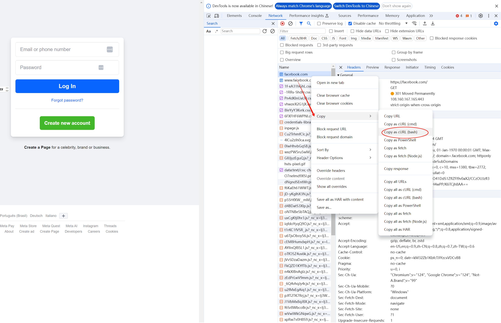

# Connect to the specific host

You should always use the --resolve to connecto the the specific host.

For example

```shell
curl --resolve test.com:443:127.0.0.1 http://test.com/
```

# Show the timing information

The `-w` option make curl display information on stdout after a completed transfer.

These are the timing information we are interested in.

- time_namelookup

      The time, in seconds, it took from the start until the name resolving was completed.

- time_connect

      The time, in seconds, it took from the start until the TCP connect to the remote host (or proxy) was completed.


- time_appconnect

      The  time,  in seconds, it took from the start until the SSL/SSH/etc connect/handshake to the remote host was completed. (Added in 7.19.0)

- time_pretransfer

      The  time,  in seconds, it took from the start until the file transfer was just about to begin. This includes all pre-transfer commands and negotiations that are specific to the particular  protocol(s) involved.

- time_redirect

      The  time, in seconds, it took for all redirection steps including name lookup, connect, pretransfer and transfer before the final transaction was started. time_redirect shows the complete execution time for multiple redirections. (Added in 7.12.3)

- time_starttransfer

      The  time, in seconds, it took from the start until the first byte was just about to be transferred. This includes time_pretransfer and also the time the server needed to calculate the result.

- time_total

      The total time, in seconds, that the full operation lasted.

For example:

```shell
$ curl -w " time_namelookup: %{time_namelookup}\n time_connect: %{time_connect}\n time_appconnect: %{time_appconnect}\n time_pretransfer: %{time_pretransfer}\n time_redirect: %{time_redirect}\n time_starttransfer: %{time_starttransfer}\n time_total: %{time_total}\n" -o /dev/null --resolve www.sina.com:443:124.72.131.224 https://www.sina.com/
 % Total    % Received % Xferd  Average Speed   Time    Time     Time  Current
                                 Dload  Upload   Total   Spent    Left  Speed
100 24000  100 24000    0     0   172k      0 --:--:-- --:--:-- --:--:--  172k
 time_namelookup: 0.000047
 time_connect: 0.005811
 time_appconnect: 0.096998
 time_pretransfer: 0.097243
 time_redirect: 0.000000
 time_starttransfer: 0.132671
 time_total: 0.136250
```

Make sure you add the `--resolve` option to connect to the specific host otherwise curl will connect to the address resolved by the hostname which may not you want.


# Show the HTTP headers

The HTTP headers are very important when debugging the HTTP problem.
We should examize the HTTP headers carefully.
Add the `-v` option to see the HTTP headers.

```shell
$ curl --resolve www.sina.com:443:124.72.131.224 -v https://www.sina.com -o /dev/null
  % Total    % Received % Xferd  Average Speed   Time    Time     Time  Current
                                 Dload  Upload   Total   Spent    Left  Speed
  0     0    0     0    0     0      0      0 --:--:-- --:--:-- --:--:--     0*   Trying 124.72.131.222:443...
* Connected to www.sina.com (124.72.131.222) port 443 (#0)
* ALPN, offering h2
* ALPN, offering http/1.1
*  CAfile: /etc/pki/tls/certs/ca-bundle.crt
* TLSv1.0 (OUT), TLS header, Certificate Status (22):
} [5 bytes data]
* TLSv1.3 (OUT), TLS handshake, Client hello (1):
} [512 bytes data]
* TLSv1.2 (IN), TLS header, Certificate Status (22):
{ [5 bytes data]
* TLSv1.3 (IN), TLS handshake, Server hello (2):
{ [122 bytes data]
* TLSv1.2 (IN), TLS header, Finished (20):
{ [5 bytes data]
* TLSv1.2 (IN), TLS header, Unknown (23):
{ [5 bytes data]
* TLSv1.3 (IN), TLS handshake, Encrypted Extensions (8):
{ [19 bytes data]
* TLSv1.2 (IN), TLS header, Unknown (23):
{ [5 bytes data]
* TLSv1.3 (IN), TLS handshake, Certificate (11):
{ [5006 bytes data]
* TLSv1.2 (IN), TLS header, Unknown (23):
{ [5 bytes data]
* TLSv1.3 (IN), TLS handshake, CERT verify (15):
{ [264 bytes data]
* TLSv1.2 (IN), TLS header, Unknown (23):
{ [5 bytes data]
* TLSv1.3 (IN), TLS handshake, Finished (20):
{ [52 bytes data]
* TLSv1.2 (OUT), TLS header, Finished (20):
} [5 bytes data]
* TLSv1.3 (OUT), TLS change cipher, Change cipher spec (1):
} [1 bytes data]
* TLSv1.2 (OUT), TLS header, Unknown (23):
} [5 bytes data]
* TLSv1.3 (OUT), TLS handshake, Finished (20):
} [52 bytes data]
* SSL connection using TLSv1.3 / TLS_AES_256_GCM_SHA384
* ALPN, server accepted to use h2
* Server certificate:
*  subject: C=CN; ST=\U5317\U4EAC\U5E02; O=\U5317\U4EAC\U65B0\U6D6A\U4E92\U8054\U4FE1\U606F\U670D\U52A1\U6709\U9650\U516C\U53F8; CN=*.weibo.cn
*  start date: Dec  6 00:00:00 2023 GMT
*  expire date: Jan  3 23:59:59 2025 GMT
*  subjectAltName: host "www.sina.com" matched cert's "*.sina.com"
*  issuer: C=US; O=DigiCert Inc; OU=www.digicert.com; CN=GeoTrust CN RSA CA G1
*  SSL certificate verify ok.
* Using HTTP2, server supports multi-use
* Connection state changed (HTTP/2 confirmed)
* Copying HTTP/2 data in stream buffer to connection buffer after upgrade: len=0
* TLSv1.2 (OUT), TLS header, Unknown (23):
} [5 bytes data]
* TLSv1.2 (OUT), TLS header, Unknown (23):
} [5 bytes data]
* TLSv1.2 (OUT), TLS header, Unknown (23):
} [5 bytes data]
* Using Stream ID: 1 (easy handle 0x5555555b2820)
* TLSv1.2 (OUT), TLS header, Unknown (23):
} [5 bytes data]
> GET / HTTP/2
> Host: www.sina.com
> user-agent: curl/7.76.1
> accept: */*
> 
* TLSv1.2 (IN), TLS header, Unknown (23):
{ [5 bytes data]
* TLSv1.3 (IN), TLS handshake, Newsession Ticket (4):
{ [273 bytes data]
* TLSv1.2 (IN), TLS header, Unknown (23):
{ [5 bytes data]
* TLSv1.3 (IN), TLS handshake, Newsession Ticket (4):
{ [273 bytes data]
* old SSL session ID is stale, removing
* TLSv1.2 (IN), TLS header, Unknown (23):
{ [5 bytes data]
* Connection state changed (MAX_CONCURRENT_STREAMS == 128)!
* TLSv1.2 (OUT), TLS header, Unknown (23):
} [5 bytes data]
* TLSv1.2 (IN), TLS header, Unknown (23):
{ [5 bytes data]
< HTTP/2 200 
< server: Tengine
< content-type: text/html
< content-length: 24000
< date: Sun, 12 May 2024 08:24:33 GMT
< vary: Accept-Encoding
< etag: W/"607e94a3-c2c"V=5965C31
< x-powered-by: shci_v1.13
< expires: Sun, 12 May 2024 08:26:09 GMT
< cache-control: max-age=120
< x-via-ssl: ssl.30.sinag1.bx.lb.sinanode.com
< edge-copy-time: 1715502249582
< via: http/1.1 cmcc.guangzhou.union.7777 (ApacheTrafficServer/6.2.1 [cRs f ]), cache49.l2cn2632[0,0,200-0,H], cache19.l2cn2632[1,0], vcache4.cn4292[0,0,200-0,H], vcache11.cn4292[1,0]
< x-via-cdn: f=aliyun,s=vcache11.cn4292,c=120.36.218.213;f=sinaedge,s=cmcc.guangzhou.union.72.nb.sinaedge.com,c=27.128.150.35;f=Edge,s=cmcc.guangzhou.union.7777,c=172.16.174.72
< x-via-edge: 17155022731192396801b48ae10ac160fa6a6
< ali-swift-global-savetime: 1715502273
< age: 95
< x-cache: HIT TCP_MEM_HIT dirn:-2:-2
< x-swift-savetime: Sun, 12 May 2024 08:24:34 GMT
< x-swift-cachetime: 119
< timing-allow-origin: *
< eagleid: 7c48839f17155023684428015e
< 
{ [15699 bytes data]
* TLSv1.2 (IN), TLS header, Unknown (23):
{ [5 bytes data]
* TLSv1.2 (IN), TLS header, Unknown (23):
{ [5 bytes data]
100 24000  100 24000    0     0   127k      0 --:--:-- --:--:-- --:--:--  128k
* Connection #0 to host www.sina.com left intact
```

You may found that the above request use the HTTP2 protocol. And the problem may only occur in HTTP 1.1
So you need to add the `--http1.1`.

```shell
curl --resolve www.sina.com:443:124.72.131.224 --http1.1 -v https://www.sina.com -o /dev/null
```

You can also change the HTTP protocol with --http0.9 --http1.0 --http1.1 --http2 and --http3.

# Copy the curl command from chrome

Do you know what is the HOST header of the following cmd?

```shell
$ curl --http1.1 --resolve test.com:18888:127.0.0.1 -v http://test.com:18888 -o /dev/null 
* Added test.com:18888:127.0.0.1 to DNS cache
* Hostname test.com was found in DNS cache
*   Trying 127.0.0.1:18888...
  % Total    % Received % Xferd  Average Speed   Time    Time     Time  Current
                                 Dload  Upload   Total   Spent    Left  Speed
  0     0    0     0    0     0      0      0 --:--:-- --:--:-- --:--:--     0* Connected to test.com (127.0.0.1) port 18888 (#0)
> GET / HTTP/1.1
> Host: test.com:18888
> User-Agent: curl/7.76.1
> Accept: */*
> 
  0     0    0     0    0     0      0      0 --:--:--  0:00:02 --:--:--
```

It is `Host: test.com:1888`.

Don't trust your eyes, just copy the command from chrome other than construct the curl command yourself when you found a problem in chrome.

1. Press F12 and then F5 to refresh the Pages.
1. Right click on the url you want to reproduce the problem.
1. copy the command given by chrome.


