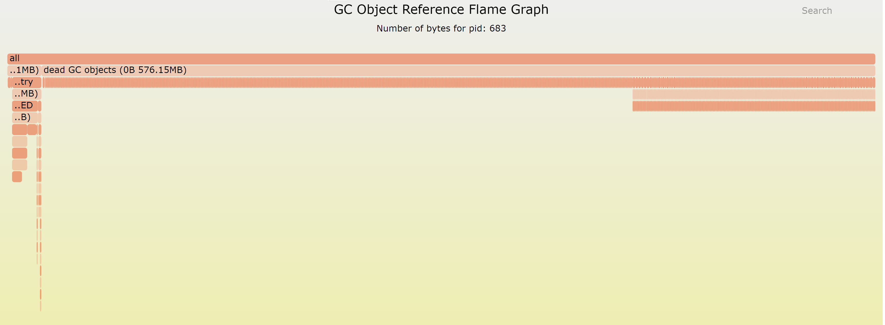

# 垃圾回收

`LuaJIT` 是使用 Lua 5.1 的标准。 跟 Lua 5.1 一样， `LuaJIT` 也是使用增量标记和扫描回收的算法。Lua 5.2 ~ 5.4 的垃圾回收算法已经更新成分代垃圾回收算法，可以参考 [云风的博客](https://blog.codingnow.com/2018/10/lua_gc.html)。

`LuaJIT` 的垃圾回收是在主线程中执行的，而不是像 JAVA/GO 在一个独立的线程中执行，如果主线程不执行，那么垃圾回收肯定也不会执行。
因此 `LuaJIT` 的垃圾回收其实是跟时间没有直接关系的。`LuaJIT` 的垃圾回收是跟着 `LuaJIT` 的内存分配一起执行，也就是说内存分配是会触发执行内存回收的动作。`GC` 依靠新增内存量来决定步进执行的最大工作量（比如标记多少内存）。每次执行的工作量太大了会导致程序更多额外的停顿，执行太少会导致内存回收速度赶不上新增速度。

这里涉及到两个重要的配置参数：垃圾回收暂停和垃圾回收步进因子。这两个参数使用的的百分比的形式，100 代表 1 倍， 200 代表 2 倍。
那么如何理解这两个参数呢？

## 垃圾回收器暂停值

垃圾回收器暂停用于控制在 `LuaJIT` 的自动内存管理再次调用之前，垃圾回收器需要等待多长时间。暂停值小于 100 意味着 `LuaJIT` 不会等待下一个周期。同样，该值越大，垃圾回收器的运行速度就越慢，越不激进。如果值为 200，则意味着垃圾回收器会等待使用中的内存总量翻倍后才开始新的循环。因此，根据应用程序的性质和速度，在 `LuaJIT` 应用程序中可能需要更改该值，以获得最佳性能。

## 垃圾回收器步进系数

这个步长系数控制着 `LuaJIT` 程序中垃圾回收器与内存分配的相对速度。步长值越大，垃圾收集器越积极，垃圾收集的每个增量步长也越大。小于 100 的值通常会导致垃圾收集器无法完成循环，因此一般不推荐使用。默认值为 200，这意味着垃圾收集器的运行速度是内存分配速度的两倍。
这里意思是如果分配 1K 的内存，那么应该扫描标记 2K 的内存量。


# 垃圾回收 API

`LuaJIT` `GC` 的 API 接口 是 `collectbargage()`。该接口支持下面这些参数：

- collectgarbage("collect") − 执行一次完整的 GC回收。

- collectgarbage("count") − 以 KB 为单位，返回当前的程序使用的内存。

- collectgarbage("restart", num) − 如果程序性停止了 LUA GC, 那么启用 GC。如果设置了 num 为 -1，那么 GC 回收阈值为当前 GC 内存总量乘以 setpause 的数值， 否则回收阈值为当前 GC 内存总量。

- collectgarbage("stop") − 如果程序 GC 是启用状态，那么停止 GC。

- collectgarbage("isrunning") − 返回当前 GC 是否启用的状态

- collectgarbage("setpause", num) −  设置垃圾回收暂停的值.

- collectgarbage("setstepmul", num) − 设置垃圾回收步进值。

- collectgarbage("step", num) − 执行一定数量的分步垃圾回收动作。第二个参数 num 越大，执行的步骤越多。如果完成了一次完整的垃圾回收，那么返回 true。

在 `LuaJIT` 中， `collectgarbage` 对应这个 `C` 代码片段。

```C
LUA_API int lua_gc(lua_State *L, int what, int data)
{
  global_State *g = G(L);
  int res = 0;
  switch (what) {
  case LUA_GCSTOP:
    g->gc.threshold = LJ_MAX_MEM;
    break;
  case LUA_GCRESTART:
    g->gc.threshold = data == -1 ? (g->gc.total/100)*g->gc.pause : g->gc.total;
    break;
  case LUA_GCCOLLECT:
    lj_gc_fullgc(L);
    break;
  case LUA_GCCOUNT:
    res = (int)(g->gc.total >> 10);
    break;
  case LUA_GCCOUNTB:
    res = (int)(g->gc.total & 0x3ff);
    break;
  case LUA_GCSTEP: {
    GCSize a = (GCSize)data << 10;
    g->gc.threshold = (a <= g->gc.total) ? (g->gc.total - a) : 0;
    while (g->gc.total >= g->gc.threshold)
      if (lj_gc_step(L) > 0) {
        res = 1;
        break;
      }
    break;
  }
  case LUA_GCSETPAUSE:
    res = (int)(g->gc.pause);
    g->gc.pause = (MSize)data;
    break;
  case LUA_GCSETSTEPMUL:
    res = (int)(g->gc.stepmul);
    g->gc.stepmul = (MSize)data;
    break;
  case LUA_GCISRUNNING:
    res = (g->gc.threshold != LJ_MAX_MEM);
    break;
  default:
    res = -1;  /* Invalid option. */
  }
  return res;
}
```

这些 API 看起来都很简单，关键是我们何时，如何使用这些 API 来解决我们的内存分配问题。

# 异常的垃圾回收案例

有时候，我们会发现我们的 Lua GC 对象占用的内存高得离谱，远远比我我们预期的要高几十倍。
比如这里是 [OpenResty XRay](https://xray.openresty.com) 分析的一次 Lua 对象的引用关系图。



我们可以看到，`dead GC objects` 占比非常之大。这就是一种异常的情况，是我们不希望看到的。
那么这种情况是怎么发生的呢？作为程序员，我们还是应该多怀疑自己，再怀疑 Lua 的实现出现了问题。
毕竟 Lua 虚拟机这种核心代码是千锤百炼，经过无数的应用程序的验证的。

其实这种情况很简单，就是因为 `GC` 内存涨到这个值的时候并没有执行 `GC` 回收，随后也的执行并也没有执行垃圾回收导致的。如何后续没有内存分配或者内存分配无法达到 2 倍上一次垃圾回收的数值，那么就不会触发垃圾回收。这时候就会存在大量的未被回收的死对象。

这个时候或许我们应该主动调用 `collectgarbage("step")` 来执行 GC 回收。

对应的代码片段是：

```C
  case LUA_GCSTEP: {
    GCSize a = (GCSize)data << 10;
    g->gc.threshold = (a <= g->gc.total) ? (g->gc.total - a) : 0;
    while (g->gc.total >= g->gc.threshold)
      if (lj_gc_step(L) > 0) {
        res = 1;
        break;
      }
    break;
  }
```

我们可以看到，`step` 的单位是 1024 B。

这里是把 `gc.threshold` 的值减去 `step` 的值，然后执行 `lj_gc_step`。我们就需要知道
`gc.total` 和 `gc.threshold` 的意义。 

- gc.total 当前所有 GC 对象占用的内存
- gc.threshold 执行 GC 垃圾回收的阈值。通过 `collectgarbage("stop")` 停止 GC，其实是把 gc.threshold 设置为 LJ_MAX_MEM，使得 `gc.total` 永远达不到该值，就不会执行 GC 回收。如果是 "restart", 那么根据 "restart" 的第二个参数觉得 `gc.threshold` 的值。

`gc.threshold` 设置的地方比较多，也明显更加复杂。

`gc.threshold` 的重点在 lj_gc_step 函数中。 要理解 `lj_gc_step` 就要结合 `lua_gc` 函数。

1. 在 lua_gc 函数中，将 gc.threshold 设置成 `g->gc.threshold = (a <= g->gc.total) ? (g->gc.total - a) : 0`。
2. 进入 lj_gc_step 函数后，在 gc.total 大于 gc.threshold 时候会 计算 `gc.debt` 的值。
3. lua_gc 的 调用 lj_gc_step 的 while 循环什么时候结束也跟 `gc.debt` 有关系。
    - 1. 如果执行完整的GC，那边就直接退出
    - 1. 如果 `gc.debt` < CSTEPSIZE, 那么也会通过调整 gc.threshold 的值实现结束 while 循环。
4. 每次执行 lj_gc_step 会将 `gc.debt` 减去 GCSTEPSIZE，实现 `gc.debt` 的值越来越小。


```C
/* Perform a limited amount of incremental GC steps. */
int LJ_FASTCALL lj_gc_step(lua_State *L)
{
  global_State *g = G(L);
  GCSize lim;
  int32_t ostate = g->vmstate;
  setvmstate(g, GC);
  lim = (GCSTEPSIZE/100) * g->gc.stepmul;
  if (lim == 0)
    lim = LJ_MAX_MEM;
  if (g->gc.total > g->gc.threshold)
    g->gc.debt += g->gc.total - g->gc.threshold;
  do {
    lim -= (GCSize)gc_onestep(L);
    if (g->gc.state == GCSpause) {
      g->gc.threshold = (g->gc.estimate/100) * g->gc.pause;
      g->vmstate = ostate;
      return 1;  /* Finished a GC cycle. */
    }
  } while (sizeof(lim) == 8 ? ((int64_t)lim > 0) : ((int32_t)lim > 0));
  if (g->gc.debt < GCSTEPSIZE) {
    g->gc.threshold = g->gc.total + GCSTEPSIZE;
    g->vmstate = ostate;
    return -1;
  } else {
    g->gc.debt -= GCSTEPSIZE;
    g->gc.threshold = g->gc.total;
    g->vmstate = ostate;
    return 0;
  }
}
```

我们来看看调用了 `collectgarbage("step", 2)` 会是怎么执行的。

0. 假设 gc.dept = 0
1. lua_gc 函数执行 LUA_GCSTEP分支，将 gc.threshold 设置为 gc.total - 2048
2. lua_gc while 循环调用 lj_gc_step, 直到 gc.total **小于** gc.threshold
3. lua_gc_step 将步长 lim 设置为 lim = (GCSTEPSIZE/100) * g->gc.stepmul。在默认参数下是 1024 / 100 * 200 = 2000.
4. lj_gc_step 执行，将 gc.debt 加上 2048（g->gc.debt += g->gc.total - g->gc.threshold）
5. 执行 gc_onestep 进行标记等动作直到执行步长的数据量处理结束。
6. 因为 gc.dept(2048) 大于 GCSTEPSIZE（1024），所以将 gc.dept 减去 GCSTEPSIZE, 得到新的 gc.dept 为 1024， 同时把 gc.threshold 设置为 gc.total
7. lua_gc 执行 while 循环判断，因为此时 gc.total 等于 gc.threshold，因此 while 循环继续
8. lua_gc_step 将步长 lim 设置为 lim = (GCSTEPSIZE/100) * g->gc.stepmul。在默认参数下是 1024 / 100 * 200 = 2000.
9. 执行 gc_onestep 进行标记等动作直到执行步长的数据量处理结束。
10. 因为 gc.dept(1024) 等于 GCSTEPSIZE（1024），所以将 gc.dept 减去 GCSTEPSIZE, 得到新的 gc.dept 为 0， 同时把 gc.threshold 设置为 gc.total
10. lua_gc 执行 while 循环判断，因为此时 gc.total 等于 gc.threshold，因此 while 循环继续
11. lua_gc_step 将步长 lim 设置为 lim = (GCSTEPSIZE/100) * g->gc.stepmul。在默认参数下是 1024 / 100 * 200 = 2000.
12. 执行 gc_onestep 进行标记等动作直到执行步长的数据量处理结束。
13. 因为 gc.dept(0) 小于 GCSTEPSIZE（1024），所以将 gc.threshold 设置为 gc.total + GCSTEPSIZE。
10. lua_gc 执行 while 循环判断，因为此时 gc.total 小于 gc.threshold，因此 while 循环退出。

因此，从上面看，`collectgarbage("step", 2)` 实际上会执行三次的 lj_gc_step, 也就是会处理三个步长的数据。
