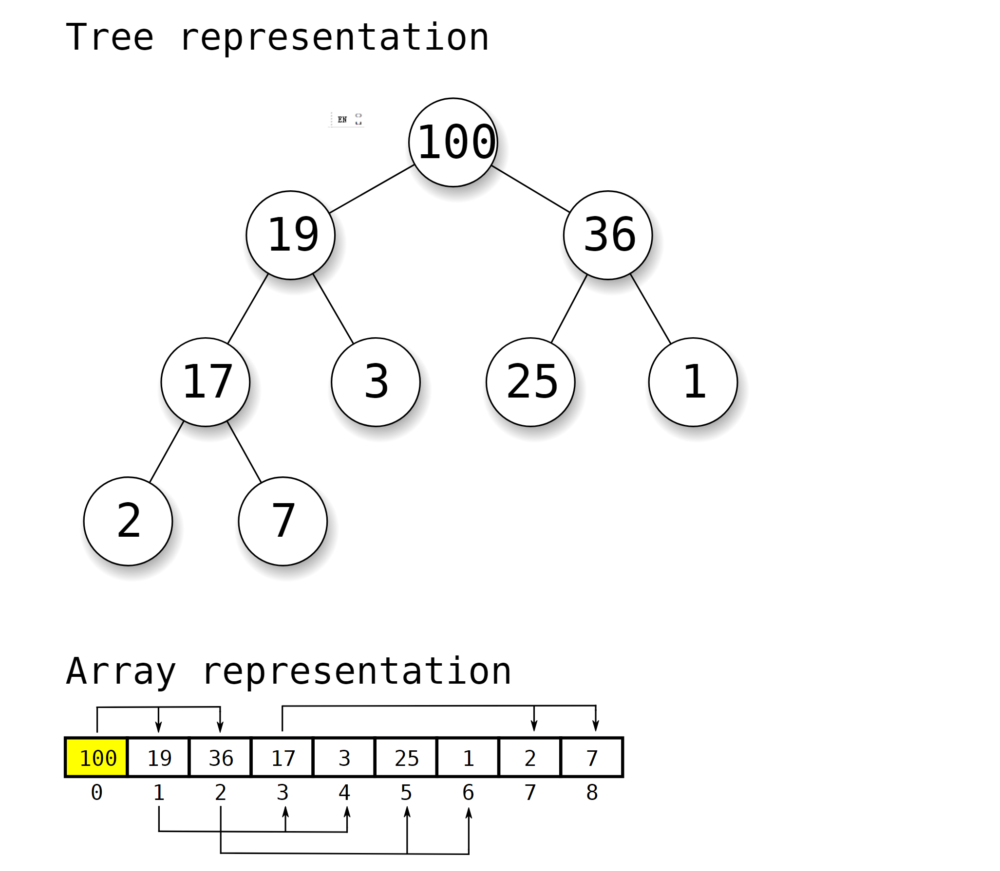

这里并没有啥新意，只是为了方便我自己拷贝算法。

虽然号称 AI 能给很好的代码，但是我搜索的时候经常找不到满意的代码。

# 堆的介绍

我们经常会听说堆排序，最大堆，最小堆。这里的堆跟内存分配中的堆栈的堆是没有关系的。内存分配中的堆是有别于栈的另一个内存空间，堆是不会自动回收的, 而栈在函数调用返回后就自动收缩了。

我们这里要讨论的是一种排序算法。以最大堆为例，最大堆的根节点的值整个堆里面是最大的，而根节点的左右两棵子树也是满足这样的特性。具体可以参考下面这张来自 [wiki](https://en.wikipedia.org/wiki/Heap_(data_structure)) 的图片。



这张图片非常的好，把堆的树状的逻辑表示和数组的实现方式结合起来，解释得非常的清楚。

堆的算法中最重要的是父子节点之间的关系。

从图中的数组我们可以看到，节点 0 的子节点分别是 1 和 2，节点 1 的子节点分别是 3 和 4。
因此我们可以推到 节点 n 的 子节点是 `n * 2 + 1`, `n * 2 + 2`, 而节点 n 的父节点就是 `(n - 1) / 2`。
这个关系是我们编程的重点。

堆的操作包含如下几个：

- 插入
- 删除
- 从数组建堆

而堆的常见应用包含：

- 获取 top N 个最大或者最小值
- 堆排序
- 图算法（Dijkstra's algorithm）

这里将元素上浮或者下沉有很多种不同的叫法。

比如上浮可以是 bubble-up, percolate-up, sift-up, trickle-up, swim-up, heapify-up, cascade-up, or fix-up.
所以只要记住是 up 还是 down 就好了，不要管他具体是什么叫法。

另外一点提及的是 heapify 这个动作。WiKi 的不同页面堆 heapify 的作用描述也不尽相同，因此有时候会让人交流起来如同鸡同鸭讲。比如 https://en.wikipedia.org/wiki/Binary_heap#Heap_implementation 里面的 Max-Heapify 跟 https://en.wikipedia.org/wiki/Heapsort 中的 heapify 完全不是一个东西，而是相当于后者里面的 siftDown 函数。
https://en.wikipedia.org/wiki/Heapsort 这个页面也是把 heapify 作为一个从数组构建堆的动作，而不仅仅是从堆中移动一个元素来满足堆的特性。


# 算法实现

## C 语言实现

这个算法实现获取 Top N 个元素的功能

```C
#include<stdio.h>
#include<stdlib.h>

typedef struct heap_node_s {
    size_t val;
    void *data;
} heap_node_t;

typedef struct heap_s {
    size_t size;
    size_t capicity;
    heap_node_t *nodes;
} heap_t;


#define LEFT_CHILD_IDX(i)  (2 * i + 1)
#define RIGHT_CHILD_IDX(i) (2 * i + 2)
#define PARENT_IDX(i)     ((i - 1) / 2)
#define CMP_OP(a, b) ((a).val > (b).val)
//#define CMP_OP(a, b) ((a).val < (b).val) // max heap

static void sift_down(heap_node_t *a, size_t root, size_t end)
{
    size_t child;
  
    while (LEFT_CHILD_IDX(root) < end) {
        child = LEFT_CHILD_IDX(root);
        if (child + 1 < end && CMP_OP(a[child], a[child + 1]))
            child++;
    
        if (CMP_OP(a[root], a[child])) {
            heap_node_t tmp = a[root];
            a[root] = a[child];
            a[child] = tmp;
            root = child;
        } else {
          return;
        }
    }
}

static void sift_up(heap_node_t *a, size_t child)
{
    size_t parent;

    while (child > 0) {
        parent = PARENT_IDX(child);
        if (CMP_OP(a[parent], a[child])) {
            heap_node_t tmp = a[parent];
            a[parent] = a[child];
            a[child] = tmp;
            child = parent;
            continue; 
        }
        return;
    }
}

static void heapify(heap_node_t *a, size_t count)
{
  size_t start = PARENT_IDX(count - 1) + 1;

  while (start > 0) {
    start = start - 1;
    sift_down(a, start, count);
  }
}

void
heap_insert(heap_t *h, heap_node_t *node)
{
    size_t capicity = h->capicity;

#ifdef HEAPIFY_ON_FULL
    if (h->size < capicity) {
        h->nodes[h->size] = *node;
        h->size++;

        if (h->size == capicity) {
            heapify(h->nodes, capicity);
        }

        return;
    }

    if (!CMP_OP(h->nodes[0], *node)) {
        h->nodes[0] = *node;
        sift_down(h->nodes, 0, capicity);
    }
#else
    if (h->size == capicity) {
        if (!CMP_OP(h->nodes[0], *node)) {
            h->nodes[0] = *node;
            sift_down(h->nodes, 0, capicity);
        }
        return;
    }

    h->nodes[h->size] = *node;
    h->size++;
    sift_up(h->nodes, h->size - 1);
#endif
}

void
print_heap(heap_t *a)
{
    for (int i = 0; i < a->size; i++) {
        printf("%ld ", a->nodes[i].val);
    }

    printf("\n");
}

void
Test()
{
    int i;
    int arr[] = { 12, 2, 10, 4, 6, 1000, 8, 54, 67, 25, 178, 300 };
    int k = 5;
    heap_t heap;
    heap_node_t nodes[5];
    heap.capicity = k;
    heap.size = 0;
    heap.nodes = nodes;

    for (i = 0; i < sizeof(arr) / sizeof(arr[0]); i++) {
        heap_node_t node = {arr[i], NULL};
        heap_insert(&heap, &node);
    }

    print_heap(&heap);
}


int
main()
{
    Test();
    return 0;
}
```

## Python 的实现

Copy from [https://www.shubo.io/binary-heap/](https://www.shubo.io/binary-heap/)

```python3
class MaxHeap:
	def __init__(self):
		self.heap = []

	def insert(self, item):
		self.heap.append(item)
		self.__swim(len(self.heap) - 1)

	def extract_max(self):
		value = self.heap[0]
		self.heap[0] = self.heap[-1]
		self.heap.pop()
		self.__sink(0)
		return value

	def __swim(self, k):
		while (k > 0 and self.heap[(k - 1) // 2] < self.heap[k]):
			self.__swap((k - 1) // 2, k)
			k = (k - 1) // 2

	def __sink(self, k):
		while (k * 2 + 1 < len(self.heap)):
			j = k * 2 + 1
			if (k * 2 + 2 < len(self.heap) and self.heap[k * 2 + 2] > self.heap[k * 2 + 1]):
				j = k * 2 + 2

			if (self.heap[j] > self.heap[k]):
				self.__swap(j, k)

			k = j

	def __swap(self, j, k):
		tmp = self.heap[j]
		self.heap[j] = self.heap[k]
		self.heap[k] = tmp
```

# Links

https://en.wikipedia.org/wiki/Heapsort
