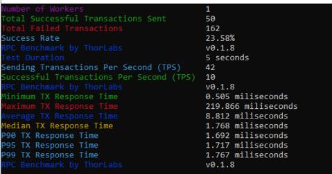
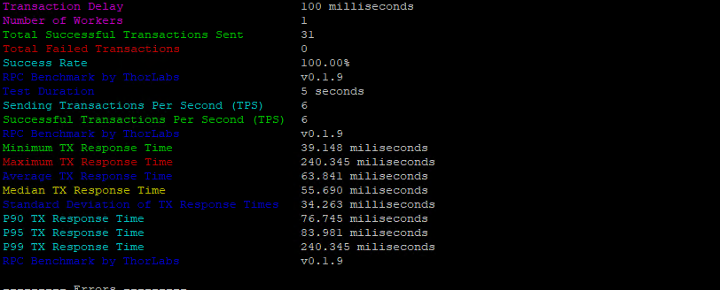

最近遇到一个奇怪的问题，用户通过代理后响应时间和不通过代理的响应时间差别很大。
不通过代理只有几毫秒，而通过代理需要 100 毫秒以上。

直接访问

通过代理

用户提出问题的时候，用户给的信息是很简单的。而这个时候我们需要像医生给病人看病一样，
需要深入的询问病史而不是简单的接受病人提供的信息就一头栽进去。

我想应该是安装这样的步骤分析问题：

1. 首先,我们需要仔细验证用户提供的信息是否准确无误。这包括确认用户描述的问题细节、涉及的设备和拓扑等信息是否正确。我们需要对用户提供的信息进行确认和补充,以确保有足够的信息来分析和解决问题。
1. 其次,我们需要全面了解用户遇到的问题,包括问题的症状、发生的时间和频率、影响的范围等。同时,我们还需要绘制出相关的网络拓扑图,了解问题涉及的设备、链路以及它们之间的连接关系。这有助于我们更好地理解问题的根源所在。
1. 接下来,我们要尝试复现用户所描述的问题情况。这可能需要我们模拟用户的操作步骤,在测试环境中重现问题,以便进一步分析和排查问题的原因。通过复现问题,我们可以获得更多有价值的信息和线索。
1. 然后,我们要设法简化问题,排除掉与之无关的各种因素。这可能需要我们逐步缩小问题的范围,隔离可能导致问题的各个环节,以找出问题的根源所在。通过不断简化问题,我们可以更清楚地认识问题的本质。
1. 之后,我们会分析可能造成问题的各种原因,并将这些原因与实际观察到的现象进行匹配。我们需要系统地分析可能的故障点、配置错误、硬件问题等,并尝试找出哪些原因能够充分解释用户反馈的问题现象。这个过程需要我们运用专业知识和经验进行综合分析。
1. 最后,在问题修复完成后,我们需要再次验证问题是否确实已经得到解决。这包括在测试环境中重现用户的操作场景,检查问题是否彻底消除,确保修复方案能够有效解决问题,并避免引入新的问题。只有经过彻底的验证,我们才能最终确认问题已经得到解决。

针对这次的问题，我想应该是这样子提问更有效率

1. 让用户提供两次不同测试的数据，确保用户没有误读，并且从提供的数据中发现更多用户没有提供的信息。
2. 让用户告知测试的细节，包括测试的工具，测试的机器，测试的命令行参数。
3. 画出用户测试的拓扑，方便我们分析问题
4. 分析用户测试数据差异和拓扑差异之间的关系
5. 尽可能的减少差异并进行重新测试
6. 有条件的情况下在多个关键节点进行抓包，分析是哪个阶段引入的延时（本次上游机器用户无法登录）
7. 通过以上步骤我们可以看到在客户端的机器 A 上直接访问上游和在代理服务器直接访问上游就会出现差异，可以排除代理的问题。

如果要更快速的排除代理的问题，那么应该一开始就是通过代理和不通过代理两种访问方式。但是要注意不通过代理服务器是指不通过代理软件的处理，而不是不经过代理服务器这个节点。这里的处理方式就多种多样：

1. 在代理服务器上起一个简单的代理，比如使用 nc
2. 在代理服务器上添加一个 iptables 规则
3. 直接在代理服务器上测试。

为什么需要前两者，因为有时候测试工具不容易放在代理服务器上。

经过排查分析后，我们确认问题出在上有服务器，但是用户没有上游服务器的访问权限，我们无法在上游服务器上抓包验证。因为 HTTP 请求的参数是完全一样，服务端通过 HTTP 请求数据是完全没有办法区分不同的请求。
那么服务户端又是如何区分客户端的呢？再比较一下差异，只有客户端的 IP 地址是不同的。

如果说服务端根据 IP 地址给不同的客户端执行不同的限速策略，这个虽然理论上说得通，但是实际上很少有这么做的。更多的应用是根据应用层信息来进行限速，比如VIP, VVIP等不同的客户等级。

那么客户端 IP 还有什么应用呢？ 一般会根据客户端 IP 地址进行哈希路由，实现会话保持的功能。
在这种方式下，同一个 IP 一直会转发到同一个后端。而这里客户提供的上游 IP 其实不是真正的后端服务器的 IP 地址，而是 cloudflare 的转发 IP。

至此，问题很清楚了，请求被路由到不同的上游服务器，导致请求延时完全不同。
这个解释可以说比较完美的解释了不同的请求延时的问题。
